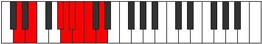
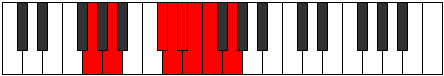

# Mode Dydian

## Links

- [Documentation](index.md)
- [Scales Index](Scales.md)
- [Modes Index](Modes.md)
- [Chords Index](Chords.md)

## Parent Scale

[Stanian](ScaleStanian.md)

## Number

[1989](https://ianring.com/musictheory/scales/1989)

## Perfection

- 3 Perfect notes
- 4 Perfect notes

## Perfection Profile

[true true false true false false false]

## Permutations

| Tonic | Notes | Signature | Illustration | Audio |
|-------|-------|-----------|--------------|-------|
| [C](ModeCNaturalDydian.md) | C, D, **E##**, F##, **G#**, **A**, **Bb**, C | C |  | [midi](ModeCNaturalDydian.mid) [ogg](ModeCNaturalDydian.ogg) |
| [C#](ModeCSharpDydian.md) | C#, D#, **E###**, F###, **G##**, **A#**, **B**, C# | C |  | [midi](ModeCSharpDydian.mid) [ogg](ModeCSharpDydian.ogg) |
| [Db](ModeDFlatDydian.md) | Db, Eb, **F##**, G#, **A**, **Bb**, **Cb**, Db | C |  | [midi](ModeDFlatDydian.mid) [ogg](ModeDFlatDydian.ogg) |
| [D](ModeDNaturalDydian.md) | D, E, **F###**, G##, **A#**, **B**, **C**, D | C |  | [midi](ModeDNaturalDydian.mid) [ogg](ModeDNaturalDydian.ogg) |
| [D#](ModeDSharpDydian.md) | D#, E#, **Cbbb**, Cbb, **Dbbb**, **Dbb**, **Ebbb**, D# | C |  | [midi](ModeDSharpDydian.mid) [ogg](ModeDSharpDydian.ogg) |
| [Eb](ModeEFlatDydian.md) | Eb, F, **G##**, A#, **B**, **C**, **Db**, Eb | C |  | [midi](ModeEFlatDydian.mid) [ogg](ModeEFlatDydian.ogg) |
| [E](ModeENaturalDydian.md) | E, F#, **G###**, A##, **B#**, **C#**, **D**, E | C |  | [midi](ModeENaturalDydian.mid) [ogg](ModeENaturalDydian.ogg) |
| [F](ModeFNaturalDydian.md) | F, G, **A##**, B#, **C#**, **D**, **Eb**, F | C |  | [midi](ModeFNaturalDydian.mid) [ogg](ModeFNaturalDydian.ogg) |
| [F#](ModeFSharpDydian.md) | F#, G#, **A###**, B##, **C##**, **D#**, **E**, F# | C |  | [midi](ModeFSharpDydian.mid) [ogg](ModeFSharpDydian.ogg) |
| [Gb](ModeGFlatDydian.md) | Gb, Ab, **B#**, C#, **D**, **Eb**, **Fb**, Gb | C |  | [midi](ModeGFlatDydian.mid) [ogg](ModeGFlatDydian.ogg) |
| [G](ModeGNaturalDydian.md) | G, A, **B##**, C##, **D#**, **E**, **F**, G | C |  | [midi](ModeGNaturalDydian.mid) [ogg](ModeGNaturalDydian.ogg) |
| [G#](ModeGSharpDydian.md) | G#, A#, **B###**, C###, **D##**, **E#**, **F#**, G# | C |  | [midi](ModeGSharpDydian.mid) [ogg](ModeGSharpDydian.ogg) |
| [Ab](ModeAFlatDydian.md) | Ab, Bb, **C##**, D#, **E**, **F**, **Gb**, Ab | C |  | [midi](ModeAFlatDydian.mid) [ogg](ModeAFlatDydian.ogg) |
| [A](ModeANaturalDydian.md) | A, B, **C###**, D##, **E#**, **F#**, **G**, A | C |  | [midi](ModeANaturalDydian.mid) [ogg](ModeANaturalDydian.ogg) |
| [A#](ModeASharpDydian.md) | A#, B#, **D##**, E#, **F#**, **G**, **Ab**, A# | C |  | [midi](ModeASharpDydian.mid) [ogg](ModeASharpDydian.ogg) |
| [Bb](ModeBFlatDydian.md) | Bb, C, **D##**, E#, **F#**, **G**, **Ab**, Bb | C |  | [midi](ModeBFlatDydian.mid) [ogg](ModeBFlatDydian.ogg) |
| [B](ModeBNaturalDydian.md) | B, C#, **D###**, E##, **F##**, **G#**, **A**, B | C |  | [midi](ModeBNaturalDydian.mid) [ogg](ModeBNaturalDydian.ogg) |
