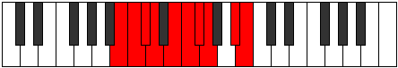

# Mode Dydygic

## Links

- [Documentation](index.md)
- [Scales Index](Scales.md)
- [Modes Index](Modes.md)
- [Chords Index](Chords.md)

## Parent Scale

[Dycrygic](ScaleDycrygic.md)

## Number

[2543](https://ianring.com/musictheory/scales/2543)

## Perfection

- 7 Perfect notes
- 2 Perfect notes

## Perfection Profile

[true true false false true true true true true]

## Permutations

| Tonic | Notes | Signature | Illustration | Audio |
|-------|-------|-----------|--------------|-------|
| [C](ModeCNaturalDydygic.md) | C, C#, **D**, **D#**, F, F#, G, G#, B, C | C |  | [midi](ModeCNaturalDydygic.mid) [ogg](ModeCNaturalDydygic.ogg) |
| [C#](ModeCSharpDydygic.md) | C#, D, **D#**, **E**, F#, G, G#, A, C, C# | C |  | [midi](ModeCSharpDydygic.mid) [ogg](ModeCSharpDydygic.ogg) |
| [Db](ModeDFlatDydygic.md) | Db, D, **Eb**, **E**, Gb, G, Ab, A, C, Db | C |  | [midi](ModeDFlatDydygic.mid) [ogg](ModeDFlatDydygic.ogg) |
| [D](ModeDNaturalDydygic.md) | D, D#, **E**, **F**, G, G#, A, A#, C#, D | C |  | [midi](ModeDNaturalDydygic.mid) [ogg](ModeDNaturalDydygic.ogg) |
| [D#](ModeDSharpDydygic.md) | D#, E, **F**, **F#**, G#, A, A#, B, D, D# | C |  | [midi](ModeDSharpDydygic.mid) [ogg](ModeDSharpDydygic.ogg) |
| [Eb](ModeEFlatDydygic.md) | Eb, E, **F**, **Gb**, Ab, A, Bb, B, D, Eb | C |  | [midi](ModeEFlatDydygic.mid) [ogg](ModeEFlatDydygic.ogg) |
| [E](ModeENaturalDydygic.md) | E, F, **F#**, **G**, A, A#, B, C, D#, E | C |  | [midi](ModeENaturalDydygic.mid) [ogg](ModeENaturalDydygic.ogg) |
| [F](ModeFNaturalDydygic.md) | F, F#, **G**, **G#**, A#, B, C, C#, E, F | C |  | [midi](ModeFNaturalDydygic.mid) [ogg](ModeFNaturalDydygic.ogg) |
| [F#](ModeFSharpDydygic.md) | F#, G, **G#**, **A**, B, C, C#, D, F, F# | C |  | [midi](ModeFSharpDydygic.mid) [ogg](ModeFSharpDydygic.ogg) |
| [Gb](ModeGFlatDydygic.md) | Gb, G, **Ab**, **A**, B, C, Db, D, F, Gb | C |  | [midi](ModeGFlatDydygic.mid) [ogg](ModeGFlatDydygic.ogg) |
| [G](ModeGNaturalDydygic.md) | G, G#, **A**, **A#**, C, C#, D, D#, F#, G | C |  | [midi](ModeGNaturalDydygic.mid) [ogg](ModeGNaturalDydygic.ogg) |
| [G#](ModeGSharpDydygic.md) | G#, A, **A#**, **B**, C#, D, D#, E, G, G# | C |  | [midi](ModeGSharpDydygic.mid) [ogg](ModeGSharpDydygic.ogg) |
| [Ab](ModeAFlatDydygic.md) | Ab, A, **Bb**, **B**, Db, D, Eb, E, G, Ab | C |  | [midi](ModeAFlatDydygic.mid) [ogg](ModeAFlatDydygic.ogg) |
| [A](ModeANaturalDydygic.md) | A, A#, **B**, **C**, D, D#, E, F, G#, A | C |  | [midi](ModeANaturalDydygic.mid) [ogg](ModeANaturalDydygic.ogg) |
| [A#](ModeASharpDydygic.md) | A#, B, **C**, **C#**, D#, E, F, F#, A, A# | C |  | [midi](ModeASharpDydygic.mid) [ogg](ModeASharpDydygic.ogg) |
| [Bb](ModeBFlatDydygic.md) | Bb, B, **C**, **Db**, Eb, E, F, Gb, A, Bb | C |  | [midi](ModeBFlatDydygic.mid) [ogg](ModeBFlatDydygic.ogg) |
| [B](ModeBNaturalDydygic.md) | B, C, **C#**, **D**, E, F, F#, G, A#, B | C |  | [midi](ModeBNaturalDydygic.mid) [ogg](ModeBNaturalDydygic.ogg) |
