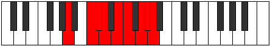

# Mode Dydyllic

## Links

- [Documentation](index.md)
- [Scales Index](Scales.md)
- [Modes Index](Modes.md)
- [Chords Index](Chords.md)

## Parent Scale

[Dydyllic](ScaleDydyllic.md)

## Number

[3513](https://ianring.com/musictheory/scales/3513)

## Perfection

- 6 Perfect notes
- 2 Perfect notes

## Perfection Profile

[true true true true false true true false]

## Permutations

| Tonic | Notes | Signature | Illustration | Audio |
|-------|-------|-----------|--------------|-------|
| [C](ModeCNaturalDydyllic.md) | C, D#, E, F, **G**, G#, A#, **B**, C | C |  | [midi](ModeCNaturalDydyllic.mid) [ogg](ModeCNaturalDydyllic.ogg) |
| [C#](ModeCSharpDydyllic.md) | C#, E, F, F#, **G#**, A, B, **C**, C# | C |  | [midi](ModeCSharpDydyllic.mid) [ogg](ModeCSharpDydyllic.ogg) |
| [Db](ModeDFlatDydyllic.md) | Db, E, F, Gb, **Ab**, A, B, **C**, Db | C |  | [midi](ModeDFlatDydyllic.mid) [ogg](ModeDFlatDydyllic.ogg) |
| [D](ModeDNaturalDydyllic.md) | D, F, F#, G, **A**, A#, C, **C#**, D | C |  | [midi](ModeDNaturalDydyllic.mid) [ogg](ModeDNaturalDydyllic.ogg) |
| [D#](ModeDSharpDydyllic.md) | D#, F#, G, G#, **A#**, B, C#, **D**, D# | C |  | [midi](ModeDSharpDydyllic.mid) [ogg](ModeDSharpDydyllic.ogg) |
| [Eb](ModeEFlatDydyllic.md) | Eb, Gb, G, Ab, **Bb**, B, Db, **D**, Eb | C |  | [midi](ModeEFlatDydyllic.mid) [ogg](ModeEFlatDydyllic.ogg) |
| [E](ModeENaturalDydyllic.md) | E, G, G#, A, **B**, C, D, **D#**, E | C |  | [midi](ModeENaturalDydyllic.mid) [ogg](ModeENaturalDydyllic.ogg) |
| [F](ModeFNaturalDydyllic.md) | F, G#, A, A#, **C**, C#, D#, **E**, F | C |  | [midi](ModeFNaturalDydyllic.mid) [ogg](ModeFNaturalDydyllic.ogg) |
| [F#](ModeFSharpDydyllic.md) | F#, A, A#, B, **C#**, D, E, **F**, F# | C |  | [midi](ModeFSharpDydyllic.mid) [ogg](ModeFSharpDydyllic.ogg) |
| [Gb](ModeGFlatDydyllic.md) | Gb, A, Bb, B, **Db**, D, E, **F**, Gb | C |  | [midi](ModeGFlatDydyllic.mid) [ogg](ModeGFlatDydyllic.ogg) |
| [G](ModeGNaturalDydyllic.md) | G, A#, B, C, **D**, D#, F, **F#**, G | C |  | [midi](ModeGNaturalDydyllic.mid) [ogg](ModeGNaturalDydyllic.ogg) |
| [G#](ModeGSharpDydyllic.md) | G#, B, C, C#, **D#**, E, F#, **G**, G# | C |  | [midi](ModeGSharpDydyllic.mid) [ogg](ModeGSharpDydyllic.ogg) |
| [Ab](ModeAFlatDydyllic.md) | Ab, B, C, Db, **Eb**, E, Gb, **G**, Ab | C |  | [midi](ModeAFlatDydyllic.mid) [ogg](ModeAFlatDydyllic.ogg) |
| [A](ModeANaturalDydyllic.md) | A, C, C#, D, **E**, F, G, **G#**, A | C |  | [midi](ModeANaturalDydyllic.mid) [ogg](ModeANaturalDydyllic.ogg) |
| [A#](ModeASharpDydyllic.md) | A#, C#, D, D#, **F**, F#, G#, **A**, A# | C |  | [midi](ModeASharpDydyllic.mid) [ogg](ModeASharpDydyllic.ogg) |
| [Bb](ModeBFlatDydyllic.md) | Bb, Db, D, Eb, **F**, Gb, Ab, **A**, Bb | C |  | [midi](ModeBFlatDydyllic.mid) [ogg](ModeBFlatDydyllic.ogg) |
| [B](ModeBNaturalDydyllic.md) | B, D, D#, E, **F#**, G, A, **A#**, B | C |  | [midi](ModeBNaturalDydyllic.mid) [ogg](ModeBNaturalDydyllic.ogg) |
