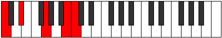
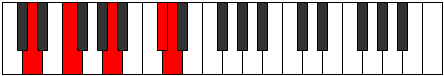
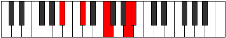

# Mode Dygic

## Links

- [Documentation](index.md)
- [Scales Index](Scales.md)
- [Modes Index](Modes.md)
- [Chords Index](Chords.md)

## Parent Scale

[Aeoloric](ScaleAeoloric.md)

## Number

[2185](https://ianring.com/musictheory/scales/2185)

## Perfection

- 1 Perfect notes
- 3 Perfect notes

## Perfection Profile

[true false false false]

## Permutations

| Tonic | Notes | Signature | Illustration | Audio |
|-------|-------|-----------|--------------|-------|
| [C](ModeCNaturalDygic.md) | C, **D#**, **G**, **B**, C | C |  | [midi](ModeCNaturalDygic.mid) [ogg](ModeCNaturalDygic.ogg) |
| [C#](ModeCSharpDygic.md) | C#, **E**, **G#**, **C**, C# | C |  | [midi](ModeCSharpDygic.mid) [ogg](ModeCSharpDygic.ogg) |
| [Db](ModeDFlatDygic.md) | Db, **E**, **Ab**, **C**, Db | C |  | [midi](ModeDFlatDygic.mid) [ogg](ModeDFlatDygic.ogg) |
| [D](ModeDNaturalDygic.md) | D, **F**, **A**, **C#**, D | C |  | [midi](ModeDNaturalDygic.mid) [ogg](ModeDNaturalDygic.ogg) |
| [D#](ModeDSharpDygic.md) | D#, **F#**, **A#**, **D**, D# | C |  | [midi](ModeDSharpDygic.mid) [ogg](ModeDSharpDygic.ogg) |
| [Eb](ModeEFlatDygic.md) | Eb, **Gb**, **Bb**, **D**, Eb | C |  | [midi](ModeEFlatDygic.mid) [ogg](ModeEFlatDygic.ogg) |
| [E](ModeENaturalDygic.md) | E, **G**, **B**, **D#**, E | C |  | [midi](ModeENaturalDygic.mid) [ogg](ModeENaturalDygic.ogg) |
| [F](ModeFNaturalDygic.md) | F, **G#**, **C**, **E**, F | C |  | [midi](ModeFNaturalDygic.mid) [ogg](ModeFNaturalDygic.ogg) |
| [F#](ModeFSharpDygic.md) | F#, **A**, **C#**, **F**, F# | C |  | [midi](ModeFSharpDygic.mid) [ogg](ModeFSharpDygic.ogg) |
| [Gb](ModeGFlatDygic.md) | Gb, **A**, **Db**, **F**, Gb | C |  | [midi](ModeGFlatDygic.mid) [ogg](ModeGFlatDygic.ogg) |
| [G](ModeGNaturalDygic.md) | G, **A#**, **D**, **F#**, G | C |  | [midi](ModeGNaturalDygic.mid) [ogg](ModeGNaturalDygic.ogg) |
| [G#](ModeGSharpDygic.md) | G#, **B**, **D#**, **G**, G# | C |  | [midi](ModeGSharpDygic.mid) [ogg](ModeGSharpDygic.ogg) |
| [Ab](ModeAFlatDygic.md) | Ab, **B**, **Eb**, **G**, Ab | C |  | [midi](ModeAFlatDygic.mid) [ogg](ModeAFlatDygic.ogg) |
| [A](ModeANaturalDygic.md) | A, **C**, **E**, **G#**, A | C |  | [midi](ModeANaturalDygic.mid) [ogg](ModeANaturalDygic.ogg) |
| [A#](ModeASharpDygic.md) | A#, **C#**, **F**, **A**, A# | C |  | [midi](ModeASharpDygic.mid) [ogg](ModeASharpDygic.ogg) |
| [Bb](ModeBFlatDygic.md) | Bb, **Db**, **F**, **A**, Bb | C |  | [midi](ModeBFlatDygic.mid) [ogg](ModeBFlatDygic.ogg) |
| [B](ModeBNaturalDygic.md) | B, **D**, **F#**, **A#**, B | C |  | [midi](ModeBNaturalDygic.mid) [ogg](ModeBNaturalDygic.ogg) |
