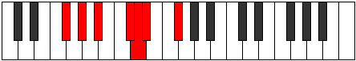
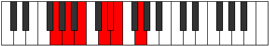

# Mode Dygimic

## Links

- [Documentation](README.md)
- [Scales Index](Scales.md)
- [Modes Index](Modes.md)
- [Chords Index](Chords.md)

## Parent Scale

[Dalimic](ScaleDalimic.md)

## Number

[917](https://ianring.com/musictheory/scales/917)

## Transposition

2, 2, 3, 1, 1, 3

## Chord Pattern

I⁺, III⁺, V⁺

## Perfection

- 4 Perfect notes
- 2 Perfect notes

## Perfection Profile

[true true false true false true]

## Permutations

| Tonic | Notes | Signature | Illustration | Audio |
|-------|-------|-----------|--------------|-------|
| [C](ModeCNaturalDygimic.md) | C, D, **E**, F##, **G#**, A, C | C |  | [midi](https://github.com/edipermadi/music/blob/main/docs/ModeCNaturalDygimic.mid?raw=true) |
| [C#](ModeCSharpDygimic.md) | C#, D#, **E#**, F###, **G##**, A#, C# | C |  | [midi](https://github.com/edipermadi/music/blob/main/docs/ModeCSharpDygimic.mid?raw=true) |
| [Db](ModeDFlatDygimic.md) | Db, Eb, **F**, G#, **A**, Bb, Db | C |  | [midi](https://github.com/edipermadi/music/blob/main/docs/ModeDFlatDygimic.mid?raw=true) |
| [D](ModeDNaturalDygimic.md) | D, E, **F#**, G##, **A#**, B, D | C |  | [midi](https://github.com/edipermadi/music/blob/main/docs/ModeDNaturalDygimic.mid?raw=true) |
| [D#](ModeDSharpDygimic.md) | D#, E#, **F##**, G###, **A##**, B#, D# | C |  | [midi](https://github.com/edipermadi/music/blob/main/docs/ModeDSharpDygimic.mid?raw=true) |
| [Eb](ModeEFlatDygimic.md) | Eb, F, **G**, A#, **B**, C, Eb | C |  | [midi](https://github.com/edipermadi/music/blob/main/docs/ModeEFlatDygimic.mid?raw=true) |
| [E](ModeENaturalDygimic.md) | E, F#, **G#**, A##, **B#**, C#, E | C |  | [midi](https://github.com/edipermadi/music/blob/main/docs/ModeENaturalDygimic.mid?raw=true) |
| [F](ModeFNaturalDygimic.md) | F, G, **A**, B#, **C#**, D, F | C |  | [midi](https://github.com/edipermadi/music/blob/main/docs/ModeFNaturalDygimic.mid?raw=true) |
| [F#](ModeFSharpDygimic.md) | F#, G#, **A#**, B##, **C##**, D#, F# | C |  | [midi](https://github.com/edipermadi/music/blob/main/docs/ModeFSharpDygimic.mid?raw=true) |
| [Gb](ModeGFlatDygimic.md) | Gb, Ab, **Bb**, C#, **D**, Eb, Gb | C |  | [midi](https://github.com/edipermadi/music/blob/main/docs/ModeGFlatDygimic.mid?raw=true) |
| [G](ModeGNaturalDygimic.md) | G, A, **B**, C##, **D#**, E, G | C |  | [midi](https://github.com/edipermadi/music/blob/main/docs/ModeGNaturalDygimic.mid?raw=true) |
| [G#](ModeGSharpDygimic.md) | G#, A#, **B#**, C###, **D##**, E#, G# | C |  | [midi](https://github.com/edipermadi/music/blob/main/docs/ModeGSharpDygimic.mid?raw=true) |
| [Ab](ModeAFlatDygimic.md) | Ab, Bb, **C**, D#, **E**, F, Ab | C |  | [midi](https://github.com/edipermadi/music/blob/main/docs/ModeAFlatDygimic.mid?raw=true) |
| [A](ModeANaturalDygimic.md) | A, B, **C#**, D##, **E#**, F#, A | C |  | [midi](https://github.com/edipermadi/music/blob/main/docs/ModeANaturalDygimic.mid?raw=true) |
| [A#](ModeASharpDygimic.md) | A#, B#, **C##**, D###, **E##**, F##, A# | C |  | [midi](https://github.com/edipermadi/music/blob/main/docs/ModeASharpDygimic.mid?raw=true) |
| [Bb](ModeBFlatDygimic.md) | Bb, C, **D**, E#, **F#**, G, Bb | C |  | [midi](https://github.com/edipermadi/music/blob/main/docs/ModeBFlatDygimic.mid?raw=true) |
| [B](ModeBNaturalDygimic.md) | B, C#, **D#**, E##, **F##**, G#, B | C |  | [midi](https://github.com/edipermadi/music/blob/main/docs/ModeBNaturalDygimic.mid?raw=true) |
