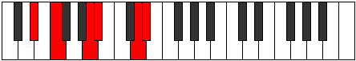
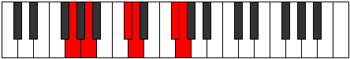

# Mode Dygitonic

## Links

- [Documentation](index.md)
- [Scales Index](Scales.md)
- [Modes Index](Modes.md)
- [Chords Index](Chords.md)

## Parent Scale

[Phraditonic](ScalePhraditonic.md)

## Number

[2245](https://ianring.com/musictheory/scales/2245)

## Interval Pattern

2, 4, 1, 4, 1

## Chord Pattern

## Perfection

- 3 Perfect notes
- 2 Perfect notes

## Perfection Profile

[true false false true true]

## Permutations

| Tonic | Notes | Signature | Illustration | Audio |
|-------|-------|-----------|--------------|-------|
| [C](ModeCNaturalDygitonic.md) | C, **D**, **F#**, G, B, C | C |  | [midi](https://github.com/edipermadi/music/blob/main/docs/ModeCNaturalDygitonic.mid?raw=true) |
| [C#](ModeCSharpDygitonic.md) | C#, **D#**, **G**, G#, C, C# | C |  | [midi](https://github.com/edipermadi/music/blob/main/docs/ModeCSharpDygitonic.mid?raw=true) |
| [Db](ModeDFlatDygitonic.md) | Db, **Eb**, **G**, Ab, C, Db | C |  | [midi](https://github.com/edipermadi/music/blob/main/docs/ModeDFlatDygitonic.mid?raw=true) |
| [D](ModeDNaturalDygitonic.md) | D, **E**, **G#**, A, C#, D | C |  | [midi](https://github.com/edipermadi/music/blob/main/docs/ModeDNaturalDygitonic.mid?raw=true) |
| [D#](ModeDSharpDygitonic.md) | D#, **F**, **A**, A#, D, D# | C |  | [midi](https://github.com/edipermadi/music/blob/main/docs/ModeDSharpDygitonic.mid?raw=true) |
| [Eb](ModeEFlatDygitonic.md) | Eb, **F**, **A**, Bb, D, Eb | C |  | [midi](https://github.com/edipermadi/music/blob/main/docs/ModeEFlatDygitonic.mid?raw=true) |
| [E](ModeENaturalDygitonic.md) | E, **F#**, **A#**, B, D#, E | C |  | [midi](https://github.com/edipermadi/music/blob/main/docs/ModeENaturalDygitonic.mid?raw=true) |
| [F](ModeFNaturalDygitonic.md) | F, **G**, **B**, C, E, F | C |  | [midi](https://github.com/edipermadi/music/blob/main/docs/ModeFNaturalDygitonic.mid?raw=true) |
| [F#](ModeFSharpDygitonic.md) | F#, **G#**, **C**, C#, F, F# | C |  | [midi](https://github.com/edipermadi/music/blob/main/docs/ModeFSharpDygitonic.mid?raw=true) |
| [Gb](ModeGFlatDygitonic.md) | Gb, **Ab**, **C**, Db, F, Gb | C |  | [midi](https://github.com/edipermadi/music/blob/main/docs/ModeGFlatDygitonic.mid?raw=true) |
| [G](ModeGNaturalDygitonic.md) | G, **A**, **C#**, D, F#, G | C |  | [midi](https://github.com/edipermadi/music/blob/main/docs/ModeGNaturalDygitonic.mid?raw=true) |
| [G#](ModeGSharpDygitonic.md) | G#, **A#**, **D**, D#, G, G# | C |  | [midi](https://github.com/edipermadi/music/blob/main/docs/ModeGSharpDygitonic.mid?raw=true) |
| [Ab](ModeAFlatDygitonic.md) | Ab, **Bb**, **D**, Eb, G, Ab | C |  | [midi](https://github.com/edipermadi/music/blob/main/docs/ModeAFlatDygitonic.mid?raw=true) |
| [A](ModeANaturalDygitonic.md) | A, **B**, **D#**, E, G#, A | C |  | [midi](https://github.com/edipermadi/music/blob/main/docs/ModeANaturalDygitonic.mid?raw=true) |
| [A#](ModeASharpDygitonic.md) | A#, **C**, **E**, F, A, A# | C |  | [midi](https://github.com/edipermadi/music/blob/main/docs/ModeASharpDygitonic.mid?raw=true) |
| [Bb](ModeBFlatDygitonic.md) | Bb, **C**, **E**, F, A, Bb | C |  | [midi](https://github.com/edipermadi/music/blob/main/docs/ModeBFlatDygitonic.mid?raw=true) |
| [B](ModeBNaturalDygitonic.md) | B, **C#**, **F**, F#, A#, B | C |  | [midi](https://github.com/edipermadi/music/blob/main/docs/ModeBNaturalDygitonic.mid?raw=true) |
