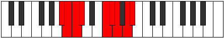

# Mode Dygyllic

## Links

- [Documentation](index.md)
- [Scales Index](Scales.md)
- [Modes Index](Modes.md)
- [Chords Index](Chords.md)

## Parent Scale

[Thagyllic](ScaleThagyllic.md)

## Number

[2959](https://ianring.com/musictheory/scales/2959)

## Perfection

- 5 Perfect notes
- 3 Perfect notes

## Perfection Profile

[true true true false true true false false]

## Permutations

| Tonic | Notes | Signature | Illustration | Audio |
|-------|-------|-----------|--------------|-------|
| [C](ModeCNaturalDygyllic.md) | C, C#, D, **D#**, G, G#, **A**, **B**, C | C |  | [midi](ModeCNaturalDygyllic.mid) [ogg](ModeCNaturalDygyllic.ogg) |
| [C#](ModeCSharpDygyllic.md) | C#, D, D#, **E**, G#, A, **A#**, **C**, C# | C |  | [midi](ModeCSharpDygyllic.mid) [ogg](ModeCSharpDygyllic.ogg) |
| [Db](ModeDFlatDygyllic.md) | Db, D, Eb, **E**, Ab, A, **Bb**, **C**, Db | C |  | [midi](ModeDFlatDygyllic.mid) [ogg](ModeDFlatDygyllic.ogg) |
| [D](ModeDNaturalDygyllic.md) | D, D#, E, **F**, A, A#, **B**, **C#**, D | C |  | [midi](ModeDNaturalDygyllic.mid) [ogg](ModeDNaturalDygyllic.ogg) |
| [D#](ModeDSharpDygyllic.md) | D#, E, F, **F#**, A#, B, **C**, **D**, D# | C |  | [midi](ModeDSharpDygyllic.mid) [ogg](ModeDSharpDygyllic.ogg) |
| [Eb](ModeEFlatDygyllic.md) | Eb, E, F, **Gb**, Bb, B, **C**, **D**, Eb | C |  | [midi](ModeEFlatDygyllic.mid) [ogg](ModeEFlatDygyllic.ogg) |
| [E](ModeENaturalDygyllic.md) | E, F, F#, **G**, B, C, **C#**, **D#**, E | C |  | [midi](ModeENaturalDygyllic.mid) [ogg](ModeENaturalDygyllic.ogg) |
| [F](ModeFNaturalDygyllic.md) | F, F#, G, **G#**, C, C#, **D**, **E**, F | C |  | [midi](ModeFNaturalDygyllic.mid) [ogg](ModeFNaturalDygyllic.ogg) |
| [F#](ModeFSharpDygyllic.md) | F#, G, G#, **A**, C#, D, **D#**, **F**, F# | C |  | [midi](ModeFSharpDygyllic.mid) [ogg](ModeFSharpDygyllic.ogg) |
| [Gb](ModeGFlatDygyllic.md) | Gb, G, Ab, **A**, Db, D, **Eb**, **F**, Gb | C |  | [midi](ModeGFlatDygyllic.mid) [ogg](ModeGFlatDygyllic.ogg) |
| [G](ModeGNaturalDygyllic.md) | G, G#, A, **A#**, D, D#, **E**, **F#**, G | C |  | [midi](ModeGNaturalDygyllic.mid) [ogg](ModeGNaturalDygyllic.ogg) |
| [G#](ModeGSharpDygyllic.md) | G#, A, A#, **B**, D#, E, **F**, **G**, G# | C |  | [midi](ModeGSharpDygyllic.mid) [ogg](ModeGSharpDygyllic.ogg) |
| [Ab](ModeAFlatDygyllic.md) | Ab, A, Bb, **B**, Eb, E, **F**, **G**, Ab | C |  | [midi](ModeAFlatDygyllic.mid) [ogg](ModeAFlatDygyllic.ogg) |
| [A](ModeANaturalDygyllic.md) | A, A#, B, **C**, E, F, **F#**, **G#**, A | C |  | [midi](ModeANaturalDygyllic.mid) [ogg](ModeANaturalDygyllic.ogg) |
| [A#](ModeASharpDygyllic.md) | A#, B, C, **C#**, F, F#, **G**, **A**, A# | C |  | [midi](ModeASharpDygyllic.mid) [ogg](ModeASharpDygyllic.ogg) |
| [Bb](ModeBFlatDygyllic.md) | Bb, B, C, **Db**, F, Gb, **G**, **A**, Bb | C |  | [midi](ModeBFlatDygyllic.mid) [ogg](ModeBFlatDygyllic.ogg) |
| [B](ModeBNaturalDygyllic.md) | B, C, C#, **D**, F#, G, **G#**, **A#**, B | C |  | [midi](ModeBNaturalDygyllic.mid) [ogg](ModeBNaturalDygyllic.ogg) |
