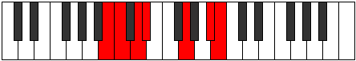

# Mode Dylimic

## Links

- [Documentation](index.md)
- [Scales Index](Scales.md)
- [Modes Index](Modes.md)
- [Chords Index](Chords.md)

## Parent Scale

[Bygimic](ScaleBygimic.md)

## Number

[2331](https://ianring.com/musictheory/scales/2331)

## Perfection

- 3 Perfect notes
- 3 Perfect notes

## Perfection Profile

[false true false true true false]

## Permutations

| Tonic | Notes | Signature | Illustration | Audio |
|-------|-------|-----------|--------------|-------|
| [C](ModeCNaturalDylimic.md) | **C**, Db, **Eb**, Fb, G#, **A##**, **C** | C |  | [midi](ModeCNaturalDylimic.mid) [ogg](ModeCNaturalDylimic.ogg) |
| [C#](ModeCSharpDylimic.md) | **C#**, D, **E**, F, G##, **A###**, **C#** | C |  | [midi](ModeCSharpDylimic.mid) [ogg](ModeCSharpDylimic.ogg) |
| [Db](ModeDFlatDylimic.md) | **Db**, Ebb, **Fb**, Gbb, A, **B#**, **Db** | C |  | [midi](ModeDFlatDylimic.mid) [ogg](ModeDFlatDylimic.ogg) |
| [D](ModeDNaturalDylimic.md) | **D**, Eb, **F**, Gb, A#, **B##**, **D** | C |  | [midi](ModeDNaturalDylimic.mid) [ogg](ModeDNaturalDylimic.ogg) |
| [D#](ModeDSharpDylimic.md) | **D#**, E, **F#**, G, A##, **B###**, **D#** | C |  | [midi](ModeDSharpDylimic.mid) [ogg](ModeDSharpDylimic.ogg) |
| [Eb](ModeEFlatDylimic.md) | **Eb**, Fb, **Gb**, Abb, B, **C##**, **Eb** | C |  | [midi](ModeEFlatDylimic.mid) [ogg](ModeEFlatDylimic.ogg) |
| [E](ModeENaturalDylimic.md) | **E**, F, **G**, Ab, B#, **C###**, **E** | C |  | [midi](ModeENaturalDylimic.mid) [ogg](ModeENaturalDylimic.ogg) |
| [F](ModeFNaturalDylimic.md) | **F**, Gb, **Ab**, Bbb, C#, **D##**, **F** | C |  | [midi](ModeFNaturalDylimic.mid) [ogg](ModeFNaturalDylimic.ogg) |
| [F#](ModeFSharpDylimic.md) | **F#**, G, **A**, Bb, C##, **D###**, **F#** | C |  | [midi](ModeFSharpDylimic.mid) [ogg](ModeFSharpDylimic.ogg) |
| [Gb](ModeGFlatDylimic.md) | **Gb**, Abb, **Bbb**, Cbb, D, **E#**, **Gb** | C |  | [midi](ModeGFlatDylimic.mid) [ogg](ModeGFlatDylimic.ogg) |
| [G](ModeGNaturalDylimic.md) | **G**, Ab, **Bb**, Cb, D#, **E##**, **G** | C |  | [midi](ModeGNaturalDylimic.mid) [ogg](ModeGNaturalDylimic.ogg) |
| [G#](ModeGSharpDylimic.md) | **G#**, A, **B**, C, D##, **E###**, **G#** | C |  | [midi](ModeGSharpDylimic.mid) [ogg](ModeGSharpDylimic.ogg) |
| [Ab](ModeAFlatDylimic.md) | **Ab**, Bbb, **Cb**, Dbb, E, **F##**, **Ab** | C |  | [midi](ModeAFlatDylimic.mid) [ogg](ModeAFlatDylimic.ogg) |
| [A](ModeANaturalDylimic.md) | **A**, Bb, **C**, Db, E#, **F###**, **A** | C |  | [midi](ModeANaturalDylimic.mid) [ogg](ModeANaturalDylimic.ogg) |
| [A#](ModeASharpDylimic.md) | **A#**, B, **C#**, D, E##, **Cbbb**, **A#** | C |  | [midi](ModeASharpDylimic.mid) [ogg](ModeASharpDylimic.ogg) |
| [Bb](ModeBFlatDylimic.md) | **Bb**, Cb, **Db**, Ebb, F#, **G##**, **Bb** | C |  | [midi](ModeBFlatDylimic.mid) [ogg](ModeBFlatDylimic.ogg) |
| [B](ModeBNaturalDylimic.md) | **B**, C, **D**, Eb, F##, **G###**, **B** | C |  | [midi](ModeBNaturalDylimic.mid) [ogg](ModeBNaturalDylimic.ogg) |
