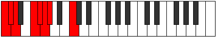

# Mode Dynian

## Links

- [Documentation](README.md)
- [Scales Index](Scales.md)
- [Modes Index](Modes.md)
- [Chords Index](Chords.md)

## Parent Scale

[Ionarian](ScaleIonarian.md)

## Number

[487](https://ianring.com/musictheory/scales/487)

## Interval Pattern

1, 1, 3, 1, 1, 1, 4

## Chord Pattern

## Perfection

- 5 Perfect notes
- 2 Perfect notes

## Perfection Profile

[true true false true true true false]

## Permutations

| Tonic | Notes | Signature | Illustration | Audio |
|-------|-------|-----------|--------------|-------|
| [C](ModeCNaturalDynian.md) | C, Db, **Ebb**, F, Gb, Abb, **Bbbb**, C | C |  | [midi](https://github.com/edipermadi/music/blob/main/docs/ModeCNaturalDynian.mid?raw=true) |
| [C#](ModeCSharpDynian.md) | C#, D, **Eb**, F#, G, Ab, **Bbb**, C# | C |  | [midi](https://github.com/edipermadi/music/blob/main/docs/ModeCSharpDynian.mid?raw=true) |
| [Db](ModeDFlatDynian.md) | Db, Ebb, **Fbb**, Gb, Abb, Bbbb, **Cbbb**, Db | C |  | [midi](https://github.com/edipermadi/music/blob/main/docs/ModeDFlatDynian.mid?raw=true) |
| [D](ModeDNaturalDynian.md) | D, Eb, **Fb**, G, Ab, Bbb, **Cbb**, D | C |  | [midi](https://github.com/edipermadi/music/blob/main/docs/ModeDNaturalDynian.mid?raw=true) |
| [D#](ModeDSharpDynian.md) | D#, E, **F**, G#, A, Bb, **Cb**, D# | C |  | [midi](https://github.com/edipermadi/music/blob/main/docs/ModeDSharpDynian.mid?raw=true) |
| [Eb](ModeEFlatDynian.md) | Eb, Fb, **Gbb**, Ab, Bbb, Cbb, **Dbbb**, Eb | C |  | [midi](https://github.com/edipermadi/music/blob/main/docs/ModeEFlatDynian.mid?raw=true) |
| [E](ModeENaturalDynian.md) | E, F, **Gb**, A, Bb, Cb, **Dbb**, E | C |  | [midi](https://github.com/edipermadi/music/blob/main/docs/ModeENaturalDynian.mid?raw=true) |
| [F](ModeFNaturalDynian.md) | F, Gb, **Abb**, Bb, Cb, Dbb, **Ebbb**, F | C |  | [midi](https://github.com/edipermadi/music/blob/main/docs/ModeFNaturalDynian.mid?raw=true) |
| [F#](ModeFSharpDynian.md) | F#, G, **Ab**, B, C, Db, **Ebb**, F# | C |  | [midi](https://github.com/edipermadi/music/blob/main/docs/ModeFSharpDynian.mid?raw=true) |
| [Gb](ModeGFlatDynian.md) | Gb, Abb, **Bbbb**, Cb, Dbb, Ebbb, **Fbbb**, Gb | C |  | [midi](https://github.com/edipermadi/music/blob/main/docs/ModeGFlatDynian.mid?raw=true) |
| [G](ModeGNaturalDynian.md) | G, Ab, **Bbb**, C, Db, Ebb, **Fbb**, G | C |  | [midi](https://github.com/edipermadi/music/blob/main/docs/ModeGNaturalDynian.mid?raw=true) |
| [G#](ModeGSharpDynian.md) | G#, A, **Bb**, C#, D, Eb, **Fb**, G# | C |  | [midi](https://github.com/edipermadi/music/blob/main/docs/ModeGSharpDynian.mid?raw=true) |
| [Ab](ModeAFlatDynian.md) | Ab, Bbb, **Cbb**, Db, Ebb, Fbb, **Gbbb**, Ab | C |  | [midi](https://github.com/edipermadi/music/blob/main/docs/ModeAFlatDynian.mid?raw=true) |
| [A](ModeANaturalDynian.md) | A, Bb, **Cb**, D, Eb, Fb, **Gbb**, A | C |  | [midi](https://github.com/edipermadi/music/blob/main/docs/ModeANaturalDynian.mid?raw=true) |
| [A#](ModeASharpDynian.md) | A#, B, **C**, D#, E, F, **Gb**, A# | C |  | [midi](https://github.com/edipermadi/music/blob/main/docs/ModeASharpDynian.mid?raw=true) |
| [Bb](ModeBFlatDynian.md) | Bb, Cb, **Dbb**, Eb, Fb, Gbb, **Abbb**, Bb | C |  | [midi](https://github.com/edipermadi/music/blob/main/docs/ModeBFlatDynian.mid?raw=true) |
| [B](ModeBNaturalDynian.md) | B, C, **Db**, E, F, Gb, **Abb**, B | C |  | [midi](https://github.com/edipermadi/music/blob/main/docs/ModeBNaturalDynian.mid?raw=true) |
