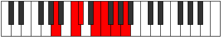

# Mode Dynimic

## Links

- [Documentation](README.md)
- [Scales Index](Scales.md)
- [Modes Index](Modes.md)
- [Chords Index](Chords.md)

## Parent Scale

[Dynimic](ScaleDynimic.md)

## Number

[1433](https://ianring.com/musictheory/scales/1433)

## Luminosity

6

## Transposition

3, 1, 3, 1, 2, 2

## Chord Pattern

I⁺, II, III⁺, V⁺

## Perfection

- 3 Perfect notes
- 3 Perfect notes

## Perfection Profile

true, true, false, false, true, false

## Permutations

| Tonic | Notes | Signature | Illustration | Audio |
|-------|-------|-----------|--------------|-------|
| [C](ModeCNaturalDynimic.md) | C, D#, **E**, **F##**, G#, **A#**, C | C |  | [midi](https://github.com/edipermadi/music/blob/main/docs/ModeCNaturalDynimic.mid?raw=true) |
| [C#](ModeCSharpDynimic.md) | C#, D##, **E#**, **F###**, G##, **A##**, C# | C |  | [midi](https://github.com/edipermadi/music/blob/main/docs/ModeCSharpDynimic.mid?raw=true) |
| [Db](ModeDFlatDynimic.md) | Db, E, **F**, **G#**, A, **B**, Db | C |  | [midi](https://github.com/edipermadi/music/blob/main/docs/ModeDFlatDynimic.mid?raw=true) |
| [D](ModeDNaturalDynimic.md) | D, E#, **F#**, **G##**, A#, **B#**, D | C |  | [midi](https://github.com/edipermadi/music/blob/main/docs/ModeDNaturalDynimic.mid?raw=true) |
| [D#](ModeDSharpDynimic.md) | D#, E##, **F##**, **G###**, A##, **B##**, D# | C |  | [midi](https://github.com/edipermadi/music/blob/main/docs/ModeDSharpDynimic.mid?raw=true) |
| [Eb](ModeEFlatDynimic.md) | Eb, F#, **G**, **A#**, B, **C#**, Eb | C |  | [midi](https://github.com/edipermadi/music/blob/main/docs/ModeEFlatDynimic.mid?raw=true) |
| [E](ModeENaturalDynimic.md) | E, F##, **G#**, **A##**, B#, **C##**, E | C |  | [midi](https://github.com/edipermadi/music/blob/main/docs/ModeENaturalDynimic.mid?raw=true) |
| [F](ModeFNaturalDynimic.md) | F, G#, **A**, **B#**, C#, **D#**, F | C |  | [midi](https://github.com/edipermadi/music/blob/main/docs/ModeFNaturalDynimic.mid?raw=true) |
| [F#](ModeFSharpDynimic.md) | F#, G##, **A#**, **B##**, C##, **D##**, F# | C |  | [midi](https://github.com/edipermadi/music/blob/main/docs/ModeFSharpDynimic.mid?raw=true) |
| [Gb](ModeGFlatDynimic.md) | Gb, A, **Bb**, **C#**, D, **E**, Gb | C |  | [midi](https://github.com/edipermadi/music/blob/main/docs/ModeGFlatDynimic.mid?raw=true) |
| [G](ModeGNaturalDynimic.md) | G, A#, **B**, **C##**, D#, **E#**, G | C |  | [midi](https://github.com/edipermadi/music/blob/main/docs/ModeGNaturalDynimic.mid?raw=true) |
| [G#](ModeGSharpDynimic.md) | G#, A##, **B#**, **C###**, D##, **E##**, G# | C |  | [midi](https://github.com/edipermadi/music/blob/main/docs/ModeGSharpDynimic.mid?raw=true) |
| [Ab](ModeAFlatDynimic.md) | Ab, B, **C**, **D#**, E, **F#**, Ab | C |  | [midi](https://github.com/edipermadi/music/blob/main/docs/ModeAFlatDynimic.mid?raw=true) |
| [A](ModeANaturalDynimic.md) | A, B#, **C#**, **D##**, E#, **F##**, A | C |  | [midi](https://github.com/edipermadi/music/blob/main/docs/ModeANaturalDynimic.mid?raw=true) |
| [A#](ModeASharpDynimic.md) | A#, B##, **C##**, **D###**, E##, **F###**, A# | C |  | [midi](https://github.com/edipermadi/music/blob/main/docs/ModeASharpDynimic.mid?raw=true) |
| [Bb](ModeBFlatDynimic.md) | Bb, C#, **D**, **E#**, F#, **G#**, Bb | C |  | [midi](https://github.com/edipermadi/music/blob/main/docs/ModeBFlatDynimic.mid?raw=true) |
| [B](ModeBNaturalDynimic.md) | B, C##, **D#**, **E##**, F##, **G##**, B | C |  | [midi](https://github.com/edipermadi/music/blob/main/docs/ModeBNaturalDynimic.mid?raw=true) |
