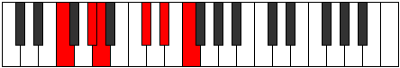

# Mode Dynitonic

## Links

- [Documentation](index.md)
- [Scales Index](Scales.md)
- [Modes Index](Modes.md)
- [Chords Index](Chords.md)

## Parent Scale

[Aeolanitonic](ScaleAeolanitonic.md)

## Number

[1305](https://ianring.com/musictheory/scales/1305)

## Perfection

- 2 Perfect notes
- 3 Perfect notes

## Perfection Profile

[false true false true false]

## Permutations

| Tonic | Notes | Signature | Illustration | Audio |
|-------|-------|-----------|--------------|-------|
| [C](ModeCNaturalDynitonic.md) | **C**, D#, **E**, G#, **A#**, **C** | C |  | [midi](ModeCNaturalDynitonic.mid) [ogg](ModeCNaturalDynitonic.ogg) |
| [C#](ModeCSharpDynitonic.md) | **C#**, E, **F**, A, **B**, **C#** | C |  | [midi](ModeCSharpDynitonic.mid) [ogg](ModeCSharpDynitonic.ogg) |
| [Db](ModeDFlatDynitonic.md) | **Db**, E, **F**, A, **B**, **Db** | C |  | [midi](ModeDFlatDynitonic.mid) [ogg](ModeDFlatDynitonic.ogg) |
| [D](ModeDNaturalDynitonic.md) | **D**, F, **F#**, A#, **C**, **D** | C |  | [midi](ModeDNaturalDynitonic.mid) [ogg](ModeDNaturalDynitonic.ogg) |
| [D#](ModeDSharpDynitonic.md) | **D#**, F#, **G**, B, **C#**, **D#** | C |  | [midi](ModeDSharpDynitonic.mid) [ogg](ModeDSharpDynitonic.ogg) |
| [Eb](ModeEFlatDynitonic.md) | **Eb**, Gb, **G**, B, **Db**, **Eb** | C |  | [midi](ModeEFlatDynitonic.mid) [ogg](ModeEFlatDynitonic.ogg) |
| [E](ModeENaturalDynitonic.md) | **E**, G, **G#**, C, **D**, **E** | C |  | [midi](ModeENaturalDynitonic.mid) [ogg](ModeENaturalDynitonic.ogg) |
| [F](ModeFNaturalDynitonic.md) | **F**, G#, **A**, C#, **D#**, **F** | C |  | [midi](ModeFNaturalDynitonic.mid) [ogg](ModeFNaturalDynitonic.ogg) |
| [F#](ModeFSharpDynitonic.md) | **F#**, A, **A#**, D, **E**, **F#** | C |  | [midi](ModeFSharpDynitonic.mid) [ogg](ModeFSharpDynitonic.ogg) |
| [Gb](ModeGFlatDynitonic.md) | **Gb**, A, **Bb**, D, **E**, **Gb** | C |  | [midi](ModeGFlatDynitonic.mid) [ogg](ModeGFlatDynitonic.ogg) |
| [G](ModeGNaturalDynitonic.md) | **G**, A#, **B**, D#, **F**, **G** | C |  | [midi](ModeGNaturalDynitonic.mid) [ogg](ModeGNaturalDynitonic.ogg) |
| [G#](ModeGSharpDynitonic.md) | **G#**, B, **C**, E, **F#**, **G#** | C |  | [midi](ModeGSharpDynitonic.mid) [ogg](ModeGSharpDynitonic.ogg) |
| [Ab](ModeAFlatDynitonic.md) | **Ab**, B, **C**, E, **Gb**, **Ab** | C |  | [midi](ModeAFlatDynitonic.mid) [ogg](ModeAFlatDynitonic.ogg) |
| [A](ModeANaturalDynitonic.md) | **A**, C, **C#**, F, **G**, **A** | C |  | [midi](ModeANaturalDynitonic.mid) [ogg](ModeANaturalDynitonic.ogg) |
| [A#](ModeASharpDynitonic.md) | **A#**, C#, **D**, F#, **G#**, **A#** | C |  | [midi](ModeASharpDynitonic.mid) [ogg](ModeASharpDynitonic.ogg) |
| [Bb](ModeBFlatDynitonic.md) | **Bb**, Db, **D**, Gb, **Ab**, **Bb** | C |  | [midi](ModeBFlatDynitonic.mid) [ogg](ModeBFlatDynitonic.ogg) |
| [B](ModeBNaturalDynitonic.md) | **B**, D, **D#**, G, **A**, **B** | C |  | [midi](ModeBNaturalDynitonic.mid) [ogg](ModeBNaturalDynitonic.ogg) |
