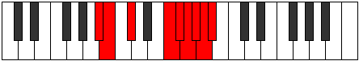

# Mode Dynyllic

## Links

- [Documentation](index.md)
- [Scales Index](Scales.md)
- [Modes Index](Modes.md)
- [Chords Index](Chords.md)

## Parent Scale

[Stolyllic](ScaleStolyllic.md)

## Number

[3979](https://ianring.com/musictheory/scales/3979)

## Perfection

- 4 Perfect notes
- 4 Perfect notes

## Perfection Profile

[true true true false true false false false]

## Permutations

| Tonic | Notes | Signature | Illustration | Audio |
|-------|-------|-----------|--------------|-------|
| [C](ModeCNaturalDynyllic.md) | C, C#, D#, **G**, G#, **A**, **A#**, **B**, C | C |  | [midi](https://github.com/edipermadi/music/blob/main/docs/ModeCNaturalDynyllic.mid?raw=true) |
| [C#](ModeCSharpDynyllic.md) | C#, D, E, **G#**, A, **A#**, **B**, **C**, C# | C |  | [midi](https://github.com/edipermadi/music/blob/main/docs/ModeCSharpDynyllic.mid?raw=true) |
| [Db](ModeDFlatDynyllic.md) | Db, D, E, **Ab**, A, **Bb**, **B**, **C**, Db | C |  | [midi](https://github.com/edipermadi/music/blob/main/docs/ModeDFlatDynyllic.mid?raw=true) |
| [D](ModeDNaturalDynyllic.md) | D, D#, F, **A**, A#, **B**, **C**, **C#**, D | C |  | [midi](https://github.com/edipermadi/music/blob/main/docs/ModeDNaturalDynyllic.mid?raw=true) |
| [D#](ModeDSharpDynyllic.md) | D#, E, F#, **A#**, B, **C**, **C#**, **D**, D# | C |  | [midi](https://github.com/edipermadi/music/blob/main/docs/ModeDSharpDynyllic.mid?raw=true) |
| [Eb](ModeEFlatDynyllic.md) | Eb, E, Gb, **Bb**, B, **C**, **Db**, **D**, Eb | C |  | [midi](https://github.com/edipermadi/music/blob/main/docs/ModeEFlatDynyllic.mid?raw=true) |
| [E](ModeENaturalDynyllic.md) | E, F, G, **B**, C, **C#**, **D**, **D#**, E | C |  | [midi](https://github.com/edipermadi/music/blob/main/docs/ModeENaturalDynyllic.mid?raw=true) |
| [F](ModeFNaturalDynyllic.md) | F, F#, G#, **C**, C#, **D**, **D#**, **E**, F | C |  | [midi](https://github.com/edipermadi/music/blob/main/docs/ModeFNaturalDynyllic.mid?raw=true) |
| [F#](ModeFSharpDynyllic.md) | F#, G, A, **C#**, D, **D#**, **E**, **F**, F# | C |  | [midi](https://github.com/edipermadi/music/blob/main/docs/ModeFSharpDynyllic.mid?raw=true) |
| [Gb](ModeGFlatDynyllic.md) | Gb, G, A, **Db**, D, **Eb**, **E**, **F**, Gb | C |  | [midi](https://github.com/edipermadi/music/blob/main/docs/ModeGFlatDynyllic.mid?raw=true) |
| [G](ModeGNaturalDynyllic.md) | G, G#, A#, **D**, D#, **E**, **F**, **F#**, G | C |  | [midi](https://github.com/edipermadi/music/blob/main/docs/ModeGNaturalDynyllic.mid?raw=true) |
| [G#](ModeGSharpDynyllic.md) | G#, A, B, **D#**, E, **F**, **F#**, **G**, G# | C |  | [midi](https://github.com/edipermadi/music/blob/main/docs/ModeGSharpDynyllic.mid?raw=true) |
| [Ab](ModeAFlatDynyllic.md) | Ab, A, B, **Eb**, E, **F**, **Gb**, **G**, Ab | C |  | [midi](https://github.com/edipermadi/music/blob/main/docs/ModeAFlatDynyllic.mid?raw=true) |
| [A](ModeANaturalDynyllic.md) | A, A#, C, **E**, F, **F#**, **G**, **G#**, A | C |  | [midi](https://github.com/edipermadi/music/blob/main/docs/ModeANaturalDynyllic.mid?raw=true) |
| [A#](ModeASharpDynyllic.md) | A#, B, C#, **F**, F#, **G**, **G#**, **A**, A# | C |  | [midi](https://github.com/edipermadi/music/blob/main/docs/ModeASharpDynyllic.mid?raw=true) |
| [Bb](ModeBFlatDynyllic.md) | Bb, B, Db, **F**, Gb, **G**, **Ab**, **A**, Bb | C |  | [midi](https://github.com/edipermadi/music/blob/main/docs/ModeBFlatDynyllic.mid?raw=true) |
| [B](ModeBNaturalDynyllic.md) | B, C, D, **F#**, G, **G#**, **A**, **A#**, B | C |  | [midi](https://github.com/edipermadi/music/blob/main/docs/ModeBNaturalDynyllic.mid?raw=true) |
