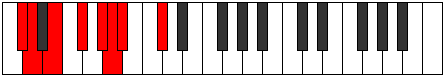
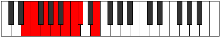
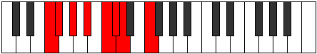
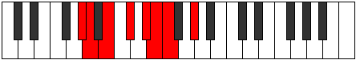
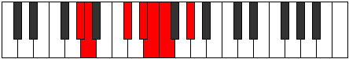

# Mode Dyptian

## Links

- [Documentation](index.md)
- [Scales Index](Scales.md)
- [Modes Index](Modes.md)
- [Chords Index](Chords.md)

## Parent Scale

[Golian](ScaleGolian.md)

## Number

[939](https://ianring.com/musictheory/scales/939)

## Perfection

- 4 Perfect notes
- 3 Perfect notes

## Interval Pattern

1, 2, 2, 2, 1, 1, 3

## Perfection Profile

[true true false true false true false]

## Permutations

| Tonic | Notes | Signature | Illustration | Audio |
|-------|-------|-----------|--------------|-------|
| [C](ModeCNaturalDyptian.md) | C, Db, **Eb**, F, **G**, Ab, **Bbb**, C | C |  | [midi](https://github.com/edipermadi/music/blob/main/docs/ModeCNaturalDyptian.mid?raw=true) |
| [C#](ModeCSharpDyptian.md) | C#, D, **E**, F#, **G#**, A, **Bb**, C# | C |  | [midi](https://github.com/edipermadi/music/blob/main/docs/ModeCSharpDyptian.mid?raw=true) |
| [Db](ModeDFlatDyptian.md) | Db, Ebb, **Fb**, Gb, **Ab**, Bbb, **Cbb**, Db | C |  | [midi](https://github.com/edipermadi/music/blob/main/docs/ModeDFlatDyptian.mid?raw=true) |
| [D](ModeDNaturalDyptian.md) | D, Eb, **F**, G, **A**, Bb, **Cb**, D | C |  | [midi](https://github.com/edipermadi/music/blob/main/docs/ModeDNaturalDyptian.mid?raw=true) |
| [D#](ModeDSharpDyptian.md) | D#, E, **F#**, G#, **A#**, B, **C**, D# | C |  | [midi](https://github.com/edipermadi/music/blob/main/docs/ModeDSharpDyptian.mid?raw=true) |
| [Eb](ModeEFlatDyptian.md) | Eb, Fb, **Gb**, Ab, **Bb**, Cb, **Dbb**, Eb | C |  | [midi](https://github.com/edipermadi/music/blob/main/docs/ModeEFlatDyptian.mid?raw=true) |
| [E](ModeENaturalDyptian.md) | E, F, **G**, A, **B**, C, **Db**, E | C |  | [midi](https://github.com/edipermadi/music/blob/main/docs/ModeENaturalDyptian.mid?raw=true) |
| [F](ModeFNaturalDyptian.md) | F, Gb, **Ab**, Bb, **C**, Db, **Ebb**, F | C |  | [midi](https://github.com/edipermadi/music/blob/main/docs/ModeFNaturalDyptian.mid?raw=true) |
| [F#](ModeFSharpDyptian.md) | F#, G, **A**, B, **C#**, D, **Eb**, F# | C |  | [midi](https://github.com/edipermadi/music/blob/main/docs/ModeFSharpDyptian.mid?raw=true) |
| [Gb](ModeGFlatDyptian.md) | Gb, Abb, **Bbb**, Cb, **Db**, Ebb, **Fbb**, Gb | C |  | [midi](https://github.com/edipermadi/music/blob/main/docs/ModeGFlatDyptian.mid?raw=true) |
| [G](ModeGNaturalDyptian.md) | G, Ab, **Bb**, C, **D**, Eb, **Fb**, G | C |  | [midi](https://github.com/edipermadi/music/blob/main/docs/ModeGNaturalDyptian.mid?raw=true) |
| [G#](ModeGSharpDyptian.md) | G#, A, **B**, C#, **D#**, E, **F**, G# | C |  | [midi](https://github.com/edipermadi/music/blob/main/docs/ModeGSharpDyptian.mid?raw=true) |
| [Ab](ModeAFlatDyptian.md) | Ab, Bbb, **Cb**, Db, **Eb**, Fb, **Gbb**, Ab | C |  | [midi](https://github.com/edipermadi/music/blob/main/docs/ModeAFlatDyptian.mid?raw=true) |
| [A](ModeANaturalDyptian.md) | A, Bb, **C**, D, **E**, F, **Gb**, A | C |  | [midi](https://github.com/edipermadi/music/blob/main/docs/ModeANaturalDyptian.mid?raw=true) |
| [A#](ModeASharpDyptian.md) | A#, B, **C#**, D#, **E#**, F#, **G**, A# | C |  | [midi](https://github.com/edipermadi/music/blob/main/docs/ModeASharpDyptian.mid?raw=true) |
| [Bb](ModeBFlatDyptian.md) | Bb, Cb, **Db**, Eb, **F**, Gb, **Abb**, Bb | C |  | [midi](https://github.com/edipermadi/music/blob/main/docs/ModeBFlatDyptian.mid?raw=true) |
| [B](ModeBNaturalDyptian.md) | B, C, **D**, E, **F#**, G, **Ab**, B | C |  | [midi](https://github.com/edipermadi/music/blob/main/docs/ModeBNaturalDyptian.mid?raw=true) |
