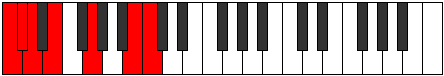
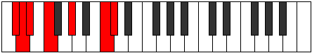
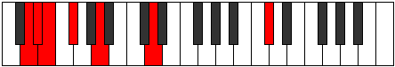
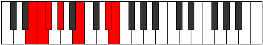
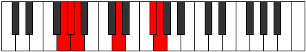
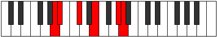
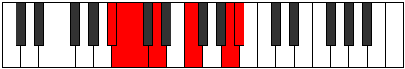
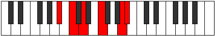

# Mode Dyptimic

## Links

- [Documentation](index.md)
- [Scales Index](Scales.md)
- [Modes Index](Modes.md)
- [Chords Index](Chords.md)

## Parent Scale

[Kytrimic](ScaleKytrimic.md)

## Number

[2199](https://ianring.com/musictheory/scales/2199)

## Perfection

- 3 Perfect notes
- 3 Perfect notes

## Interval Pattern

1, 1, 2, 3, 4, 1

## Perfection Profile

[true false false true true false]

## Permutations

| Tonic | Notes | Signature | Illustration | Audio |
|-------|-------|-----------|--------------|-------|
| [C](ModeCNaturalDyptimic.md) | C, **Db**, **Ebb**, Fb, G, **A##**, C | C |  | [midi](https://github.com/edipermadi/music/blob/main/docs/ModeCNaturalDyptimic.mid?raw=true) |
| [C#](ModeCSharpDyptimic.md) | C#, **D**, **Eb**, F, G#, **A###**, C# | C |  | [midi](https://github.com/edipermadi/music/blob/main/docs/ModeCSharpDyptimic.mid?raw=true) |
| [Db](ModeDFlatDyptimic.md) | Db, **Ebb**, **Fbb**, Gbb, Ab, **B#**, Db | C |  | [midi](https://github.com/edipermadi/music/blob/main/docs/ModeDFlatDyptimic.mid?raw=true) |
| [D](ModeDNaturalDyptimic.md) | D, **Eb**, **Fb**, Gb, A, **B##**, D | C |  | [midi](https://github.com/edipermadi/music/blob/main/docs/ModeDNaturalDyptimic.mid?raw=true) |
| [D#](ModeDSharpDyptimic.md) | D#, **E**, **F**, G, A#, **B###**, D# | C |  | [midi](https://github.com/edipermadi/music/blob/main/docs/ModeDSharpDyptimic.mid?raw=true) |
| [Eb](ModeEFlatDyptimic.md) | Eb, **Fb**, **Gbb**, Abb, Bb, **C##**, Eb | C |  | [midi](https://github.com/edipermadi/music/blob/main/docs/ModeEFlatDyptimic.mid?raw=true) |
| [E](ModeENaturalDyptimic.md) | E, **F**, **Gb**, Ab, B, **C###**, E | C |  | [midi](https://github.com/edipermadi/music/blob/main/docs/ModeENaturalDyptimic.mid?raw=true) |
| [F](ModeFNaturalDyptimic.md) | F, **Gb**, **Abb**, Bbb, C, **D##**, F | C |  | [midi](https://github.com/edipermadi/music/blob/main/docs/ModeFNaturalDyptimic.mid?raw=true) |
| [F#](ModeFSharpDyptimic.md) | F#, **G**, **Ab**, Bb, C#, **D###**, F# | C |  | [midi](https://github.com/edipermadi/music/blob/main/docs/ModeFSharpDyptimic.mid?raw=true) |
| [Gb](ModeGFlatDyptimic.md) | Gb, **Abb**, **Bbbb**, Cbb, Db, **E#**, Gb | C |  | [midi](https://github.com/edipermadi/music/blob/main/docs/ModeGFlatDyptimic.mid?raw=true) |
| [G](ModeGNaturalDyptimic.md) | G, **Ab**, **Bbb**, Cb, D, **E##**, G | C |  | [midi](https://github.com/edipermadi/music/blob/main/docs/ModeGNaturalDyptimic.mid?raw=true) |
| [G#](ModeGSharpDyptimic.md) | G#, **A**, **Bb**, C, D#, **E###**, G# | C |  | [midi](https://github.com/edipermadi/music/blob/main/docs/ModeGSharpDyptimic.mid?raw=true) |
| [Ab](ModeAFlatDyptimic.md) | Ab, **Bbb**, **Cbb**, Dbb, Eb, **F##**, Ab | C |  | [midi](https://github.com/edipermadi/music/blob/main/docs/ModeAFlatDyptimic.mid?raw=true) |
| [A](ModeANaturalDyptimic.md) | A, **Bb**, **Cb**, Db, E, **F###**, A | C |  | [midi](https://github.com/edipermadi/music/blob/main/docs/ModeANaturalDyptimic.mid?raw=true) |
| [A#](ModeASharpDyptimic.md) | A#, **B**, **C**, D, E#, **Cbbb**, A# | C |  | [midi](https://github.com/edipermadi/music/blob/main/docs/ModeASharpDyptimic.mid?raw=true) |
| [Bb](ModeBFlatDyptimic.md) | Bb, **Cb**, **Dbb**, Ebb, F, **G##**, Bb | C |  | [midi](https://github.com/edipermadi/music/blob/main/docs/ModeBFlatDyptimic.mid?raw=true) |
| [B](ModeBNaturalDyptimic.md) | B, **C**, **Db**, Eb, F#, **G###**, B | C |  | [midi](https://github.com/edipermadi/music/blob/main/docs/ModeBNaturalDyptimic.mid?raw=true) |
