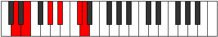

# Mode Dyptitonic

## Links

- [Documentation](README.md)
- [Scales Index](Scales.md)
- [Modes Index](Modes.md)
- [Chords Index](Chords.md)

## Parent Scale

[Phronitonic](ScalePhronitonic.md)

## Number

[2373](https://ianring.com/musictheory/scales/2373)

## Transposition

2, 4, 2, 3, 1

## Chord Pattern

## Perfection

- 1 Perfect notes
- 4 Perfect notes

## Perfection Profile

false, false, false, false, true

## Permutations

| Tonic | Notes | Signature | Illustration | Audio |
|-------|-------|-----------|--------------|-------|
| [C](ModeCNaturalDyptitonic.md) | **C**, **D**, **F#**, **G#**, B, **C** | C |  | [midi](https://github.com/edipermadi/music/blob/main/docs/ModeCNaturalDyptitonic.mid?raw=true) |
| [C#](ModeCSharpDyptitonic.md) | **C#**, **D#**, **G**, **A**, C, **C#** | C |  | [midi](https://github.com/edipermadi/music/blob/main/docs/ModeCSharpDyptitonic.mid?raw=true) |
| [Db](ModeDFlatDyptitonic.md) | **Db**, **Eb**, **G**, **A**, C, **Db** | C |  | [midi](https://github.com/edipermadi/music/blob/main/docs/ModeDFlatDyptitonic.mid?raw=true) |
| [D](ModeDNaturalDyptitonic.md) | **D**, **E**, **G#**, **A#**, C#, **D** | C |  | [midi](https://github.com/edipermadi/music/blob/main/docs/ModeDNaturalDyptitonic.mid?raw=true) |
| [D#](ModeDSharpDyptitonic.md) | **D#**, **F**, **A**, **B**, D, **D#** | C |  | [midi](https://github.com/edipermadi/music/blob/main/docs/ModeDSharpDyptitonic.mid?raw=true) |
| [Eb](ModeEFlatDyptitonic.md) | **Eb**, **F**, **A**, **B**, D, **Eb** | C |  | [midi](https://github.com/edipermadi/music/blob/main/docs/ModeEFlatDyptitonic.mid?raw=true) |
| [E](ModeENaturalDyptitonic.md) | **E**, **F#**, **A#**, **C**, D#, **E** | C |  | [midi](https://github.com/edipermadi/music/blob/main/docs/ModeENaturalDyptitonic.mid?raw=true) |
| [F](ModeFNaturalDyptitonic.md) | **F**, **G**, **B**, **C#**, E, **F** | C |  | [midi](https://github.com/edipermadi/music/blob/main/docs/ModeFNaturalDyptitonic.mid?raw=true) |
| [F#](ModeFSharpDyptitonic.md) | **F#**, **G#**, **C**, **D**, F, **F#** | C |  | [midi](https://github.com/edipermadi/music/blob/main/docs/ModeFSharpDyptitonic.mid?raw=true) |
| [Gb](ModeGFlatDyptitonic.md) | **Gb**, **Ab**, **C**, **D**, F, **Gb** | C |  | [midi](https://github.com/edipermadi/music/blob/main/docs/ModeGFlatDyptitonic.mid?raw=true) |
| [G](ModeGNaturalDyptitonic.md) | **G**, **A**, **C#**, **D#**, F#, **G** | C |  | [midi](https://github.com/edipermadi/music/blob/main/docs/ModeGNaturalDyptitonic.mid?raw=true) |
| [G#](ModeGSharpDyptitonic.md) | **G#**, **A#**, **D**, **E**, G, **G#** | C |  | [midi](https://github.com/edipermadi/music/blob/main/docs/ModeGSharpDyptitonic.mid?raw=true) |
| [Ab](ModeAFlatDyptitonic.md) | **Ab**, **Bb**, **D**, **E**, G, **Ab** | C |  | [midi](https://github.com/edipermadi/music/blob/main/docs/ModeAFlatDyptitonic.mid?raw=true) |
| [A](ModeANaturalDyptitonic.md) | **A**, **B**, **D#**, **F**, G#, **A** | C |  | [midi](https://github.com/edipermadi/music/blob/main/docs/ModeANaturalDyptitonic.mid?raw=true) |
| [A#](ModeASharpDyptitonic.md) | **A#**, **C**, **E**, **F#**, A, **A#** | C |  | [midi](https://github.com/edipermadi/music/blob/main/docs/ModeASharpDyptitonic.mid?raw=true) |
| [Bb](ModeBFlatDyptitonic.md) | **Bb**, **C**, **E**, **Gb**, A, **Bb** | C |  | [midi](https://github.com/edipermadi/music/blob/main/docs/ModeBFlatDyptitonic.mid?raw=true) |
| [B](ModeBNaturalDyptitonic.md) | **B**, **C#**, **F**, **G**, A#, **B** | C |  | [midi](https://github.com/edipermadi/music/blob/main/docs/ModeBNaturalDyptitonic.mid?raw=true) |
