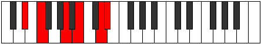
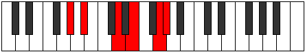

# Mode Dyptitonic

## Links

- [Documentation](index.md)
- [Scales Index](Scales.md)
- [Modes Index](Modes.md)
- [Chords Index](Chords.md)

## Parent Scale

[Phronitonic](ScalePhronitonic.md)

## Number

[2373](https://ianring.com/musictheory/scales/2373)

## Perfection

- 1 Perfect notes
- 4 Perfect notes

## Perfection Profile

[false false false false true]

## Permutations

| Tonic | Notes | Signature | Illustration | Audio |
|-------|-------|-----------|--------------|-------|
| [C](ModeCNaturalDyptitonic.md) | **C**, **D**, **F#**, **G#**, B, **C** | C |  | [midi](ModeCNaturalDyptitonic.mid) [ogg](ModeCNaturalDyptitonic.ogg) |
| [C#](ModeCSharpDyptitonic.md) | **C#**, **D#**, **G**, **A**, C, **C#** | C |  | [midi](ModeCSharpDyptitonic.mid) [ogg](ModeCSharpDyptitonic.ogg) |
| [Db](ModeDFlatDyptitonic.md) | **Db**, **Eb**, **G**, **A**, C, **Db** | C |  | [midi](ModeDFlatDyptitonic.mid) [ogg](ModeDFlatDyptitonic.ogg) |
| [D](ModeDNaturalDyptitonic.md) | **D**, **E**, **G#**, **A#**, C#, **D** | C |  | [midi](ModeDNaturalDyptitonic.mid) [ogg](ModeDNaturalDyptitonic.ogg) |
| [D#](ModeDSharpDyptitonic.md) | **D#**, **F**, **A**, **B**, D, **D#** | C |  | [midi](ModeDSharpDyptitonic.mid) [ogg](ModeDSharpDyptitonic.ogg) |
| [Eb](ModeEFlatDyptitonic.md) | **Eb**, **F**, **A**, **B**, D, **Eb** | C |  | [midi](ModeEFlatDyptitonic.mid) [ogg](ModeEFlatDyptitonic.ogg) |
| [E](ModeENaturalDyptitonic.md) | **E**, **F#**, **A#**, **C**, D#, **E** | C |  | [midi](ModeENaturalDyptitonic.mid) [ogg](ModeENaturalDyptitonic.ogg) |
| [F](ModeFNaturalDyptitonic.md) | **F**, **G**, **B**, **C#**, E, **F** | C |  | [midi](ModeFNaturalDyptitonic.mid) [ogg](ModeFNaturalDyptitonic.ogg) |
| [F#](ModeFSharpDyptitonic.md) | **F#**, **G#**, **C**, **D**, F, **F#** | C |  | [midi](ModeFSharpDyptitonic.mid) [ogg](ModeFSharpDyptitonic.ogg) |
| [Gb](ModeGFlatDyptitonic.md) | **Gb**, **Ab**, **C**, **D**, F, **Gb** | C |  | [midi](ModeGFlatDyptitonic.mid) [ogg](ModeGFlatDyptitonic.ogg) |
| [G](ModeGNaturalDyptitonic.md) | **G**, **A**, **C#**, **D#**, F#, **G** | C |  | [midi](ModeGNaturalDyptitonic.mid) [ogg](ModeGNaturalDyptitonic.ogg) |
| [G#](ModeGSharpDyptitonic.md) | **G#**, **A#**, **D**, **E**, G, **G#** | C |  | [midi](ModeGSharpDyptitonic.mid) [ogg](ModeGSharpDyptitonic.ogg) |
| [Ab](ModeAFlatDyptitonic.md) | **Ab**, **Bb**, **D**, **E**, G, **Ab** | C |  | [midi](ModeAFlatDyptitonic.mid) [ogg](ModeAFlatDyptitonic.ogg) |
| [A](ModeANaturalDyptitonic.md) | **A**, **B**, **D#**, **F**, G#, **A** | C |  | [midi](ModeANaturalDyptitonic.mid) [ogg](ModeANaturalDyptitonic.ogg) |
| [A#](ModeASharpDyptitonic.md) | **A#**, **C**, **E**, **F#**, A, **A#** | C |  | [midi](ModeASharpDyptitonic.mid) [ogg](ModeASharpDyptitonic.ogg) |
| [Bb](ModeBFlatDyptitonic.md) | **Bb**, **C**, **E**, **Gb**, A, **Bb** | C |  | [midi](ModeBFlatDyptitonic.mid) [ogg](ModeBFlatDyptitonic.ogg) |
| [B](ModeBNaturalDyptitonic.md) | **B**, **C#**, **F**, **G**, A#, **B** | C |  | [midi](ModeBNaturalDyptitonic.mid) [ogg](ModeBNaturalDyptitonic.ogg) |
