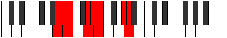

# Mode Dyrian

## Links

- [Documentation](index.md)
- [Scales Index](Scales.md)
- [Modes Index](Modes.md)
- [Chords Index](Chords.md)

## Parent Scale

[Aeolacrian](ScaleAeolacrian.md)

## Number

[2279](https://ianring.com/musictheory/scales/2279)

## Perfection

- 5 Perfect notes
- 2 Perfect notes

## Perfection Profile

[true false false true true true true]

## Permutations

| Tonic | Notes | Signature | Illustration | Audio |
|-------|-------|-----------|--------------|-------|
| [C](ModeCNaturalDyrian.md) | C, **Db**, **Ebb**, F, Gb, Abb, B, C | C |  | [midi](ModeCNaturalDyrian.mid) [ogg](ModeCNaturalDyrian.ogg) |
| [C#](ModeCSharpDyrian.md) | C#, **D**, **Eb**, F#, G, Ab, B#, C# | C |  | [midi](ModeCSharpDyrian.mid) [ogg](ModeCSharpDyrian.ogg) |
| [Db](ModeDFlatDyrian.md) | Db, **Ebb**, **Fbb**, Gb, Abb, Bbbb, C, Db | C |  | [midi](ModeDFlatDyrian.mid) [ogg](ModeDFlatDyrian.ogg) |
| [D](ModeDNaturalDyrian.md) | D, **Eb**, **Fb**, G, Ab, Bbb, C#, D | C |  | [midi](ModeDNaturalDyrian.mid) [ogg](ModeDNaturalDyrian.ogg) |
| [D#](ModeDSharpDyrian.md) | D#, **E**, **F**, G#, A, Bb, C##, D# | C |  | [midi](ModeDSharpDyrian.mid) [ogg](ModeDSharpDyrian.ogg) |
| [Eb](ModeEFlatDyrian.md) | Eb, **Fb**, **Gbb**, Ab, Bbb, Cbb, D, Eb | C |  | [midi](ModeEFlatDyrian.mid) [ogg](ModeEFlatDyrian.ogg) |
| [E](ModeENaturalDyrian.md) | E, **F**, **Gb**, A, Bb, Cb, D#, E | C |  | [midi](ModeENaturalDyrian.mid) [ogg](ModeENaturalDyrian.ogg) |
| [F](ModeFNaturalDyrian.md) | F, **Gb**, **Abb**, Bb, Cb, Dbb, E, F | C |  | [midi](ModeFNaturalDyrian.mid) [ogg](ModeFNaturalDyrian.ogg) |
| [F#](ModeFSharpDyrian.md) | F#, **G**, **Ab**, B, C, Db, E#, F# | C |  | [midi](ModeFSharpDyrian.mid) [ogg](ModeFSharpDyrian.ogg) |
| [Gb](ModeGFlatDyrian.md) | Gb, **Abb**, **Bbbb**, Cb, Dbb, Ebbb, F, Gb | C |  | [midi](ModeGFlatDyrian.mid) [ogg](ModeGFlatDyrian.ogg) |
| [G](ModeGNaturalDyrian.md) | G, **Ab**, **Bbb**, C, Db, Ebb, F#, G | C |  | [midi](ModeGNaturalDyrian.mid) [ogg](ModeGNaturalDyrian.ogg) |
| [G#](ModeGSharpDyrian.md) | G#, **A**, **Bb**, C#, D, Eb, F##, G# | C |  | [midi](ModeGSharpDyrian.mid) [ogg](ModeGSharpDyrian.ogg) |
| [Ab](ModeAFlatDyrian.md) | Ab, **Bbb**, **Cbb**, Db, Ebb, Fbb, G, Ab | C |  | [midi](ModeAFlatDyrian.mid) [ogg](ModeAFlatDyrian.ogg) |
| [A](ModeANaturalDyrian.md) | A, **Bb**, **Cb**, D, Eb, Fb, G#, A | C |  | [midi](ModeANaturalDyrian.mid) [ogg](ModeANaturalDyrian.ogg) |
| [A#](ModeASharpDyrian.md) | A#, **B**, **C**, D#, E, F, G##, A# | C |  | [midi](ModeASharpDyrian.mid) [ogg](ModeASharpDyrian.ogg) |
| [Bb](ModeBFlatDyrian.md) | Bb, **Cb**, **Dbb**, Eb, Fb, Gbb, A, Bb | C |  | [midi](ModeBFlatDyrian.mid) [ogg](ModeBFlatDyrian.ogg) |
| [B](ModeBNaturalDyrian.md) | B, **C**, **Db**, E, F, Gb, A#, B | C |  | [midi](ModeBNaturalDyrian.mid) [ogg](ModeBNaturalDyrian.ogg) |
