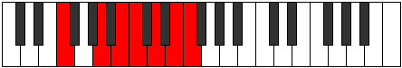

# Mode Dyrimic

## Links

- [Documentation](index.md)
- [Scales Index](Scales.md)
- [Modes Index](Modes.md)
- [Chords Index](Chords.md)

## Parent Scale

[Dyrimic](ScaleDyrimic.md)

## Number

[2769](https://ianring.com/musictheory/scales/2769)

## Interval Pattern

4, 2, 1, 2, 2, 1

## Chord Pattern

ii, iii⁰

## Perfection

- 4 Perfect notes
- 2 Perfect notes

## Perfection Profile

[true true false false true true]

## Permutations

| Tonic | Notes | Signature | Illustration | Audio |
|-------|-------|-----------|--------------|-------|
| [C](ModeCNaturalDyrimic.md) | C, D##, **E##**, **F##**, G##, A##, C | C |  | [midi](https://github.com/edipermadi/music/blob/main/docs/ModeCNaturalDyrimic.mid?raw=true) |
| [C#](ModeCSharpDyrimic.md) | C#, D###, **E###**, **F###**, G###, A###, C# | C |  | [midi](https://github.com/edipermadi/music/blob/main/docs/ModeCSharpDyrimic.mid?raw=true) |
| [Db](ModeDFlatDyrimic.md) | Db, E#, **F##**, **G#**, A#, B#, Db | C |  | [midi](https://github.com/edipermadi/music/blob/main/docs/ModeDFlatDyrimic.mid?raw=true) |
| [D](ModeDNaturalDyrimic.md) | D, E##, **F###**, **G##**, A##, B##, D | C |  | [midi](https://github.com/edipermadi/music/blob/main/docs/ModeDNaturalDyrimic.mid?raw=true) |
| [D#](ModeDSharpDyrimic.md) | D#, E###, **Cbbb**, **Cbb**, Dbb, Ebb, D# | C |  | [midi](https://github.com/edipermadi/music/blob/main/docs/ModeDSharpDyrimic.mid?raw=true) |
| [Eb](ModeEFlatDyrimic.md) | Eb, F##, **G##**, **A#**, B#, C##, Eb | C |  | [midi](https://github.com/edipermadi/music/blob/main/docs/ModeEFlatDyrimic.mid?raw=true) |
| [E](ModeENaturalDyrimic.md) | E, F###, **G###**, **A##**, B##, C###, E | C |  | [midi](https://github.com/edipermadi/music/blob/main/docs/ModeENaturalDyrimic.mid?raw=true) |
| [F](ModeFNaturalDyrimic.md) | F, G##, **A##**, **B#**, C##, D##, F | C |  | [midi](https://github.com/edipermadi/music/blob/main/docs/ModeFNaturalDyrimic.mid?raw=true) |
| [F#](ModeFSharpDyrimic.md) | F#, G###, **A###**, **B##**, C###, D###, F# | C |  | [midi](https://github.com/edipermadi/music/blob/main/docs/ModeFSharpDyrimic.mid?raw=true) |
| [Gb](ModeGFlatDyrimic.md) | Gb, A#, **B#**, **C#**, D#, E#, Gb | C |  | [midi](https://github.com/edipermadi/music/blob/main/docs/ModeGFlatDyrimic.mid?raw=true) |
| [G](ModeGNaturalDyrimic.md) | G, A##, **B##**, **C##**, D##, E##, G | C |  | [midi](https://github.com/edipermadi/music/blob/main/docs/ModeGNaturalDyrimic.mid?raw=true) |
| [G#](ModeGSharpDyrimic.md) | G#, A###, **B###**, **C###**, D###, E###, G# | C |  | [midi](https://github.com/edipermadi/music/blob/main/docs/ModeGSharpDyrimic.mid?raw=true) |
| [Ab](ModeAFlatDyrimic.md) | Ab, B#, **C##**, **D#**, E#, F##, Ab | C |  | [midi](https://github.com/edipermadi/music/blob/main/docs/ModeAFlatDyrimic.mid?raw=true) |
| [A](ModeANaturalDyrimic.md) | A, B##, **C###**, **D##**, E##, F###, A | C |  | [midi](https://github.com/edipermadi/music/blob/main/docs/ModeANaturalDyrimic.mid?raw=true) |
| [A#](ModeASharpDyrimic.md) | A#, B###, **D##**, **E#**, F##, G##, A# | C |  | [midi](https://github.com/edipermadi/music/blob/main/docs/ModeASharpDyrimic.mid?raw=true) |
| [Bb](ModeBFlatDyrimic.md) | Bb, C##, **D##**, **E#**, F##, G##, Bb | C |  | [midi](https://github.com/edipermadi/music/blob/main/docs/ModeBFlatDyrimic.mid?raw=true) |
| [B](ModeBNaturalDyrimic.md) | B, C###, **D###**, **E##**, F###, G###, B | C |  | [midi](https://github.com/edipermadi/music/blob/main/docs/ModeBNaturalDyrimic.mid?raw=true) |
