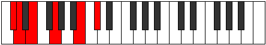
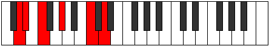

# Mode Dyritonic

## Links

- [Documentation](index.md)
- [Scales Index](Scales.md)
- [Modes Index](Modes.md)
- [Chords Index](Chords.md)

## Parent Scale

[Aeolacritonic](ScaleAeolacritonic.md)

## Number

[1099](https://ianring.com/musictheory/scales/1099)

## Perfection

- 2 Perfect notes
- 3 Perfect notes

## Perfection Profile

[false false true true false]

## Permutations

| Tonic | Notes | Signature | Illustration | Audio |
|-------|-------|-----------|--------------|-------|
| [C](ModeCNaturalDyritonic.md) | **C**, **C#**, D#, F#, **A#**, **C** | C |  | [midi](ModeCNaturalDyritonic.mid) [ogg](ModeCNaturalDyritonic.ogg) |
| [C#](ModeCSharpDyritonic.md) | **C#**, **D**, E, G, **B**, **C#** | C |  | [midi](ModeCSharpDyritonic.mid) [ogg](ModeCSharpDyritonic.ogg) |
| [Db](ModeDFlatDyritonic.md) | **Db**, **D**, E, G, **B**, **Db** | C |  | [midi](ModeDFlatDyritonic.mid) [ogg](ModeDFlatDyritonic.ogg) |
| [D](ModeDNaturalDyritonic.md) | **D**, **D#**, F, G#, **C**, **D** | C |  | [midi](ModeDNaturalDyritonic.mid) [ogg](ModeDNaturalDyritonic.ogg) |
| [D#](ModeDSharpDyritonic.md) | **D#**, **E**, F#, A, **C#**, **D#** | C |  | [midi](ModeDSharpDyritonic.mid) [ogg](ModeDSharpDyritonic.ogg) |
| [Eb](ModeEFlatDyritonic.md) | **Eb**, **E**, Gb, A, **Db**, **Eb** | C |  | [midi](ModeEFlatDyritonic.mid) [ogg](ModeEFlatDyritonic.ogg) |
| [E](ModeENaturalDyritonic.md) | **E**, **F**, G, A#, **D**, **E** | C |  | [midi](ModeENaturalDyritonic.mid) [ogg](ModeENaturalDyritonic.ogg) |
| [F](ModeFNaturalDyritonic.md) | **F**, **F#**, G#, B, **D#**, **F** | C |  | [midi](ModeFNaturalDyritonic.mid) [ogg](ModeFNaturalDyritonic.ogg) |
| [F#](ModeFSharpDyritonic.md) | **F#**, **G**, A, C, **E**, **F#** | C |  | [midi](ModeFSharpDyritonic.mid) [ogg](ModeFSharpDyritonic.ogg) |
| [Gb](ModeGFlatDyritonic.md) | **Gb**, **G**, A, C, **E**, **Gb** | C |  | [midi](ModeGFlatDyritonic.mid) [ogg](ModeGFlatDyritonic.ogg) |
| [G](ModeGNaturalDyritonic.md) | **G**, **G#**, A#, C#, **F**, **G** | C |  | [midi](ModeGNaturalDyritonic.mid) [ogg](ModeGNaturalDyritonic.ogg) |
| [G#](ModeGSharpDyritonic.md) | **G#**, **A**, B, D, **F#**, **G#** | C |  | [midi](ModeGSharpDyritonic.mid) [ogg](ModeGSharpDyritonic.ogg) |
| [Ab](ModeAFlatDyritonic.md) | **Ab**, **A**, B, D, **Gb**, **Ab** | C |  | [midi](ModeAFlatDyritonic.mid) [ogg](ModeAFlatDyritonic.ogg) |
| [A](ModeANaturalDyritonic.md) | **A**, **A#**, C, D#, **G**, **A** | C |  | [midi](ModeANaturalDyritonic.mid) [ogg](ModeANaturalDyritonic.ogg) |
| [A#](ModeASharpDyritonic.md) | **A#**, **B**, C#, E, **G#**, **A#** | C |  | [midi](ModeASharpDyritonic.mid) [ogg](ModeASharpDyritonic.ogg) |
| [Bb](ModeBFlatDyritonic.md) | **Bb**, **B**, Db, E, **Ab**, **Bb** | C |  | [midi](ModeBFlatDyritonic.mid) [ogg](ModeBFlatDyritonic.ogg) |
| [B](ModeBNaturalDyritonic.md) | **B**, **C**, D, F, **A**, **B** | C |  | [midi](ModeBNaturalDyritonic.mid) [ogg](ModeBNaturalDyritonic.ogg) |
