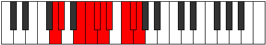

# Mode Dyrygic

## Links

- [Documentation](README.md)
- [Scales Index](Scales.md)
- [Modes Index](Modes.md)
- [Chords Index](Chords.md)

## Parent Scale

[Dycrygic](ScaleDycrygic.md)

## Number

[3571](https://ianring.com/musictheory/scales/3571)

## Interval Pattern

1, 3, 1, 1, 1, 1, 2, 1, 1

## Chord Pattern

## Perfection

- 7 Perfect notes
- 2 Perfect notes

## Perfection Profile

[true true true true true false false true true]

## Permutations

| Tonic | Notes | Signature | Illustration | Audio |
|-------|-------|-----------|--------------|-------|
| [C](ModeCNaturalDyrygic.md) | C, C#, E, F, F#, **G**, **G#**, A#, B, C | C |  | [midi](https://github.com/edipermadi/music/blob/main/docs/ModeCNaturalDyrygic.mid?raw=true) |
| [C#](ModeCSharpDyrygic.md) | C#, D, F, F#, G, **G#**, **A**, B, C, C# | C |  | [midi](https://github.com/edipermadi/music/blob/main/docs/ModeCSharpDyrygic.mid?raw=true) |
| [Db](ModeDFlatDyrygic.md) | Db, D, F, Gb, G, **Ab**, **A**, B, C, Db | C |  | [midi](https://github.com/edipermadi/music/blob/main/docs/ModeDFlatDyrygic.mid?raw=true) |
| [D](ModeDNaturalDyrygic.md) | D, D#, F#, G, G#, **A**, **A#**, C, C#, D | C |  | [midi](https://github.com/edipermadi/music/blob/main/docs/ModeDNaturalDyrygic.mid?raw=true) |
| [D#](ModeDSharpDyrygic.md) | D#, E, G, G#, A, **A#**, **B**, C#, D, D# | C |  | [midi](https://github.com/edipermadi/music/blob/main/docs/ModeDSharpDyrygic.mid?raw=true) |
| [Eb](ModeEFlatDyrygic.md) | Eb, E, G, Ab, A, **Bb**, **B**, Db, D, Eb | C |  | [midi](https://github.com/edipermadi/music/blob/main/docs/ModeEFlatDyrygic.mid?raw=true) |
| [E](ModeENaturalDyrygic.md) | E, F, G#, A, A#, **B**, **C**, D, D#, E | C |  | [midi](https://github.com/edipermadi/music/blob/main/docs/ModeENaturalDyrygic.mid?raw=true) |
| [F](ModeFNaturalDyrygic.md) | F, F#, A, A#, B, **C**, **C#**, D#, E, F | C |  | [midi](https://github.com/edipermadi/music/blob/main/docs/ModeFNaturalDyrygic.mid?raw=true) |
| [F#](ModeFSharpDyrygic.md) | F#, G, A#, B, C, **C#**, **D**, E, F, F# | C |  | [midi](https://github.com/edipermadi/music/blob/main/docs/ModeFSharpDyrygic.mid?raw=true) |
| [Gb](ModeGFlatDyrygic.md) | Gb, G, Bb, B, C, **Db**, **D**, E, F, Gb | C |  | [midi](https://github.com/edipermadi/music/blob/main/docs/ModeGFlatDyrygic.mid?raw=true) |
| [G](ModeGNaturalDyrygic.md) | G, G#, B, C, C#, **D**, **D#**, F, F#, G | C |  | [midi](https://github.com/edipermadi/music/blob/main/docs/ModeGNaturalDyrygic.mid?raw=true) |
| [G#](ModeGSharpDyrygic.md) | G#, A, C, C#, D, **D#**, **E**, F#, G, G# | C |  | [midi](https://github.com/edipermadi/music/blob/main/docs/ModeGSharpDyrygic.mid?raw=true) |
| [Ab](ModeAFlatDyrygic.md) | Ab, A, C, Db, D, **Eb**, **E**, Gb, G, Ab | C |  | [midi](https://github.com/edipermadi/music/blob/main/docs/ModeAFlatDyrygic.mid?raw=true) |
| [A](ModeANaturalDyrygic.md) | A, A#, C#, D, D#, **E**, **F**, G, G#, A | C |  | [midi](https://github.com/edipermadi/music/blob/main/docs/ModeANaturalDyrygic.mid?raw=true) |
| [A#](ModeASharpDyrygic.md) | A#, B, D, D#, E, **F**, **F#**, G#, A, A# | C |  | [midi](https://github.com/edipermadi/music/blob/main/docs/ModeASharpDyrygic.mid?raw=true) |
| [Bb](ModeBFlatDyrygic.md) | Bb, B, D, Eb, E, **F**, **Gb**, Ab, A, Bb | C |  | [midi](https://github.com/edipermadi/music/blob/main/docs/ModeBFlatDyrygic.mid?raw=true) |
| [B](ModeBNaturalDyrygic.md) | B, C, D#, E, F, **F#**, **G**, A, A#, B | C |  | [midi](https://github.com/edipermadi/music/blob/main/docs/ModeBNaturalDyrygic.mid?raw=true) |
