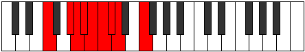

# Mode Dythyllic

## Links

- [Documentation](index.md)
- [Scales Index](Scales.md)
- [Modes Index](Modes.md)
- [Chords Index](Chords.md)

## Parent Scale

[Zaryllic](ScaleZaryllic.md)

## Number

[1017](https://ianring.com/musictheory/scales/1017)

## Perfection

- 4 Perfect notes
- 4 Perfect notes

## Perfection Profile

[true false false true false false true true]

## Permutations

| Tonic | Notes | Signature | Illustration | Audio |
|-------|-------|-----------|--------------|-------|
| [C](ModeCNaturalDythyllic.md) | C, **D#**, **E**, F, **F#**, **G**, G#, A, C | C |  | [midi](ModeCNaturalDythyllic.mid) [ogg](ModeCNaturalDythyllic.ogg) |
| [C#](ModeCSharpDythyllic.md) | C#, **E**, **F**, F#, **G**, **G#**, A, A#, C# | C |  | [midi](ModeCSharpDythyllic.mid) [ogg](ModeCSharpDythyllic.ogg) |
| [Db](ModeDFlatDythyllic.md) | Db, **E**, **F**, Gb, **G**, **Ab**, A, Bb, Db | C |  | [midi](ModeDFlatDythyllic.mid) [ogg](ModeDFlatDythyllic.ogg) |
| [D](ModeDNaturalDythyllic.md) | D, **F**, **F#**, G, **G#**, **A**, A#, B, D | C |  | [midi](ModeDNaturalDythyllic.mid) [ogg](ModeDNaturalDythyllic.ogg) |
| [D#](ModeDSharpDythyllic.md) | D#, **F#**, **G**, G#, **A**, **A#**, B, C, D# | C |  | [midi](ModeDSharpDythyllic.mid) [ogg](ModeDSharpDythyllic.ogg) |
| [Eb](ModeEFlatDythyllic.md) | Eb, **Gb**, **G**, Ab, **A**, **Bb**, B, C, Eb | C |  | [midi](ModeEFlatDythyllic.mid) [ogg](ModeEFlatDythyllic.ogg) |
| [E](ModeENaturalDythyllic.md) | E, **G**, **G#**, A, **A#**, **B**, C, C#, E | C |  | [midi](ModeENaturalDythyllic.mid) [ogg](ModeENaturalDythyllic.ogg) |
| [F](ModeFNaturalDythyllic.md) | F, **G#**, **A**, A#, **B**, **C**, C#, D, F | C |  | [midi](ModeFNaturalDythyllic.mid) [ogg](ModeFNaturalDythyllic.ogg) |
| [F#](ModeFSharpDythyllic.md) | F#, **A**, **A#**, B, **C**, **C#**, D, D#, F# | C |  | [midi](ModeFSharpDythyllic.mid) [ogg](ModeFSharpDythyllic.ogg) |
| [Gb](ModeGFlatDythyllic.md) | Gb, **A**, **Bb**, B, **C**, **Db**, D, Eb, Gb | C |  | [midi](ModeGFlatDythyllic.mid) [ogg](ModeGFlatDythyllic.ogg) |
| [G](ModeGNaturalDythyllic.md) | G, **A#**, **B**, C, **C#**, **D**, D#, E, G | C |  | [midi](ModeGNaturalDythyllic.mid) [ogg](ModeGNaturalDythyllic.ogg) |
| [G#](ModeGSharpDythyllic.md) | G#, **B**, **C**, C#, **D**, **D#**, E, F, G# | C |  | [midi](ModeGSharpDythyllic.mid) [ogg](ModeGSharpDythyllic.ogg) |
| [Ab](ModeAFlatDythyllic.md) | Ab, **B**, **C**, Db, **D**, **Eb**, E, F, Ab | C |  | [midi](ModeAFlatDythyllic.mid) [ogg](ModeAFlatDythyllic.ogg) |
| [A](ModeANaturalDythyllic.md) | A, **C**, **C#**, D, **D#**, **E**, F, F#, A | C |  | [midi](ModeANaturalDythyllic.mid) [ogg](ModeANaturalDythyllic.ogg) |
| [A#](ModeASharpDythyllic.md) | A#, **C#**, **D**, D#, **E**, **F**, F#, G, A# | C |  | [midi](ModeASharpDythyllic.mid) [ogg](ModeASharpDythyllic.ogg) |
| [Bb](ModeBFlatDythyllic.md) | Bb, **Db**, **D**, Eb, **E**, **F**, Gb, G, Bb | C |  | [midi](ModeBFlatDythyllic.mid) [ogg](ModeBFlatDythyllic.ogg) |
| [B](ModeBNaturalDythyllic.md) | B, **D**, **D#**, E, **F**, **F#**, G, G#, B | C |  | [midi](ModeBNaturalDythyllic.mid) [ogg](ModeBNaturalDythyllic.ogg) |
