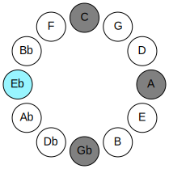
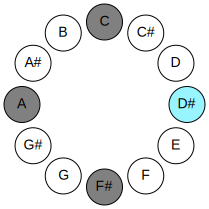
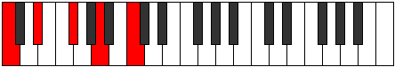
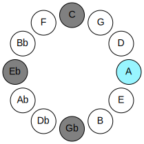
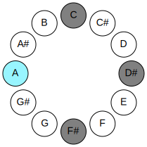
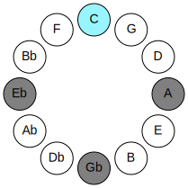
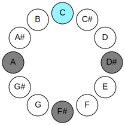

# Mode EFlatPhrynic

## Links

- [Documentation](README.md)
- [Scales Index](Scales.md)
- [Modes Index](Modes.md)
- [Chords Index](Chords.md)

## Scale

[Phrynic](ScalePhrynic.md)

## Mode

[EFlatPhrynic](ModeEFlatPhrynic.md)

## Tonic

Eb

## Signature

[CNaturalMajor]

## Transposition

3, 3, 3, 3

## Chord Pattern

## Perfection

 - 0 Perfect Notes

 - 4 Imperfect Notes

## Notes

- Eb (Imperfect)
- Gb (Imperfect)
- A (Imperfect)
- C (Imperfect)
- Eb (Imperfect)

## Illustration

## Diagram

| Circle of Fifth | Chromatic Circle |
|-----------------|------------------|
|  |  |
## Relative Modes

| Number | Mode | Tonic | Notes | Illustration |
|--------|------|-------|-------|--------------|
| [585](https://ianring.com/musictheory/scales/585) | [Phrynic](ModePhrynic.md) | D# | D#, F#, A, C, D# |  |
| [585](https://ianring.com/musictheory/scales/585) | [Phrynic](ModePhrynic.md) | Eb | Eb, Gb, A, C, Eb |  |
| [585](https://ianring.com/musictheory/scales/585) | [Phrynic](ModePhrynic.md) | F# | F#, A, C, D#, F# |  |
| [585](https://ianring.com/musictheory/scales/585) | [Phrynic](ModePhrynic.md) | Gb | Gb, A, C, Eb, Gb |  |
| [585](https://ianring.com/musictheory/scales/585) | [Phrynic](ModePhrynic.md) | A | A, C, D#, F#, A |  |
| [585](https://ianring.com/musictheory/scales/585) | [Phrynic](ModePhrynic.md) | C | C, D#, F#, A, C |  |
## Relative Brightness

| Number | Mode | Tonic | Notes | Circle Of Fifth | Chromatic Circle |
|--------|------|-------|-------|-----------------|------------------|
| [585](https://ianring.com/musictheory/scales/585) | [Phrynic](ModePhrynic.md) | D# | D#, F#, A, C, D# |  |  |
| [585](https://ianring.com/musictheory/scales/585) | [Phrynic](ModePhrynic.md) | Eb | Eb, Gb, A, C, Eb |  |  |
| [585](https://ianring.com/musictheory/scales/585) | [Phrynic](ModePhrynic.md) | F# | F#, A, C, D#, F# |  |  |
| [585](https://ianring.com/musictheory/scales/585) | [Phrynic](ModePhrynic.md) | Gb | Gb, A, C, Eb, Gb |  |  |
| [585](https://ianring.com/musictheory/scales/585) | [Phrynic](ModePhrynic.md) | A | A, C, D#, F#, A |  |  |
| [585](https://ianring.com/musictheory/scales/585) | [Phrynic](ModePhrynic.md) | C | C, D#, F#, A, C |  |  |

## Chords

### Eb

| Number | Root | Name | Notes | Illustration | Audio |
|--------|------|------|-------|--------------|-------|
| 584 | Eb | [D#o](ChordDSharpDiminished.md) | D#, F#, A |  | [midi](ChordDSharpDiminishedRootPosition.mid) |
| 584 | Eb | [Ebo](ChordEFlatDiminished.md) | Eb, Gb, Bbb |  | [midi](ChordEFlatDiminishedRootPosition.mid) |
| 585 | Eb | [D#o7](ChordDSharpFullDiminishedSeventh.md) | D#, F#, A, C |  | [midi](ChordDSharpFullDiminishedSeventhRootPosition.mid) |
| 585 | Eb | [Ebo7](ChordEFlatFullDiminishedSeventh.md) | Eb, Gb, Bbb, Dbb |  | [midi](ChordEFlatFullDiminishedSeventhRootPosition.mid) |

### Gb

| Number | Root | Name | Notes | Illustration | Audio |
|--------|------|------|-------|--------------|-------|
| 577 | Gb | [F#o](ChordFSharpDiminished.md) | F#, A, C |  | [midi](ChordFSharpDiminishedRootPosition.mid) |
| 577 | Gb | [Gbo](ChordGFlatDiminished.md) | Gb, Bbb, Dbb |  | [midi](ChordGFlatDiminishedRootPosition.mid) |
| 585 | Gb | [F#o7](ChordFSharpFullDiminishedSeventh.md) | F#, A, C, Eb |  | [midi](ChordFSharpFullDiminishedSeventhRootPosition.mid) |
| 585 | Gb | [Gbo7](ChordGFlatFullDiminishedSeventh.md) | Gb, Bbb, Dbb, Fbb |  | [midi](ChordGFlatFullDiminishedSeventhRootPosition.mid) |

### A

| Number | Root | Name | Notes | Illustration | Audio |
|--------|------|------|-------|--------------|-------|
| 521 | A | [Ao](ChordANaturalDiminished.md) | A, C, Eb |  | [midi](ChordANaturalDiminishedRootPosition.mid) |
| 585 | A | [Ao7](ChordANaturalFullDiminishedSeventh.md) | A, C, Eb, Gb |  | [midi](ChordANaturalFullDiminishedSeventhRootPosition.mid) |

### C

| Number | Root | Name | Notes | Illustration | Audio |
|--------|------|------|-------|--------------|-------|
| 73 | C | [Co](ChordCNaturalDiminished.md) | C, Eb, Gb |  | [midi](ChordCNaturalDiminishedRootPosition.mid) |
| 585 | C | [Co7](ChordCNaturalFullDiminishedSeventh.md) | C, Eb, Gb, Bbb |  | [midi](ChordCNaturalFullDiminishedSeventhRootPosition.mid) |

