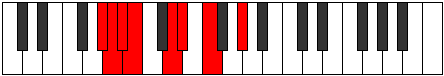

# Mode EFlatPodian

## Links

- [Documentation](index.md)
- [Scales Index](Scales.md)
- [Modes Index](Modes.md)
- [Chords Index](Chords.md)

## Scale

[Ranian](ScaleRanian.md)

## Mode

[EFlatPodian](ModeEFlatPodian.md)

## Tonic

Eb

## Signature

[CNaturalMajor]

## Perfection

 - 4 Perfect Notes

 - 3 Imperfect Notes

## Notes

- Eb
- F (Imperfect)
- G#
- A (Imperfect)
- Bb
- Cb (Imperfect)
- D
- Eb

## Illustration

## Relative Modes

| Number | Mode | Tonic | Notes | Illustration |
|--------|------|-------|-------|--------------|
| [2533](https://ianring.com/musictheory/scales/2533) | [Podian](ModePodian.md) | Eb | Eb, F, G#, A, Bb, Cb, D, Eb |  |
| [1657](https://ianring.com/musictheory/scales/1657) | [Ionothian](ModeIonothian.md) | F | F, G#, A, Bb, Cb, D, Eb, F |  |
| [719](https://ianring.com/musictheory/scales/719) | [Kanian](ModeKanian.md) | G# | G#, A, Bb, Cb, D, Eb, F, G# |  |
| [2407](https://ianring.com/musictheory/scales/2407) | [Zylian](ModeZylian.md) | A | A, Bb, Cb, D, Eb, F, G#, A |  |
| [3251](https://ianring.com/musictheory/scales/3251) | [Zodian](ModeZodian.md) | Bb | Bb, Cb, D, Eb, F, G#, A, Bb |  |
| [971](https://ianring.com/musictheory/scales/971) | [Ladian](ModeLadian.md) | D | D, Eb, F, G#, A, Bb, Cb, D |  |

## Chords

### Eb

| Number | Root | Name | Notes | Illustration | Audio |
|--------|------|------|-------|--------------|-------|

### F

| Number | Root | Name | Notes | Illustration | Audio |
|--------|------|------|-------|--------------|-------|

### G#

| Number | Root | Name | Notes | Illustration | Audio |
|--------|------|------|-------|--------------|-------|

### A

| Number | Root | Name | Notes | Illustration | Audio |
|--------|------|------|-------|--------------|-------|

### Bb

| Number | Root | Name | Notes | Illustration | Audio |
|--------|------|------|-------|--------------|-------|

### Cb

| Number | Root | Name | Notes | Illustration | Audio |
|--------|------|------|-------|--------------|-------|

### D

| Number | Root | Name | Notes | Illustration | Audio |
|--------|------|------|-------|--------------|-------|

