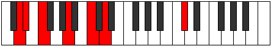
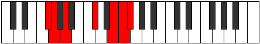
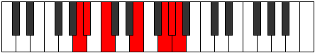
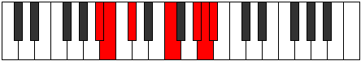
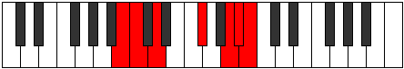

# Mode Epacrimic

## Links

- [Documentation](index.md)
- [Scales Index](Scales.md)
- [Modes Index](Modes.md)
- [Chords Index](Chords.md)

## Parent Scale

[Galimic](ScaleGalimic.md)

## Number

[3211](https://ianring.com/musictheory/scales/3211)

## Interval Pattern

1, 2, 4, 3, 1, 1

## Chord Pattern

i, III, III⁺, iv⁰, IV⁺, VI⁺

## Perfection

- 2 Perfect notes
- 4 Perfect notes

## Perfection Profile

[true false true false false false]

## Permutations

| Tonic | Notes | Signature | Illustration | Audio |
|-------|-------|-----------|--------------|-------|
| [C](ModeCNaturalEpacrimic.md) | C, **Db**, Eb, **F##**, **G###**, **A##**, C | C |  | [midi](https://github.com/edipermadi/music/blob/main/docs/ModeCNaturalEpacrimic.mid?raw=true) |
| [C#](ModeCSharpEpacrimic.md) | C#, **D**, E, **F###**, **Cb**, **Dbb**, C# | C |  | [midi](https://github.com/edipermadi/music/blob/main/docs/ModeCSharpEpacrimic.mid?raw=true) |
| [Db](ModeDFlatEpacrimic.md) | Db, **Ebb**, Fb, **G#**, **A##**, **B#**, Db | C |  | [midi](https://github.com/edipermadi/music/blob/main/docs/ModeDFlatEpacrimic.mid?raw=true) |
| [D](ModeDNaturalEpacrimic.md) | D, **Eb**, F, **G##**, **A###**, **B##**, D | C |  | [midi](https://github.com/edipermadi/music/blob/main/docs/ModeDNaturalEpacrimic.mid?raw=true) |
| [D#](ModeDSharpEpacrimic.md) | D#, **E**, F#, **G###**, **Db**, **Ebb**, D# | C |  | [midi](https://github.com/edipermadi/music/blob/main/docs/ModeDSharpEpacrimic.mid?raw=true) |
| [Eb](ModeEFlatEpacrimic.md) | Eb, **Fb**, Gb, **A#**, **B##**, **C##**, Eb | C |  | [midi](https://github.com/edipermadi/music/blob/main/docs/ModeEFlatEpacrimic.mid?raw=true) |
| [E](ModeENaturalEpacrimic.md) | E, **F**, G, **A##**, **B###**, **C###**, E | C |  | [midi](https://github.com/edipermadi/music/blob/main/docs/ModeENaturalEpacrimic.mid?raw=true) |
| [F](ModeFNaturalEpacrimic.md) | F, **Gb**, Ab, **B#**, **C###**, **D##**, F | C |  | [midi](https://github.com/edipermadi/music/blob/main/docs/ModeFNaturalEpacrimic.mid?raw=true) |
| [F#](ModeFSharpEpacrimic.md) | F#, **G**, A, **B##**, **D##**, **E#**, F# | C |  | [midi](https://github.com/edipermadi/music/blob/main/docs/ModeFSharpEpacrimic.mid?raw=true) |
| [Gb](ModeGFlatEpacrimic.md) | Gb, **Abb**, Bbb, **C#**, **D##**, **E#**, Gb | C |  | [midi](https://github.com/edipermadi/music/blob/main/docs/ModeGFlatEpacrimic.mid?raw=true) |
| [G](ModeGNaturalEpacrimic.md) | G, **Ab**, Bb, **C##**, **D###**, **E##**, G | C |  | [midi](https://github.com/edipermadi/music/blob/main/docs/ModeGNaturalEpacrimic.mid?raw=true) |
| [G#](ModeGSharpEpacrimic.md) | G#, **A**, B, **C###**, **E##**, **F##**, G# | C |  | [midi](https://github.com/edipermadi/music/blob/main/docs/ModeGSharpEpacrimic.mid?raw=true) |
| [Ab](ModeAFlatEpacrimic.md) | Ab, **Bbb**, Cb, **D#**, **E##**, **F##**, Ab | C |  | [midi](https://github.com/edipermadi/music/blob/main/docs/ModeAFlatEpacrimic.mid?raw=true) |
| [A](ModeANaturalEpacrimic.md) | A, **Bb**, C, **D##**, **E###**, **F###**, A | C |  | [midi](https://github.com/edipermadi/music/blob/main/docs/ModeANaturalEpacrimic.mid?raw=true) |
| [A#](ModeASharpEpacrimic.md) | A#, **B**, C#, **D###**, **F###**, **G##**, A# | C |  | [midi](https://github.com/edipermadi/music/blob/main/docs/ModeASharpEpacrimic.mid?raw=true) |
| [Bb](ModeBFlatEpacrimic.md) | Bb, **Cb**, Db, **E#**, **F###**, **G##**, Bb | C |  | [midi](https://github.com/edipermadi/music/blob/main/docs/ModeBFlatEpacrimic.mid?raw=true) |
| [B](ModeBNaturalEpacrimic.md) | B, **C**, D, **E##**, **Cbbb**, **Cbb**, B | C |  | [midi](https://github.com/edipermadi/music/blob/main/docs/ModeBNaturalEpacrimic.mid?raw=true) |
