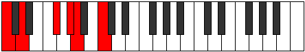
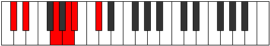

# Mode Epaditonic

## Links

- [Documentation](index.md)
- [Scales Index](Scales.md)
- [Modes Index](Modes.md)
- [Chords Index](Chords.md)

## Parent Scale

[Ionoditonic](ScaleIonoditonic.md)

## Number

[837](https://ianring.com/musictheory/scales/837)

## Perfection

- 1 Perfect notes
- 4 Perfect notes

## Perfection Profile

[false true false false false]

## Permutations

| Tonic | Notes | Signature | Illustration | Audio |
|-------|-------|-----------|--------------|-------|
| [C](ModeCNaturalEpaditonic.md) | **C**, D, **F#**, **G#**, **A**, **C** | C |  | [midi](ModeCNaturalEpaditonic.mid) [ogg](ModeCNaturalEpaditonic.ogg) |
| [C#](ModeCSharpEpaditonic.md) | **C#**, D#, **G**, **A**, **A#**, **C#** | C |  | [midi](ModeCSharpEpaditonic.mid) [ogg](ModeCSharpEpaditonic.ogg) |
| [Db](ModeDFlatEpaditonic.md) | **Db**, Eb, **G**, **A**, **Bb**, **Db** | C |  | [midi](ModeDFlatEpaditonic.mid) [ogg](ModeDFlatEpaditonic.ogg) |
| [D](ModeDNaturalEpaditonic.md) | **D**, E, **G#**, **A#**, **B**, **D** | C |  | [midi](ModeDNaturalEpaditonic.mid) [ogg](ModeDNaturalEpaditonic.ogg) |
| [D#](ModeDSharpEpaditonic.md) | **D#**, F, **A**, **B**, **C**, **D#** | C |  | [midi](ModeDSharpEpaditonic.mid) [ogg](ModeDSharpEpaditonic.ogg) |
| [Eb](ModeEFlatEpaditonic.md) | **Eb**, F, **A**, **B**, **C**, **Eb** | C |  | [midi](ModeEFlatEpaditonic.mid) [ogg](ModeEFlatEpaditonic.ogg) |
| [E](ModeENaturalEpaditonic.md) | **E**, F#, **A#**, **C**, **C#**, **E** | C |  | [midi](ModeENaturalEpaditonic.mid) [ogg](ModeENaturalEpaditonic.ogg) |
| [F](ModeFNaturalEpaditonic.md) | **F**, G, **B**, **C#**, **D**, **F** | C |  | [midi](ModeFNaturalEpaditonic.mid) [ogg](ModeFNaturalEpaditonic.ogg) |
| [F#](ModeFSharpEpaditonic.md) | **F#**, G#, **C**, **D**, **D#**, **F#** | C |  | [midi](ModeFSharpEpaditonic.mid) [ogg](ModeFSharpEpaditonic.ogg) |
| [Gb](ModeGFlatEpaditonic.md) | **Gb**, Ab, **C**, **D**, **Eb**, **Gb** | C |  | [midi](ModeGFlatEpaditonic.mid) [ogg](ModeGFlatEpaditonic.ogg) |
| [G](ModeGNaturalEpaditonic.md) | **G**, A, **C#**, **D#**, **E**, **G** | C |  | [midi](ModeGNaturalEpaditonic.mid) [ogg](ModeGNaturalEpaditonic.ogg) |
| [G#](ModeGSharpEpaditonic.md) | **G#**, A#, **D**, **E**, **F**, **G#** | C |  | [midi](ModeGSharpEpaditonic.mid) [ogg](ModeGSharpEpaditonic.ogg) |
| [Ab](ModeAFlatEpaditonic.md) | **Ab**, Bb, **D**, **E**, **F**, **Ab** | C |  | [midi](ModeAFlatEpaditonic.mid) [ogg](ModeAFlatEpaditonic.ogg) |
| [A](ModeANaturalEpaditonic.md) | **A**, B, **D#**, **F**, **F#**, **A** | C |  | [midi](ModeANaturalEpaditonic.mid) [ogg](ModeANaturalEpaditonic.ogg) |
| [A#](ModeASharpEpaditonic.md) | **A#**, C, **E**, **F#**, **G**, **A#** | C |  | [midi](ModeASharpEpaditonic.mid) [ogg](ModeASharpEpaditonic.ogg) |
| [Bb](ModeBFlatEpaditonic.md) | **Bb**, C, **E**, **Gb**, **G**, **Bb** | C |  | [midi](ModeBFlatEpaditonic.mid) [ogg](ModeBFlatEpaditonic.ogg) |
| [B](ModeBNaturalEpaditonic.md) | **B**, C#, **F**, **G**, **G#**, **B** | C |  | [midi](ModeBNaturalEpaditonic.mid) [ogg](ModeBNaturalEpaditonic.ogg) |
