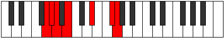

# Mode Epalimic

## Links

- [Documentation](index.md)
- [Scales Index](Scales.md)
- [Modes Index](Modes.md)
- [Chords Index](Chords.md)

## Parent Scale

[Galimic](ScaleGalimic.md)

## Number

[2327](https://ianring.com/musictheory/scales/2327)

## Perfection

- 2 Perfect notes
- 4 Perfect notes

## Perfection Profile

[false true false true false false]

## Permutations

| Tonic | Notes | Signature | Illustration | Audio |
|-------|-------|-----------|--------------|-------|
| [C](ModeCNaturalEpalimic.md) | **C**, Db, **Ebb**, Fb, **G#**, **A##**, **C** | C |  | [midi](https://github.com/edipermadi/music/blob/main/docs/ModeCNaturalEpalimic.mid?raw=true) |
| [C#](ModeCSharpEpalimic.md) | **C#**, D, **Eb**, F, **G##**, **A###**, **C#** | C |  | [midi](https://github.com/edipermadi/music/blob/main/docs/ModeCSharpEpalimic.mid?raw=true) |
| [Db](ModeDFlatEpalimic.md) | **Db**, Ebb, **Fbb**, Gbb, **A**, **B#**, **Db** | C |  | [midi](https://github.com/edipermadi/music/blob/main/docs/ModeDFlatEpalimic.mid?raw=true) |
| [D](ModeDNaturalEpalimic.md) | **D**, Eb, **Fb**, Gb, **A#**, **B##**, **D** | C |  | [midi](https://github.com/edipermadi/music/blob/main/docs/ModeDNaturalEpalimic.mid?raw=true) |
| [D#](ModeDSharpEpalimic.md) | **D#**, E, **F**, G, **A##**, **B###**, **D#** | C |  | [midi](https://github.com/edipermadi/music/blob/main/docs/ModeDSharpEpalimic.mid?raw=true) |
| [Eb](ModeEFlatEpalimic.md) | **Eb**, Fb, **Gbb**, Abb, **B**, **C##**, **Eb** | C |  | [midi](https://github.com/edipermadi/music/blob/main/docs/ModeEFlatEpalimic.mid?raw=true) |
| [E](ModeENaturalEpalimic.md) | **E**, F, **Gb**, Ab, **B#**, **C###**, **E** | C |  | [midi](https://github.com/edipermadi/music/blob/main/docs/ModeENaturalEpalimic.mid?raw=true) |
| [F](ModeFNaturalEpalimic.md) | **F**, Gb, **Abb**, Bbb, **C#**, **D##**, **F** | C |  | [midi](https://github.com/edipermadi/music/blob/main/docs/ModeFNaturalEpalimic.mid?raw=true) |
| [F#](ModeFSharpEpalimic.md) | **F#**, G, **Ab**, Bb, **C##**, **D###**, **F#** | C |  | [midi](https://github.com/edipermadi/music/blob/main/docs/ModeFSharpEpalimic.mid?raw=true) |
| [Gb](ModeGFlatEpalimic.md) | **Gb**, Abb, **Bbbb**, Cbb, **D**, **E#**, **Gb** | C |  | [midi](https://github.com/edipermadi/music/blob/main/docs/ModeGFlatEpalimic.mid?raw=true) |
| [G](ModeGNaturalEpalimic.md) | **G**, Ab, **Bbb**, Cb, **D#**, **E##**, **G** | C |  | [midi](https://github.com/edipermadi/music/blob/main/docs/ModeGNaturalEpalimic.mid?raw=true) |
| [G#](ModeGSharpEpalimic.md) | **G#**, A, **Bb**, C, **D##**, **E###**, **G#** | C |  | [midi](https://github.com/edipermadi/music/blob/main/docs/ModeGSharpEpalimic.mid?raw=true) |
| [Ab](ModeAFlatEpalimic.md) | **Ab**, Bbb, **Cbb**, Dbb, **E**, **F##**, **Ab** | C |  | [midi](https://github.com/edipermadi/music/blob/main/docs/ModeAFlatEpalimic.mid?raw=true) |
| [A](ModeANaturalEpalimic.md) | **A**, Bb, **Cb**, Db, **E#**, **F###**, **A** | C |  | [midi](https://github.com/edipermadi/music/blob/main/docs/ModeANaturalEpalimic.mid?raw=true) |
| [A#](ModeASharpEpalimic.md) | **A#**, B, **C**, D, **E##**, **Cbbb**, **A#** | C |  | [midi](https://github.com/edipermadi/music/blob/main/docs/ModeASharpEpalimic.mid?raw=true) |
| [Bb](ModeBFlatEpalimic.md) | **Bb**, Cb, **Dbb**, Ebb, **F#**, **G##**, **Bb** | C |  | [midi](https://github.com/edipermadi/music/blob/main/docs/ModeBFlatEpalimic.mid?raw=true) |
| [B](ModeBNaturalEpalimic.md) | **B**, C, **Db**, Eb, **F##**, **G###**, **B** | C |  | [midi](https://github.com/edipermadi/music/blob/main/docs/ModeBNaturalEpalimic.mid?raw=true) |
