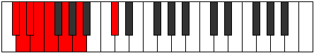
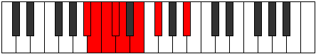

# Mode Epanian

## Links

- [Documentation](index.md)
- [Scales Index](Scales.md)
- [Modes Index](Modes.md)
- [Chords Index](Chords.md)

## Parent Scale

[Stanian](ScaleStanian.md)

## Number

[351](https://ianring.com/musictheory/scales/351)

## Perfection

- 3 Perfect notes
- 4 Perfect notes

## Perfection Profile

[false true false false false true true]

## Permutations

| Tonic | Notes | Signature | Illustration | Audio |
|-------|-------|-----------|--------------|-------|
| [C](ModeCNaturalEpanian.md) | **C**, Db, **Ebb**, **Fbb**, **Gbbb**, Abbb, Bbbb, **C** | C |  | [midi](ModeCNaturalEpanian.mid) [ogg](ModeCNaturalEpanian.ogg) |
| [C#](ModeCSharpEpanian.md) | **C#**, D, **Eb**, **Fb**, **Gbb**, Abb, Bbb, **C#** | C |  | [midi](ModeCSharpEpanian.mid) [ogg](ModeCSharpEpanian.ogg) |
| [Db](ModeDFlatEpanian.md) | **Db**, Ebb, **Fbb**, **Gbbb**, **D###**, E###, Cbbb, **Db** | C |  | [midi](ModeDFlatEpanian.mid) [ogg](ModeDFlatEpanian.ogg) |
| [D](ModeDNaturalEpanian.md) | **D**, Eb, **Fb**, **Gbb**, **Abbb**, Bbbb, Cbb, **D** | C |  | [midi](ModeDNaturalEpanian.mid) [ogg](ModeDNaturalEpanian.ogg) |
| [D#](ModeDSharpEpanian.md) | **D#**, E, **F**, **Gb**, **Abb**, Bbb, Cb, **D#** | C |  | [midi](ModeDSharpEpanian.mid) [ogg](ModeDSharpEpanian.ogg) |
| [Eb](ModeEFlatEpanian.md) | **Eb**, Fb, **Gbb**, **Abbb**, **E###**, Cbbb, Dbbb, **Eb** | C |  | [midi](ModeEFlatEpanian.mid) [ogg](ModeEFlatEpanian.ogg) |
| [E](ModeENaturalEpanian.md) | **E**, F, **Gb**, **Abb**, **Bbbb**, Cbb, Dbb, **E** | C |  | [midi](ModeENaturalEpanian.mid) [ogg](ModeENaturalEpanian.ogg) |
| [F](ModeFNaturalEpanian.md) | **F**, Gb, **Abb**, **Bbbb**, **Cbbb**, Dbbb, Ebbb, **F** | C |  | [midi](ModeFNaturalEpanian.mid) [ogg](ModeFNaturalEpanian.ogg) |
| [F#](ModeFSharpEpanian.md) | **F#**, G, **Ab**, **Bbb**, **Cbb**, Dbb, Ebb, **F#** | C |  | [midi](ModeFSharpEpanian.mid) [ogg](ModeFSharpEpanian.ogg) |
| [Gb](ModeGFlatEpanian.md) | **Gb**, Abb, **Bbbb**, **Cbbb**, **Cbb**, Dbb, Ebb, **Gb** | C |  | [midi](ModeGFlatEpanian.mid) [ogg](ModeGFlatEpanian.ogg) |
| [G](ModeGNaturalEpanian.md) | **G**, Ab, **Bbb**, **Cbb**, **Dbbb**, Ebbb, Fbb, **G** | C |  | [midi](ModeGNaturalEpanian.mid) [ogg](ModeGNaturalEpanian.ogg) |
| [G#](ModeGSharpEpanian.md) | **G#**, A, **Bb**, **Cb**, **Dbb**, Ebb, Fb, **G#** | C |  | [midi](ModeGSharpEpanian.mid) [ogg](ModeGSharpEpanian.ogg) |
| [Ab](ModeAFlatEpanian.md) | **Ab**, Bbb, **Cbb**, **Dbbb**, **Dbb**, Ebb, Fb, **Ab** | C |  | [midi](ModeAFlatEpanian.mid) [ogg](ModeAFlatEpanian.ogg) |
| [A](ModeANaturalEpanian.md) | **A**, Bb, **Cb**, **Dbb**, **Ebbb**, Fbb, Gbb, **A** | C |  | [midi](ModeANaturalEpanian.mid) [ogg](ModeANaturalEpanian.ogg) |
| [A#](ModeASharpEpanian.md) | **A#**, B, **C**, **Db**, **Ebb**, Fb, Gb, **A#** | C |  | [midi](ModeASharpEpanian.mid) [ogg](ModeASharpEpanian.ogg) |
| [Bb](ModeBFlatEpanian.md) | **Bb**, Cb, **Dbb**, **Ebbb**, **Fbbb**, Gbbb, Abbb, **Bb** | C |  | [midi](ModeBFlatEpanian.mid) [ogg](ModeBFlatEpanian.ogg) |
| [B](ModeBNaturalEpanian.md) | **B**, C, **Db**, **Ebb**, **Fbb**, Gbb, Abb, **B** | C |  | [midi](ModeBNaturalEpanian.mid) [ogg](ModeBNaturalEpanian.ogg) |
