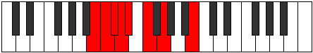

# Mode Epanian

## Links

- [Documentation](README.md)
- [Scales Index](Scales.md)
- [Modes Index](Modes.md)
- [Chords Index](Chords.md)

## Parent Scale

[Stanian](ScaleStanian.md)

## Number

[351](https://ianring.com/musictheory/scales/351)

## Luminosity

-1

## Transposition

1, 1, 1, 1, 2, 2, 4

## Chord Pattern

iii⁰b3

## Perfection

- 3 Perfect notes
- 4 Perfect notes

## Perfection Profile

false, true, false, false, false, true, true

## Permutations

| Tonic | Notes | Signature | Illustration | Audio |
|-------|-------|-----------|--------------|-------|
| [C](ModeCNaturalEpanian.md) | **C**, Db, **Ebb**, **Fbb**, **Gbbb**, Abbb, Bbbb, **C** | C |  | [midi](https://github.com/edipermadi/music/blob/main/docs/ModeCNaturalEpanian.mid?raw=true) |
| [C#](ModeCSharpEpanian.md) | **C#**, D, **Eb**, **Fb**, **Gbb**, Abb, Bbb, **C#** | C |  | [midi](https://github.com/edipermadi/music/blob/main/docs/ModeCSharpEpanian.mid?raw=true) |
| [Db](ModeDFlatEpanian.md) | **Db**, Ebb, **Fbb**, **Gbbb**, **D###**, E###, Cbbb, **Db** | C |  | [midi](https://github.com/edipermadi/music/blob/main/docs/ModeDFlatEpanian.mid?raw=true) |
| [D](ModeDNaturalEpanian.md) | **D**, Eb, **Fb**, **Gbb**, **Abbb**, Bbbb, Cbb, **D** | C |  | [midi](https://github.com/edipermadi/music/blob/main/docs/ModeDNaturalEpanian.mid?raw=true) |
| [D#](ModeDSharpEpanian.md) | **D#**, E, **F**, **Gb**, **Abb**, Bbb, Cb, **D#** | C |  | [midi](https://github.com/edipermadi/music/blob/main/docs/ModeDSharpEpanian.mid?raw=true) |
| [Eb](ModeEFlatEpanian.md) | **Eb**, Fb, **Gbb**, **Abbb**, **E###**, Cbbb, Dbbb, **Eb** | C |  | [midi](https://github.com/edipermadi/music/blob/main/docs/ModeEFlatEpanian.mid?raw=true) |
| [E](ModeENaturalEpanian.md) | **E**, F, **Gb**, **Abb**, **Bbbb**, Cbb, Dbb, **E** | C |  | [midi](https://github.com/edipermadi/music/blob/main/docs/ModeENaturalEpanian.mid?raw=true) |
| [F](ModeFNaturalEpanian.md) | **F**, Gb, **Abb**, **Bbbb**, **Cbbb**, Dbbb, Ebbb, **F** | C |  | [midi](https://github.com/edipermadi/music/blob/main/docs/ModeFNaturalEpanian.mid?raw=true) |
| [F#](ModeFSharpEpanian.md) | **F#**, G, **Ab**, **Bbb**, **Cbb**, Dbb, Ebb, **F#** | C |  | [midi](https://github.com/edipermadi/music/blob/main/docs/ModeFSharpEpanian.mid?raw=true) |
| [Gb](ModeGFlatEpanian.md) | **Gb**, Abb, **Bbbb**, **Cbbb**, **Cbb**, Dbb, Ebb, **Gb** | C |  | [midi](https://github.com/edipermadi/music/blob/main/docs/ModeGFlatEpanian.mid?raw=true) |
| [G](ModeGNaturalEpanian.md) | **G**, Ab, **Bbb**, **Cbb**, **Dbbb**, Ebbb, Fbb, **G** | C |  | [midi](https://github.com/edipermadi/music/blob/main/docs/ModeGNaturalEpanian.mid?raw=true) |
| [G#](ModeGSharpEpanian.md) | **G#**, A, **Bb**, **Cb**, **Dbb**, Ebb, Fb, **G#** | C |  | [midi](https://github.com/edipermadi/music/blob/main/docs/ModeGSharpEpanian.mid?raw=true) |
| [Ab](ModeAFlatEpanian.md) | **Ab**, Bbb, **Cbb**, **Dbbb**, **Dbb**, Ebb, Fb, **Ab** | C |  | [midi](https://github.com/edipermadi/music/blob/main/docs/ModeAFlatEpanian.mid?raw=true) |
| [A](ModeANaturalEpanian.md) | **A**, Bb, **Cb**, **Dbb**, **Ebbb**, Fbb, Gbb, **A** | C |  | [midi](https://github.com/edipermadi/music/blob/main/docs/ModeANaturalEpanian.mid?raw=true) |
| [A#](ModeASharpEpanian.md) | **A#**, B, **C**, **Db**, **Ebb**, Fb, Gb, **A#** | C |  | [midi](https://github.com/edipermadi/music/blob/main/docs/ModeASharpEpanian.mid?raw=true) |
| [Bb](ModeBFlatEpanian.md) | **Bb**, Cb, **Dbb**, **Ebbb**, **Fbbb**, Gbbb, Abbb, **Bb** | C |  | [midi](https://github.com/edipermadi/music/blob/main/docs/ModeBFlatEpanian.mid?raw=true) |
| [B](ModeBNaturalEpanian.md) | **B**, C, **Db**, **Ebb**, **Fbb**, Gbb, Abb, **B** | C |  | [midi](https://github.com/edipermadi/music/blob/main/docs/ModeBNaturalEpanian.mid?raw=true) |
