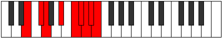

# Mode Epaphyllic

## Links

- [Documentation](index.md)
- [Scales Index](Scales.md)
- [Modes Index](Modes.md)
- [Chords Index](Chords.md)

## Parent Scale

[Aeronyllic](ScaleAeronyllic.md)

## Number

[3917](https://ianring.com/musictheory/scales/3917)

## Perfection

- 4 Perfect notes
- 4 Perfect notes

## Perfection Profile

[false true true false true false false true]

## Permutations

| Tonic | Notes | Signature | Illustration | Audio |
|-------|-------|-----------|--------------|-------|
| [C](ModeCNaturalEpaphyllic.md) | **C**, D, D#, **F#**, G#, **A**, **A#**, B, **C** | C |  | [midi](ModeCNaturalEpaphyllic.mid) [ogg](ModeCNaturalEpaphyllic.ogg) |
| [C#](ModeCSharpEpaphyllic.md) | **C#**, D#, E, **G**, A, **A#**, **B**, C, **C#** | C |  | [midi](ModeCSharpEpaphyllic.mid) [ogg](ModeCSharpEpaphyllic.ogg) |
| [Db](ModeDFlatEpaphyllic.md) | **Db**, Eb, E, **G**, A, **Bb**, **B**, C, **Db** | C |  | [midi](ModeDFlatEpaphyllic.mid) [ogg](ModeDFlatEpaphyllic.ogg) |
| [D](ModeDNaturalEpaphyllic.md) | **D**, E, F, **G#**, A#, **B**, **C**, C#, **D** | C |  | [midi](ModeDNaturalEpaphyllic.mid) [ogg](ModeDNaturalEpaphyllic.ogg) |
| [D#](ModeDSharpEpaphyllic.md) | **D#**, F, F#, **A**, B, **C**, **C#**, D, **D#** | C |  | [midi](ModeDSharpEpaphyllic.mid) [ogg](ModeDSharpEpaphyllic.ogg) |
| [Eb](ModeEFlatEpaphyllic.md) | **Eb**, F, Gb, **A**, B, **C**, **Db**, D, **Eb** | C |  | [midi](ModeEFlatEpaphyllic.mid) [ogg](ModeEFlatEpaphyllic.ogg) |
| [E](ModeENaturalEpaphyllic.md) | **E**, F#, G, **A#**, C, **C#**, **D**, D#, **E** | C |  | [midi](ModeENaturalEpaphyllic.mid) [ogg](ModeENaturalEpaphyllic.ogg) |
| [F](ModeFNaturalEpaphyllic.md) | **F**, G, G#, **B**, C#, **D**, **D#**, E, **F** | C |  | [midi](ModeFNaturalEpaphyllic.mid) [ogg](ModeFNaturalEpaphyllic.ogg) |
| [F#](ModeFSharpEpaphyllic.md) | **F#**, G#, A, **C**, D, **D#**, **E**, F, **F#** | C |  | [midi](ModeFSharpEpaphyllic.mid) [ogg](ModeFSharpEpaphyllic.ogg) |
| [Gb](ModeGFlatEpaphyllic.md) | **Gb**, Ab, A, **C**, D, **Eb**, **E**, F, **Gb** | C |  | [midi](ModeGFlatEpaphyllic.mid) [ogg](ModeGFlatEpaphyllic.ogg) |
| [G](ModeGNaturalEpaphyllic.md) | **G**, A, A#, **C#**, D#, **E**, **F**, F#, **G** | C |  | [midi](ModeGNaturalEpaphyllic.mid) [ogg](ModeGNaturalEpaphyllic.ogg) |
| [G#](ModeGSharpEpaphyllic.md) | **G#**, A#, B, **D**, E, **F**, **F#**, G, **G#** | C |  | [midi](ModeGSharpEpaphyllic.mid) [ogg](ModeGSharpEpaphyllic.ogg) |
| [Ab](ModeAFlatEpaphyllic.md) | **Ab**, Bb, B, **D**, E, **F**, **Gb**, G, **Ab** | C |  | [midi](ModeAFlatEpaphyllic.mid) [ogg](ModeAFlatEpaphyllic.ogg) |
| [A](ModeANaturalEpaphyllic.md) | **A**, B, C, **D#**, F, **F#**, **G**, G#, **A** | C |  | [midi](ModeANaturalEpaphyllic.mid) [ogg](ModeANaturalEpaphyllic.ogg) |
| [A#](ModeASharpEpaphyllic.md) | **A#**, C, C#, **E**, F#, **G**, **G#**, A, **A#** | C |  | [midi](ModeASharpEpaphyllic.mid) [ogg](ModeASharpEpaphyllic.ogg) |
| [Bb](ModeBFlatEpaphyllic.md) | **Bb**, C, Db, **E**, Gb, **G**, **Ab**, A, **Bb** | C |  | [midi](ModeBFlatEpaphyllic.mid) [ogg](ModeBFlatEpaphyllic.ogg) |
| [B](ModeBNaturalEpaphyllic.md) | **B**, C#, D, **F**, G, **G#**, **A**, A#, **B** | C |  | [midi](ModeBNaturalEpaphyllic.mid) [ogg](ModeBNaturalEpaphyllic.ogg) |
