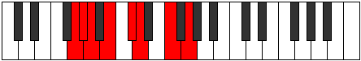

# Mode Epaptian

## Links

- [Documentation](index.md)
- [Scales Index](Scales.md)
- [Modes Index](Modes.md)
- [Chords Index](Chords.md)

## Parent Scale

[Eporian](ScaleEporian.md)

## Number

[1239](https://ianring.com/musictheory/scales/1239)

## Perfection

- 3 Perfect notes
- 4 Perfect notes

## Interval Pattern

1, 1, 2, 2, 1, 3, 2

## Perfection Profile

[true false false false true true false]

## Permutations

| Tonic | Notes | Signature | Illustration | Audio |
|-------|-------|-----------|--------------|-------|
| [C](ModeCNaturalEpaptian.md) | C, **Db**, **Ebb**, **Fb**, Gb, Abb, **Bb**, C | C |  | [midi](https://github.com/edipermadi/music/blob/main/docs/ModeCNaturalEpaptian.mid?raw=true) |
| [C#](ModeCSharpEpaptian.md) | C#, **D**, **Eb**, **F**, G, Ab, **B**, C# | C |  | [midi](https://github.com/edipermadi/music/blob/main/docs/ModeCSharpEpaptian.mid?raw=true) |
| [Db](ModeDFlatEpaptian.md) | Db, **Ebb**, **Fbb**, **Gbb**, Abb, Bbbb, **Cb**, Db | C |  | [midi](https://github.com/edipermadi/music/blob/main/docs/ModeDFlatEpaptian.mid?raw=true) |
| [D](ModeDNaturalEpaptian.md) | D, **Eb**, **Fb**, **Gb**, Ab, Bbb, **C**, D | C |  | [midi](https://github.com/edipermadi/music/blob/main/docs/ModeDNaturalEpaptian.mid?raw=true) |
| [D#](ModeDSharpEpaptian.md) | D#, **E**, **F**, **G**, A, Bb, **C#**, D# | C |  | [midi](https://github.com/edipermadi/music/blob/main/docs/ModeDSharpEpaptian.mid?raw=true) |
| [Eb](ModeEFlatEpaptian.md) | Eb, **Fb**, **Gbb**, **Abb**, Bbb, Cbb, **Db**, Eb | C |  | [midi](https://github.com/edipermadi/music/blob/main/docs/ModeEFlatEpaptian.mid?raw=true) |
| [E](ModeENaturalEpaptian.md) | E, **F**, **Gb**, **Ab**, Bb, Cb, **D**, E | C |  | [midi](https://github.com/edipermadi/music/blob/main/docs/ModeENaturalEpaptian.mid?raw=true) |
| [F](ModeFNaturalEpaptian.md) | F, **Gb**, **Abb**, **Bbb**, Cb, Dbb, **Eb**, F | C |  | [midi](https://github.com/edipermadi/music/blob/main/docs/ModeFNaturalEpaptian.mid?raw=true) |
| [F#](ModeFSharpEpaptian.md) | F#, **G**, **Ab**, **Bb**, C, Db, **E**, F# | C |  | [midi](https://github.com/edipermadi/music/blob/main/docs/ModeFSharpEpaptian.mid?raw=true) |
| [Gb](ModeGFlatEpaptian.md) | Gb, **Abb**, **Bbbb**, **Cbb**, Dbb, Ebbb, **Fb**, Gb | C |  | [midi](https://github.com/edipermadi/music/blob/main/docs/ModeGFlatEpaptian.mid?raw=true) |
| [G](ModeGNaturalEpaptian.md) | G, **Ab**, **Bbb**, **Cb**, Db, Ebb, **F**, G | C |  | [midi](https://github.com/edipermadi/music/blob/main/docs/ModeGNaturalEpaptian.mid?raw=true) |
| [G#](ModeGSharpEpaptian.md) | G#, **A**, **Bb**, **C**, D, Eb, **F#**, G# | C |  | [midi](https://github.com/edipermadi/music/blob/main/docs/ModeGSharpEpaptian.mid?raw=true) |
| [Ab](ModeAFlatEpaptian.md) | Ab, **Bbb**, **Cbb**, **Dbb**, Ebb, Fbb, **Gb**, Ab | C |  | [midi](https://github.com/edipermadi/music/blob/main/docs/ModeAFlatEpaptian.mid?raw=true) |
| [A](ModeANaturalEpaptian.md) | A, **Bb**, **Cb**, **Db**, Eb, Fb, **G**, A | C |  | [midi](https://github.com/edipermadi/music/blob/main/docs/ModeANaturalEpaptian.mid?raw=true) |
| [A#](ModeASharpEpaptian.md) | A#, **B**, **C**, **D**, E, F, **G#**, A# | C |  | [midi](https://github.com/edipermadi/music/blob/main/docs/ModeASharpEpaptian.mid?raw=true) |
| [Bb](ModeBFlatEpaptian.md) | Bb, **Cb**, **Dbb**, **Ebb**, Fb, Gbb, **Ab**, Bb | C |  | [midi](https://github.com/edipermadi/music/blob/main/docs/ModeBFlatEpaptian.mid?raw=true) |
| [B](ModeBNaturalEpaptian.md) | B, **C**, **Db**, **Eb**, F, Gb, **A**, B | C |  | [midi](https://github.com/edipermadi/music/blob/main/docs/ModeBNaturalEpaptian.mid?raw=true) |
