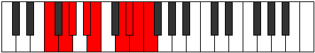

# Mode Epaptyllic

## Links

- [Documentation](README.md)
- [Scales Index](Scales.md)
- [Modes Index](Modes.md)
- [Chords Index](Chords.md)

## Parent Scale

[Aeolathyllic](ScaleAeolathyllic.md)

## Number

[3693](https://ianring.com/musictheory/scales/3693)

## Transposition

2, 1, 2, 1, 3, 1, 1, 1

## Chord Pattern

i⁰, ii, iii, IVb5, Vb5, viii⁰

## Perfection

- 5 Perfect notes
- 3 Perfect notes

## Perfection Profile

false, true, true, true, false, false, true, true

## Permutations

| Tonic | Notes | Signature | Illustration | Audio |
|-------|-------|-----------|--------------|-------|
| [C](ModeCNaturalEpaptyllic.md) | **C**, D, D#, F, **F#**, **A**, A#, B, **C** | C |  | [midi](https://github.com/edipermadi/music/blob/main/docs/ModeCNaturalEpaptyllic.mid?raw=true) |
| [C#](ModeCSharpEpaptyllic.md) | **C#**, D#, E, F#, **G**, **A#**, B, C, **C#** | C |  | [midi](https://github.com/edipermadi/music/blob/main/docs/ModeCSharpEpaptyllic.mid?raw=true) |
| [Db](ModeDFlatEpaptyllic.md) | **Db**, Eb, E, Gb, **G**, **Bb**, B, C, **Db** | C |  | [midi](https://github.com/edipermadi/music/blob/main/docs/ModeDFlatEpaptyllic.mid?raw=true) |
| [D](ModeDNaturalEpaptyllic.md) | **D**, E, F, G, **G#**, **B**, C, C#, **D** | C |  | [midi](https://github.com/edipermadi/music/blob/main/docs/ModeDNaturalEpaptyllic.mid?raw=true) |
| [D#](ModeDSharpEpaptyllic.md) | **D#**, F, F#, G#, **A**, **C**, C#, D, **D#** | C |  | [midi](https://github.com/edipermadi/music/blob/main/docs/ModeDSharpEpaptyllic.mid?raw=true) |
| [Eb](ModeEFlatEpaptyllic.md) | **Eb**, F, Gb, Ab, **A**, **C**, Db, D, **Eb** | C |  | [midi](https://github.com/edipermadi/music/blob/main/docs/ModeEFlatEpaptyllic.mid?raw=true) |
| [E](ModeENaturalEpaptyllic.md) | **E**, F#, G, A, **A#**, **C#**, D, D#, **E** | C |  | [midi](https://github.com/edipermadi/music/blob/main/docs/ModeENaturalEpaptyllic.mid?raw=true) |
| [F](ModeFNaturalEpaptyllic.md) | **F**, G, G#, A#, **B**, **D**, D#, E, **F** | C |  | [midi](https://github.com/edipermadi/music/blob/main/docs/ModeFNaturalEpaptyllic.mid?raw=true) |
| [F#](ModeFSharpEpaptyllic.md) | **F#**, G#, A, B, **C**, **D#**, E, F, **F#** | C |  | [midi](https://github.com/edipermadi/music/blob/main/docs/ModeFSharpEpaptyllic.mid?raw=true) |
| [Gb](ModeGFlatEpaptyllic.md) | **Gb**, Ab, A, B, **C**, **Eb**, E, F, **Gb** | C |  | [midi](https://github.com/edipermadi/music/blob/main/docs/ModeGFlatEpaptyllic.mid?raw=true) |
| [G](ModeGNaturalEpaptyllic.md) | **G**, A, A#, C, **C#**, **E**, F, F#, **G** | C |  | [midi](https://github.com/edipermadi/music/blob/main/docs/ModeGNaturalEpaptyllic.mid?raw=true) |
| [G#](ModeGSharpEpaptyllic.md) | **G#**, A#, B, C#, **D**, **F**, F#, G, **G#** | C |  | [midi](https://github.com/edipermadi/music/blob/main/docs/ModeGSharpEpaptyllic.mid?raw=true) |
| [Ab](ModeAFlatEpaptyllic.md) | **Ab**, Bb, B, Db, **D**, **F**, Gb, G, **Ab** | C |  | [midi](https://github.com/edipermadi/music/blob/main/docs/ModeAFlatEpaptyllic.mid?raw=true) |
| [A](ModeANaturalEpaptyllic.md) | **A**, B, C, D, **D#**, **F#**, G, G#, **A** | C |  | [midi](https://github.com/edipermadi/music/blob/main/docs/ModeANaturalEpaptyllic.mid?raw=true) |
| [A#](ModeASharpEpaptyllic.md) | **A#**, C, C#, D#, **E**, **G**, G#, A, **A#** | C |  | [midi](https://github.com/edipermadi/music/blob/main/docs/ModeASharpEpaptyllic.mid?raw=true) |
| [Bb](ModeBFlatEpaptyllic.md) | **Bb**, C, Db, Eb, **E**, **G**, Ab, A, **Bb** | C |  | [midi](https://github.com/edipermadi/music/blob/main/docs/ModeBFlatEpaptyllic.mid?raw=true) |
| [B](ModeBNaturalEpaptyllic.md) | **B**, C#, D, E, **F**, **G#**, A, A#, **B** | C |  | [midi](https://github.com/edipermadi/music/blob/main/docs/ModeBNaturalEpaptyllic.mid?raw=true) |
