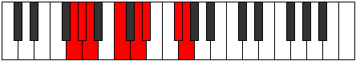

# Mode Eparian

## Links

- [Documentation](index.md)
- [Scales Index](Scales.md)
- [Modes Index](Modes.md)
- [Chords Index](Chords.md)

## Parent Scale

[Katocrian](ScaleKatocrian.md)

## Number

[2471](https://ianring.com/musictheory/scales/2471)

## Perfection

- 4 Perfect notes
- 3 Perfect notes

## Perfection Profile

[true true false true true false false]

## Permutations

| Tonic | Notes | Signature | Illustration | Audio |
|-------|-------|-----------|--------------|-------|
| [C](ModeCNaturalEparian.md) | C, Db, **Ebb**, F, G, **Ab**, **B**, C | C |  | [midi](ModeCNaturalEparian.mid) [ogg](ModeCNaturalEparian.ogg) |
| [C#](ModeCSharpEparian.md) | C#, D, **Eb**, F#, G#, **A**, **B#**, C# | C |  | [midi](ModeCSharpEparian.mid) [ogg](ModeCSharpEparian.ogg) |
| [Db](ModeDFlatEparian.md) | Db, Ebb, **Fbb**, Gb, Ab, **Bbb**, **C**, Db | C |  | [midi](ModeDFlatEparian.mid) [ogg](ModeDFlatEparian.ogg) |
| [D](ModeDNaturalEparian.md) | D, Eb, **Fb**, G, A, **Bb**, **C#**, D | C |  | [midi](ModeDNaturalEparian.mid) [ogg](ModeDNaturalEparian.ogg) |
| [D#](ModeDSharpEparian.md) | D#, E, **F**, G#, A#, **B**, **C##**, D# | C |  | [midi](ModeDSharpEparian.mid) [ogg](ModeDSharpEparian.ogg) |
| [Eb](ModeEFlatEparian.md) | Eb, Fb, **Gbb**, Ab, Bb, **Cb**, **D**, Eb | C |  | [midi](ModeEFlatEparian.mid) [ogg](ModeEFlatEparian.ogg) |
| [E](ModeENaturalEparian.md) | E, F, **Gb**, A, B, **C**, **D#**, E | C |  | [midi](ModeENaturalEparian.mid) [ogg](ModeENaturalEparian.ogg) |
| [F](ModeFNaturalEparian.md) | F, Gb, **Abb**, Bb, C, **Db**, **E**, F | C |  | [midi](ModeFNaturalEparian.mid) [ogg](ModeFNaturalEparian.ogg) |
| [F#](ModeFSharpEparian.md) | F#, G, **Ab**, B, C#, **D**, **E#**, F# | C |  | [midi](ModeFSharpEparian.mid) [ogg](ModeFSharpEparian.ogg) |
| [Gb](ModeGFlatEparian.md) | Gb, Abb, **Bbbb**, Cb, Db, **Ebb**, **F**, Gb | C |  | [midi](ModeGFlatEparian.mid) [ogg](ModeGFlatEparian.ogg) |
| [G](ModeGNaturalEparian.md) | G, Ab, **Bbb**, C, D, **Eb**, **F#**, G | C |  | [midi](ModeGNaturalEparian.mid) [ogg](ModeGNaturalEparian.ogg) |
| [G#](ModeGSharpEparian.md) | G#, A, **Bb**, C#, D#, **E**, **F##**, G# | C |  | [midi](ModeGSharpEparian.mid) [ogg](ModeGSharpEparian.ogg) |
| [Ab](ModeAFlatEparian.md) | Ab, Bbb, **Cbb**, Db, Eb, **Fb**, **G**, Ab | C |  | [midi](ModeAFlatEparian.mid) [ogg](ModeAFlatEparian.ogg) |
| [A](ModeANaturalEparian.md) | A, Bb, **Cb**, D, E, **F**, **G#**, A | C |  | [midi](ModeANaturalEparian.mid) [ogg](ModeANaturalEparian.ogg) |
| [A#](ModeASharpEparian.md) | A#, B, **C**, D#, E#, **F#**, **G##**, A# | C |  | [midi](ModeASharpEparian.mid) [ogg](ModeASharpEparian.ogg) |
| [Bb](ModeBFlatEparian.md) | Bb, Cb, **Dbb**, Eb, F, **Gb**, **A**, Bb | C |  | [midi](ModeBFlatEparian.mid) [ogg](ModeBFlatEparian.ogg) |
| [B](ModeBNaturalEparian.md) | B, C, **Db**, E, F#, **G**, **A#**, B | C |  | [midi](ModeBNaturalEparian.mid) [ogg](ModeBNaturalEparian.ogg) |
