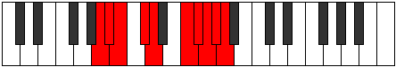

# Mode Eparygic

## Links

- [Documentation](README.md)
- [Scales Index](Scales.md)
- [Modes Index](Modes.md)
- [Chords Index](Chords.md)

## Parent Scale

[Zothygic](ScaleZothygic.md)

## Number

[3895](https://ianring.com/musictheory/scales/3895)

## Transposition

1, 1, 2, 1, 3, 1, 1, 1, 1

## Chord Pattern

ii, iii, IVb5, Vb5

## Perfection

- 6 Perfect notes
- 3 Perfect notes

## Perfection Profile

false, true, true, true, true, false, true, true, false

## Permutations

| Tonic | Notes | Signature | Illustration | Audio |
|-------|-------|-----------|--------------|-------|
| [C](ModeCNaturalEparygic.md) | **C**, C#, D, E, F, **G#**, A, A#, **B**, **C** | C |  | [midi](https://github.com/edipermadi/music/blob/main/docs/ModeCNaturalEparygic.mid?raw=true) |
| [C#](ModeCSharpEparygic.md) | **C#**, D, D#, F, F#, **A**, A#, B, **C**, **C#** | C |  | [midi](https://github.com/edipermadi/music/blob/main/docs/ModeCSharpEparygic.mid?raw=true) |
| [Db](ModeDFlatEparygic.md) | **Db**, D, Eb, F, Gb, **A**, Bb, B, **C**, **Db** | C |  | [midi](https://github.com/edipermadi/music/blob/main/docs/ModeDFlatEparygic.mid?raw=true) |
| [D](ModeDNaturalEparygic.md) | **D**, D#, E, F#, G, **A#**, B, C, **C#**, **D** | C |  | [midi](https://github.com/edipermadi/music/blob/main/docs/ModeDNaturalEparygic.mid?raw=true) |
| [D#](ModeDSharpEparygic.md) | **D#**, E, F, G, G#, **B**, C, C#, **D**, **D#** | C |  | [midi](https://github.com/edipermadi/music/blob/main/docs/ModeDSharpEparygic.mid?raw=true) |
| [Eb](ModeEFlatEparygic.md) | **Eb**, E, F, G, Ab, **B**, C, Db, **D**, **Eb** | C |  | [midi](https://github.com/edipermadi/music/blob/main/docs/ModeEFlatEparygic.mid?raw=true) |
| [E](ModeENaturalEparygic.md) | **E**, F, F#, G#, A, **C**, C#, D, **D#**, **E** | C |  | [midi](https://github.com/edipermadi/music/blob/main/docs/ModeENaturalEparygic.mid?raw=true) |
| [F](ModeFNaturalEparygic.md) | **F**, F#, G, A, A#, **C#**, D, D#, **E**, **F** | C |  | [midi](https://github.com/edipermadi/music/blob/main/docs/ModeFNaturalEparygic.mid?raw=true) |
| [F#](ModeFSharpEparygic.md) | **F#**, G, G#, A#, B, **D**, D#, E, **F**, **F#** | C |  | [midi](https://github.com/edipermadi/music/blob/main/docs/ModeFSharpEparygic.mid?raw=true) |
| [Gb](ModeGFlatEparygic.md) | **Gb**, G, Ab, Bb, B, **D**, Eb, E, **F**, **Gb** | C |  | [midi](https://github.com/edipermadi/music/blob/main/docs/ModeGFlatEparygic.mid?raw=true) |
| [G](ModeGNaturalEparygic.md) | **G**, G#, A, B, C, **D#**, E, F, **F#**, **G** | C |  | [midi](https://github.com/edipermadi/music/blob/main/docs/ModeGNaturalEparygic.mid?raw=true) |
| [G#](ModeGSharpEparygic.md) | **G#**, A, A#, C, C#, **E**, F, F#, **G**, **G#** | C |  | [midi](https://github.com/edipermadi/music/blob/main/docs/ModeGSharpEparygic.mid?raw=true) |
| [Ab](ModeAFlatEparygic.md) | **Ab**, A, Bb, C, Db, **E**, F, Gb, **G**, **Ab** | C |  | [midi](https://github.com/edipermadi/music/blob/main/docs/ModeAFlatEparygic.mid?raw=true) |
| [A](ModeANaturalEparygic.md) | **A**, A#, B, C#, D, **F**, F#, G, **G#**, **A** | C |  | [midi](https://github.com/edipermadi/music/blob/main/docs/ModeANaturalEparygic.mid?raw=true) |
| [A#](ModeASharpEparygic.md) | **A#**, B, C, D, D#, **F#**, G, G#, **A**, **A#** | C |  | [midi](https://github.com/edipermadi/music/blob/main/docs/ModeASharpEparygic.mid?raw=true) |
| [Bb](ModeBFlatEparygic.md) | **Bb**, B, C, D, Eb, **Gb**, G, Ab, **A**, **Bb** | C |  | [midi](https://github.com/edipermadi/music/blob/main/docs/ModeBFlatEparygic.mid?raw=true) |
| [B](ModeBNaturalEparygic.md) | **B**, C, C#, D#, E, **G**, G#, A, **A#**, **B** | C |  | [midi](https://github.com/edipermadi/music/blob/main/docs/ModeBNaturalEparygic.mid?raw=true) |
