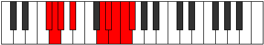

# Mode Eparyllic

## Links

- [Documentation](index.md)
- [Scales Index](Scales.md)
- [Modes Index](Modes.md)
- [Chords Index](Chords.md)

## Parent Scale

[Stolyllic](ScaleStolyllic.md)

## Number

[3863](https://ianring.com/musictheory/scales/3863)

## Perfection

- 4 Perfect notes
- 4 Perfect notes

## Perfection Profile

[false true true true false true false false]

## Permutations

| Tonic | Notes | Signature | Illustration | Audio |
|-------|-------|-----------|--------------|-------|
| [C](ModeCNaturalEparyllic.md) | **C**, C#, D, E, **G#**, A, **A#**, **B**, **C** | C |  | [midi](ModeCNaturalEparyllic.mid) [ogg](ModeCNaturalEparyllic.ogg) |
| [C#](ModeCSharpEparyllic.md) | **C#**, D, D#, F, **A**, A#, **B**, **C**, **C#** | C |  | [midi](ModeCSharpEparyllic.mid) [ogg](ModeCSharpEparyllic.ogg) |
| [Db](ModeDFlatEparyllic.md) | **Db**, D, Eb, F, **A**, Bb, **B**, **C**, **Db** | C |  | [midi](ModeDFlatEparyllic.mid) [ogg](ModeDFlatEparyllic.ogg) |
| [D](ModeDNaturalEparyllic.md) | **D**, D#, E, F#, **A#**, B, **C**, **C#**, **D** | C |  | [midi](ModeDNaturalEparyllic.mid) [ogg](ModeDNaturalEparyllic.ogg) |
| [D#](ModeDSharpEparyllic.md) | **D#**, E, F, G, **B**, C, **C#**, **D**, **D#** | C |  | [midi](ModeDSharpEparyllic.mid) [ogg](ModeDSharpEparyllic.ogg) |
| [Eb](ModeEFlatEparyllic.md) | **Eb**, E, F, G, **B**, C, **Db**, **D**, **Eb** | C |  | [midi](ModeEFlatEparyllic.mid) [ogg](ModeEFlatEparyllic.ogg) |
| [E](ModeENaturalEparyllic.md) | **E**, F, F#, G#, **C**, C#, **D**, **D#**, **E** | C |  | [midi](ModeENaturalEparyllic.mid) [ogg](ModeENaturalEparyllic.ogg) |
| [F](ModeFNaturalEparyllic.md) | **F**, F#, G, A, **C#**, D, **D#**, **E**, **F** | C |  | [midi](ModeFNaturalEparyllic.mid) [ogg](ModeFNaturalEparyllic.ogg) |
| [F#](ModeFSharpEparyllic.md) | **F#**, G, G#, A#, **D**, D#, **E**, **F**, **F#** | C |  | [midi](ModeFSharpEparyllic.mid) [ogg](ModeFSharpEparyllic.ogg) |
| [Gb](ModeGFlatEparyllic.md) | **Gb**, G, Ab, Bb, **D**, Eb, **E**, **F**, **Gb** | C |  | [midi](ModeGFlatEparyllic.mid) [ogg](ModeGFlatEparyllic.ogg) |
| [G](ModeGNaturalEparyllic.md) | **G**, G#, A, B, **D#**, E, **F**, **F#**, **G** | C |  | [midi](ModeGNaturalEparyllic.mid) [ogg](ModeGNaturalEparyllic.ogg) |
| [G#](ModeGSharpEparyllic.md) | **G#**, A, A#, C, **E**, F, **F#**, **G**, **G#** | C |  | [midi](ModeGSharpEparyllic.mid) [ogg](ModeGSharpEparyllic.ogg) |
| [Ab](ModeAFlatEparyllic.md) | **Ab**, A, Bb, C, **E**, F, **Gb**, **G**, **Ab** | C |  | [midi](ModeAFlatEparyllic.mid) [ogg](ModeAFlatEparyllic.ogg) |
| [A](ModeANaturalEparyllic.md) | **A**, A#, B, C#, **F**, F#, **G**, **G#**, **A** | C |  | [midi](ModeANaturalEparyllic.mid) [ogg](ModeANaturalEparyllic.ogg) |
| [A#](ModeASharpEparyllic.md) | **A#**, B, C, D, **F#**, G, **G#**, **A**, **A#** | C |  | [midi](ModeASharpEparyllic.mid) [ogg](ModeASharpEparyllic.ogg) |
| [Bb](ModeBFlatEparyllic.md) | **Bb**, B, C, D, **Gb**, G, **Ab**, **A**, **Bb** | C |  | [midi](ModeBFlatEparyllic.mid) [ogg](ModeBFlatEparyllic.ogg) |
| [B](ModeBNaturalEparyllic.md) | **B**, C, C#, D#, **G**, G#, **A**, **A#**, **B** | C |  | [midi](ModeBNaturalEparyllic.mid) [ogg](ModeBNaturalEparyllic.ogg) |
