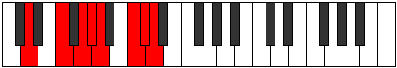

# Mode Epathian

## Links

- [Documentation](index.md)
- [Scales Index](Scales.md)
- [Modes Index](Modes.md)
- [Chords Index](Chords.md)

## Parent Scale

[Epathian](ScaleEpathian.md)

## Number

[3305](https://ianring.com/musictheory/scales/3305)

## Interval Pattern

3, 2, 1, 1, 3, 1, 1

## Chord Pattern

ii, V⁺, VII

## Perfection

- 5 Perfect notes
- 2 Perfect notes

## Perfection Profile

[true true true false false true true]

## Permutations

| Tonic | Notes | Signature | Illustration | Audio |
|-------|-------|-----------|--------------|-------|
| [C](ModeCNaturalEpathian.md) | C, D#, E#, **F#**, **G**, A#, B, C | C |  | [midi](https://github.com/edipermadi/music/blob/main/docs/ModeCNaturalEpathian.mid?raw=true) |
| [C#](ModeCSharpEpathian.md) | C#, D##, E##, **F##**, **G#**, A##, B#, C# | C |  | [midi](https://github.com/edipermadi/music/blob/main/docs/ModeCSharpEpathian.mid?raw=true) |
| [Db](ModeDFlatEpathian.md) | Db, E, F#, **G**, **Ab**, B, C, Db | C |  | [midi](https://github.com/edipermadi/music/blob/main/docs/ModeDFlatEpathian.mid?raw=true) |
| [D](ModeDNaturalEpathian.md) | D, E#, F##, **G#**, **A**, B#, C#, D | C |  | [midi](https://github.com/edipermadi/music/blob/main/docs/ModeDNaturalEpathian.mid?raw=true) |
| [D#](ModeDSharpEpathian.md) | D#, E##, F###, **G##**, **A#**, B##, C##, D# | C |  | [midi](https://github.com/edipermadi/music/blob/main/docs/ModeDSharpEpathian.mid?raw=true) |
| [Eb](ModeEFlatEpathian.md) | Eb, F#, G#, **A**, **Bb**, C#, D, Eb | C |  | [midi](https://github.com/edipermadi/music/blob/main/docs/ModeEFlatEpathian.mid?raw=true) |
| [E](ModeENaturalEpathian.md) | E, F##, G##, **A#**, **B**, C##, D#, E | C |  | [midi](https://github.com/edipermadi/music/blob/main/docs/ModeENaturalEpathian.mid?raw=true) |
| [F](ModeFNaturalEpathian.md) | F, G#, A#, **B**, **C**, D#, E, F | C |  | [midi](https://github.com/edipermadi/music/blob/main/docs/ModeFNaturalEpathian.mid?raw=true) |
| [F#](ModeFSharpEpathian.md) | F#, G##, A##, **B#**, **C#**, D##, E#, F# | C |  | [midi](https://github.com/edipermadi/music/blob/main/docs/ModeFSharpEpathian.mid?raw=true) |
| [Gb](ModeGFlatEpathian.md) | Gb, A, B, **C**, **Db**, E, F, Gb | C |  | [midi](https://github.com/edipermadi/music/blob/main/docs/ModeGFlatEpathian.mid?raw=true) |
| [G](ModeGNaturalEpathian.md) | G, A#, B#, **C#**, **D**, E#, F#, G | C |  | [midi](https://github.com/edipermadi/music/blob/main/docs/ModeGNaturalEpathian.mid?raw=true) |
| [G#](ModeGSharpEpathian.md) | G#, A##, B##, **C##**, **D#**, E##, F##, G# | C |  | [midi](https://github.com/edipermadi/music/blob/main/docs/ModeGSharpEpathian.mid?raw=true) |
| [Ab](ModeAFlatEpathian.md) | Ab, B, C#, **D**, **Eb**, F#, G, Ab | C |  | [midi](https://github.com/edipermadi/music/blob/main/docs/ModeAFlatEpathian.mid?raw=true) |
| [A](ModeANaturalEpathian.md) | A, B#, C##, **D#**, **E**, F##, G#, A | C |  | [midi](https://github.com/edipermadi/music/blob/main/docs/ModeANaturalEpathian.mid?raw=true) |
| [A#](ModeASharpEpathian.md) | A#, B##, C###, **D##**, **E#**, F###, G##, A# | C |  | [midi](https://github.com/edipermadi/music/blob/main/docs/ModeASharpEpathian.mid?raw=true) |
| [Bb](ModeBFlatEpathian.md) | Bb, C#, D#, **E**, **F**, G#, A, Bb | C |  | [midi](https://github.com/edipermadi/music/blob/main/docs/ModeBFlatEpathian.mid?raw=true) |
| [B](ModeBNaturalEpathian.md) | B, C##, D##, **E#**, **F#**, G##, A#, B | C |  | [midi](https://github.com/edipermadi/music/blob/main/docs/ModeBNaturalEpathian.mid?raw=true) |
