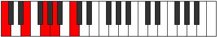
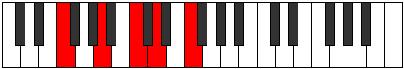
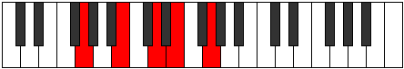
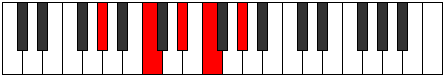
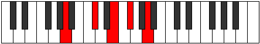
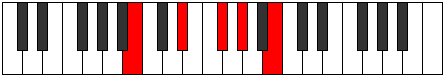

# Mode Epathic

## Links

- [Documentation](index.md)
- [Scales Index](Scales.md)
- [Modes Index](Modes.md)
- [Chords Index](Chords.md)

## Parent Scale

[Epathic](ScaleEpathic.md)

## Number

[657](https://ianring.com/musictheory/scales/657)

## Perfection

- 2 Perfect notes
- 2 Perfect notes

## Perfection Profile

[true false false true]

## Permutations

| Tonic | Notes | Signature | Illustration | Audio |
|-------|-------|-----------|--------------|-------|
| [C](ModeCNaturalEpathic.md) | C, **E**, **G**, A, C | C |  | [midi](ModeCNaturalEpathic.mid) [ogg](ModeCNaturalEpathic.ogg) |
| [C#](ModeCSharpEpathic.md) | C#, **F**, **G#**, A#, C# | C |  | [midi](ModeCSharpEpathic.mid) [ogg](ModeCSharpEpathic.ogg) |
| [Db](ModeDFlatEpathic.md) | Db, **F**, **Ab**, Bb, Db | C |  | [midi](ModeDFlatEpathic.mid) [ogg](ModeDFlatEpathic.ogg) |
| [D](ModeDNaturalEpathic.md) | D, **F#**, **A**, B, D | C |  | [midi](ModeDNaturalEpathic.mid) [ogg](ModeDNaturalEpathic.ogg) |
| [D#](ModeDSharpEpathic.md) | D#, **G**, **A#**, C, D# | C |  | [midi](ModeDSharpEpathic.mid) [ogg](ModeDSharpEpathic.ogg) |
| [Eb](ModeEFlatEpathic.md) | Eb, **G**, **Bb**, C, Eb | C |  | [midi](ModeEFlatEpathic.mid) [ogg](ModeEFlatEpathic.ogg) |
| [E](ModeENaturalEpathic.md) | E, **G#**, **B**, C#, E | C |  | [midi](ModeENaturalEpathic.mid) [ogg](ModeENaturalEpathic.ogg) |
| [F](ModeFNaturalEpathic.md) | F, **A**, **C**, D, F | C |  | [midi](ModeFNaturalEpathic.mid) [ogg](ModeFNaturalEpathic.ogg) |
| [F#](ModeFSharpEpathic.md) | F#, **A#**, **C#**, D#, F# | C |  | [midi](ModeFSharpEpathic.mid) [ogg](ModeFSharpEpathic.ogg) |
| [Gb](ModeGFlatEpathic.md) | Gb, **Bb**, **Db**, Eb, Gb | C |  | [midi](ModeGFlatEpathic.mid) [ogg](ModeGFlatEpathic.ogg) |
| [G](ModeGNaturalEpathic.md) | G, **B**, **D**, E, G | C |  | [midi](ModeGNaturalEpathic.mid) [ogg](ModeGNaturalEpathic.ogg) |
| [G#](ModeGSharpEpathic.md) | G#, **C**, **D#**, F, G# | C |  | [midi](ModeGSharpEpathic.mid) [ogg](ModeGSharpEpathic.ogg) |
| [Ab](ModeAFlatEpathic.md) | Ab, **C**, **Eb**, F, Ab | C |  | [midi](ModeAFlatEpathic.mid) [ogg](ModeAFlatEpathic.ogg) |
| [A](ModeANaturalEpathic.md) | A, **C#**, **E**, F#, A | C |  | [midi](ModeANaturalEpathic.mid) [ogg](ModeANaturalEpathic.ogg) |
| [A#](ModeASharpEpathic.md) | A#, **D**, **F**, G, A# | C |  | [midi](ModeASharpEpathic.mid) [ogg](ModeASharpEpathic.ogg) |
| [Bb](ModeBFlatEpathic.md) | Bb, **D**, **F**, G, Bb | C |  | [midi](ModeBFlatEpathic.mid) [ogg](ModeBFlatEpathic.ogg) |
| [B](ModeBNaturalEpathic.md) | B, **D#**, **F#**, G#, B | C |  | [midi](ModeBNaturalEpathic.mid) [ogg](ModeBNaturalEpathic.ogg) |
