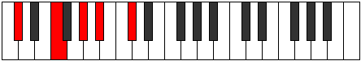

# Mode Epathic

## Links

- [Documentation](README.md)
- [Scales Index](Scales.md)
- [Modes Index](Modes.md)
- [Chords Index](Chords.md)

## Parent Scale

[Epathic](ScaleEpathic.md)

## Number

[657](https://ianring.com/musictheory/scales/657)

## Luminosity

4

## Transposition

4, 3, 2, 3

## Chord Pattern

## Perfection

- 2 Perfect notes
- 2 Perfect notes

## Perfection Profile

true, false, false, true

## Permutations

| Tonic | Notes | Signature | Illustration | Audio |
|-------|-------|-----------|--------------|-------|
| [C](ModeCNaturalEpathic.md) | C, **E**, **G**, A, C | C |  | [midi](https://github.com/edipermadi/music/blob/main/docs/ModeCNaturalEpathic.mid?raw=true) |
| [C#](ModeCSharpEpathic.md) | C#, **F**, **G#**, A#, C# | C |  | [midi](https://github.com/edipermadi/music/blob/main/docs/ModeCSharpEpathic.mid?raw=true) |
| [Db](ModeDFlatEpathic.md) | Db, **F**, **Ab**, Bb, Db | C |  | [midi](https://github.com/edipermadi/music/blob/main/docs/ModeDFlatEpathic.mid?raw=true) |
| [D](ModeDNaturalEpathic.md) | D, **F#**, **A**, B, D | C |  | [midi](https://github.com/edipermadi/music/blob/main/docs/ModeDNaturalEpathic.mid?raw=true) |
| [D#](ModeDSharpEpathic.md) | D#, **G**, **A#**, C, D# | C |  | [midi](https://github.com/edipermadi/music/blob/main/docs/ModeDSharpEpathic.mid?raw=true) |
| [Eb](ModeEFlatEpathic.md) | Eb, **G**, **Bb**, C, Eb | C |  | [midi](https://github.com/edipermadi/music/blob/main/docs/ModeEFlatEpathic.mid?raw=true) |
| [E](ModeENaturalEpathic.md) | E, **G#**, **B**, C#, E | C |  | [midi](https://github.com/edipermadi/music/blob/main/docs/ModeENaturalEpathic.mid?raw=true) |
| [F](ModeFNaturalEpathic.md) | F, **A**, **C**, D, F | C |  | [midi](https://github.com/edipermadi/music/blob/main/docs/ModeFNaturalEpathic.mid?raw=true) |
| [F#](ModeFSharpEpathic.md) | F#, **A#**, **C#**, D#, F# | C |  | [midi](https://github.com/edipermadi/music/blob/main/docs/ModeFSharpEpathic.mid?raw=true) |
| [Gb](ModeGFlatEpathic.md) | Gb, **Bb**, **Db**, Eb, Gb | C |  | [midi](https://github.com/edipermadi/music/blob/main/docs/ModeGFlatEpathic.mid?raw=true) |
| [G](ModeGNaturalEpathic.md) | G, **B**, **D**, E, G | C |  | [midi](https://github.com/edipermadi/music/blob/main/docs/ModeGNaturalEpathic.mid?raw=true) |
| [G#](ModeGSharpEpathic.md) | G#, **C**, **D#**, F, G# | C |  | [midi](https://github.com/edipermadi/music/blob/main/docs/ModeGSharpEpathic.mid?raw=true) |
| [Ab](ModeAFlatEpathic.md) | Ab, **C**, **Eb**, F, Ab | C |  | [midi](https://github.com/edipermadi/music/blob/main/docs/ModeAFlatEpathic.mid?raw=true) |
| [A](ModeANaturalEpathic.md) | A, **C#**, **E**, F#, A | C |  | [midi](https://github.com/edipermadi/music/blob/main/docs/ModeANaturalEpathic.mid?raw=true) |
| [A#](ModeASharpEpathic.md) | A#, **D**, **F**, G, A# | C |  | [midi](https://github.com/edipermadi/music/blob/main/docs/ModeASharpEpathic.mid?raw=true) |
| [Bb](ModeBFlatEpathic.md) | Bb, **D**, **F**, G, Bb | C |  | [midi](https://github.com/edipermadi/music/blob/main/docs/ModeBFlatEpathic.mid?raw=true) |
| [B](ModeBNaturalEpathic.md) | B, **D#**, **F#**, G#, B | C |  | [midi](https://github.com/edipermadi/music/blob/main/docs/ModeBNaturalEpathic.mid?raw=true) |
