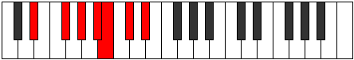

# Mode Epathimic

## Links

- [Documentation](index.md)
- [Scales Index](Scales.md)
- [Modes Index](Modes.md)
- [Chords Index](Chords.md)

## Parent Scale

[Epathimic](ScaleEpathimic.md)

## Number

[1449](https://ianring.com/musictheory/scales/1449)

## Interval Pattern

3, 2, 2, 1, 2, 2

## Chord Pattern

II, iii

## Perfection

- 5 Perfect notes
- 1 Perfect notes

## Perfection Profile

[true true true false true true]

## Permutations

| Tonic | Notes | Signature | Illustration | Audio |
|-------|-------|-----------|--------------|-------|
| [C](ModeCNaturalEpathimic.md) | C, D#, E#, **F##**, G#, A#, C | C |  | [midi](https://github.com/edipermadi/music/blob/main/docs/ModeCNaturalEpathimic.mid?raw=true) |
| [C#](ModeCSharpEpathimic.md) | C#, D##, E##, **F###**, G##, A##, C# | C |  | [midi](https://github.com/edipermadi/music/blob/main/docs/ModeCSharpEpathimic.mid?raw=true) |
| [Db](ModeDFlatEpathimic.md) | Db, E, F#, **G#**, A, B, Db | C |  | [midi](https://github.com/edipermadi/music/blob/main/docs/ModeDFlatEpathimic.mid?raw=true) |
| [D](ModeDNaturalEpathimic.md) | D, E#, F##, **G##**, A#, B#, D | C |  | [midi](https://github.com/edipermadi/music/blob/main/docs/ModeDNaturalEpathimic.mid?raw=true) |
| [D#](ModeDSharpEpathimic.md) | D#, E##, F###, **G###**, A##, B##, D# | C |  | [midi](https://github.com/edipermadi/music/blob/main/docs/ModeDSharpEpathimic.mid?raw=true) |
| [Eb](ModeEFlatEpathimic.md) | Eb, F#, G#, **A#**, B, C#, Eb | C |  | [midi](https://github.com/edipermadi/music/blob/main/docs/ModeEFlatEpathimic.mid?raw=true) |
| [E](ModeENaturalEpathimic.md) | E, F##, G##, **A##**, B#, C##, E | C |  | [midi](https://github.com/edipermadi/music/blob/main/docs/ModeENaturalEpathimic.mid?raw=true) |
| [F](ModeFNaturalEpathimic.md) | F, G#, A#, **B#**, C#, D#, F | C |  | [midi](https://github.com/edipermadi/music/blob/main/docs/ModeFNaturalEpathimic.mid?raw=true) |
| [F#](ModeFSharpEpathimic.md) | F#, G##, A##, **B##**, C##, D##, F# | C |  | [midi](https://github.com/edipermadi/music/blob/main/docs/ModeFSharpEpathimic.mid?raw=true) |
| [Gb](ModeGFlatEpathimic.md) | Gb, A, B, **C#**, D, E, Gb | C |  | [midi](https://github.com/edipermadi/music/blob/main/docs/ModeGFlatEpathimic.mid?raw=true) |
| [G](ModeGNaturalEpathimic.md) | G, A#, B#, **C##**, D#, E#, G | C |  | [midi](https://github.com/edipermadi/music/blob/main/docs/ModeGNaturalEpathimic.mid?raw=true) |
| [G#](ModeGSharpEpathimic.md) | G#, A##, B##, **C###**, D##, E##, G# | C |  | [midi](https://github.com/edipermadi/music/blob/main/docs/ModeGSharpEpathimic.mid?raw=true) |
| [Ab](ModeAFlatEpathimic.md) | Ab, B, C#, **D#**, E, F#, Ab | C |  | [midi](https://github.com/edipermadi/music/blob/main/docs/ModeAFlatEpathimic.mid?raw=true) |
| [A](ModeANaturalEpathimic.md) | A, B#, C##, **D##**, E#, F##, A | C |  | [midi](https://github.com/edipermadi/music/blob/main/docs/ModeANaturalEpathimic.mid?raw=true) |
| [A#](ModeASharpEpathimic.md) | A#, B##, C###, **D###**, E##, F###, A# | C |  | [midi](https://github.com/edipermadi/music/blob/main/docs/ModeASharpEpathimic.mid?raw=true) |
| [Bb](ModeBFlatEpathimic.md) | Bb, C#, D#, **E#**, F#, G#, Bb | C |  | [midi](https://github.com/edipermadi/music/blob/main/docs/ModeBFlatEpathimic.mid?raw=true) |
| [B](ModeBNaturalEpathimic.md) | B, C##, D##, **E##**, F##, G##, B | C |  | [midi](https://github.com/edipermadi/music/blob/main/docs/ModeBNaturalEpathimic.mid?raw=true) |
