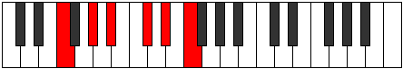
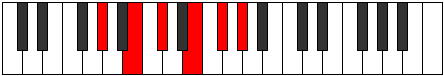

# Mode Epathitonic

## Links

- [Documentation](index.md)
- [Scales Index](Scales.md)
- [Modes Index](Modes.md)
- [Chords Index](Chords.md)

## Parent Scale

[Epathitonic](ScaleEpathitonic.md)

## Number

[1321](https://ianring.com/musictheory/scales/1321)

## Perfection

- 4 Perfect notes
- 1 Perfect notes

## Perfection Profile

[false true true true true]

## Permutations

| Tonic | Notes | Signature | Illustration | Audio |
|-------|-------|-----------|--------------|-------|
| [C](ModeCNaturalEpathitonic.md) | **C**, D#, F, G#, A#, **C** | C |  | [midi](ModeCNaturalEpathitonic.mid) [ogg](ModeCNaturalEpathitonic.ogg) |
| [C#](ModeCSharpEpathitonic.md) | **C#**, E, F#, A, B, **C#** | C |  | [midi](ModeCSharpEpathitonic.mid) [ogg](ModeCSharpEpathitonic.ogg) |
| [Db](ModeDFlatEpathitonic.md) | **Db**, E, Gb, A, B, **Db** | C |  | [midi](ModeDFlatEpathitonic.mid) [ogg](ModeDFlatEpathitonic.ogg) |
| [D](ModeDNaturalEpathitonic.md) | **D**, F, G, A#, C, **D** | C |  | [midi](ModeDNaturalEpathitonic.mid) [ogg](ModeDNaturalEpathitonic.ogg) |
| [D#](ModeDSharpEpathitonic.md) | **D#**, F#, G#, B, C#, **D#** | C |  | [midi](ModeDSharpEpathitonic.mid) [ogg](ModeDSharpEpathitonic.ogg) |
| [Eb](ModeEFlatEpathitonic.md) | **Eb**, Gb, Ab, B, Db, **Eb** | C |  | [midi](ModeEFlatEpathitonic.mid) [ogg](ModeEFlatEpathitonic.ogg) |
| [E](ModeENaturalEpathitonic.md) | **E**, G, A, C, D, **E** | C |  | [midi](ModeENaturalEpathitonic.mid) [ogg](ModeENaturalEpathitonic.ogg) |
| [F](ModeFNaturalEpathitonic.md) | **F**, G#, A#, C#, D#, **F** | C |  | [midi](ModeFNaturalEpathitonic.mid) [ogg](ModeFNaturalEpathitonic.ogg) |
| [F#](ModeFSharpEpathitonic.md) | **F#**, A, B, D, E, **F#** | C |  | [midi](ModeFSharpEpathitonic.mid) [ogg](ModeFSharpEpathitonic.ogg) |
| [Gb](ModeGFlatEpathitonic.md) | **Gb**, A, B, D, E, **Gb** | C |  | [midi](ModeGFlatEpathitonic.mid) [ogg](ModeGFlatEpathitonic.ogg) |
| [G](ModeGNaturalEpathitonic.md) | **G**, A#, C, D#, F, **G** | C |  | [midi](ModeGNaturalEpathitonic.mid) [ogg](ModeGNaturalEpathitonic.ogg) |
| [G#](ModeGSharpEpathitonic.md) | **G#**, B, C#, E, F#, **G#** | C |  | [midi](ModeGSharpEpathitonic.mid) [ogg](ModeGSharpEpathitonic.ogg) |
| [Ab](ModeAFlatEpathitonic.md) | **Ab**, B, Db, E, Gb, **Ab** | C |  | [midi](ModeAFlatEpathitonic.mid) [ogg](ModeAFlatEpathitonic.ogg) |
| [A](ModeANaturalEpathitonic.md) | **A**, C, D, F, G, **A** | C |  | [midi](ModeANaturalEpathitonic.mid) [ogg](ModeANaturalEpathitonic.ogg) |
| [A#](ModeASharpEpathitonic.md) | **A#**, C#, D#, F#, G#, **A#** | C |  | [midi](ModeASharpEpathitonic.mid) [ogg](ModeASharpEpathitonic.ogg) |
| [Bb](ModeBFlatEpathitonic.md) | **Bb**, Db, Eb, Gb, Ab, **Bb** | C |  | [midi](ModeBFlatEpathitonic.mid) [ogg](ModeBFlatEpathitonic.ogg) |
| [B](ModeBNaturalEpathitonic.md) | **B**, D, E, G, A, **B** | C |  | [midi](ModeBNaturalEpathitonic.mid) [ogg](ModeBNaturalEpathitonic.ogg) |
