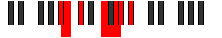

# Mode Epatimic

## Links

- [Documentation](README.md)
- [Scales Index](Scales.md)
- [Modes Index](Modes.md)
- [Chords Index](Chords.md)

## Parent Scale

[Manimic](ScaleManimic.md)

## Number

[1675](https://ianring.com/musictheory/scales/1675)

## Interval Pattern

1, 2, 4, 2, 1, 2

## Chord Pattern

iv⁰, v⁰

## Perfection

- 2 Perfect notes
- 4 Perfect notes

## Perfection Profile

[true false true false false false]

## Permutations

| Tonic | Notes | Signature | Illustration | Audio |
|-------|-------|-----------|--------------|-------|
| [C](ModeCNaturalEpatimic.md) | C, **Db**, Eb, **F##**, **G##**, **A#**, C | C |  | [midi](https://github.com/edipermadi/music/blob/main/docs/ModeCNaturalEpatimic.mid?raw=true) |
| [C#](ModeCSharpEpatimic.md) | C#, **D**, E, **F###**, **G###**, **A##**, C# | C |  | [midi](https://github.com/edipermadi/music/blob/main/docs/ModeCSharpEpatimic.mid?raw=true) |
| [Db](ModeDFlatEpatimic.md) | Db, **Ebb**, Fb, **G#**, **A#**, **B**, Db | C |  | [midi](https://github.com/edipermadi/music/blob/main/docs/ModeDFlatEpatimic.mid?raw=true) |
| [D](ModeDNaturalEpatimic.md) | D, **Eb**, F, **G##**, **A##**, **B#**, D | C |  | [midi](https://github.com/edipermadi/music/blob/main/docs/ModeDNaturalEpatimic.mid?raw=true) |
| [D#](ModeDSharpEpatimic.md) | D#, **E**, F#, **G###**, **A###**, **B##**, D# | C |  | [midi](https://github.com/edipermadi/music/blob/main/docs/ModeDSharpEpatimic.mid?raw=true) |
| [Eb](ModeEFlatEpatimic.md) | Eb, **Fb**, Gb, **A#**, **B#**, **C#**, Eb | C |  | [midi](https://github.com/edipermadi/music/blob/main/docs/ModeEFlatEpatimic.mid?raw=true) |
| [E](ModeENaturalEpatimic.md) | E, **F**, G, **A##**, **B##**, **C##**, E | C |  | [midi](https://github.com/edipermadi/music/blob/main/docs/ModeENaturalEpatimic.mid?raw=true) |
| [F](ModeFNaturalEpatimic.md) | F, **Gb**, Ab, **B#**, **C##**, **D#**, F | C |  | [midi](https://github.com/edipermadi/music/blob/main/docs/ModeFNaturalEpatimic.mid?raw=true) |
| [F#](ModeFSharpEpatimic.md) | F#, **G**, A, **B##**, **C###**, **D##**, F# | C |  | [midi](https://github.com/edipermadi/music/blob/main/docs/ModeFSharpEpatimic.mid?raw=true) |
| [Gb](ModeGFlatEpatimic.md) | Gb, **Abb**, Bbb, **C#**, **D#**, **E**, Gb | C |  | [midi](https://github.com/edipermadi/music/blob/main/docs/ModeGFlatEpatimic.mid?raw=true) |
| [G](ModeGNaturalEpatimic.md) | G, **Ab**, Bb, **C##**, **D##**, **E#**, G | C |  | [midi](https://github.com/edipermadi/music/blob/main/docs/ModeGNaturalEpatimic.mid?raw=true) |
| [G#](ModeGSharpEpatimic.md) | G#, **A**, B, **C###**, **D###**, **E##**, G# | C |  | [midi](https://github.com/edipermadi/music/blob/main/docs/ModeGSharpEpatimic.mid?raw=true) |
| [Ab](ModeAFlatEpatimic.md) | Ab, **Bbb**, Cb, **D#**, **E#**, **F#**, Ab | C |  | [midi](https://github.com/edipermadi/music/blob/main/docs/ModeAFlatEpatimic.mid?raw=true) |
| [A](ModeANaturalEpatimic.md) | A, **Bb**, C, **D##**, **E##**, **F##**, A | C |  | [midi](https://github.com/edipermadi/music/blob/main/docs/ModeANaturalEpatimic.mid?raw=true) |
| [A#](ModeASharpEpatimic.md) | A#, **B**, C#, **D###**, **E###**, **F###**, A# | C |  | [midi](https://github.com/edipermadi/music/blob/main/docs/ModeASharpEpatimic.mid?raw=true) |
| [Bb](ModeBFlatEpatimic.md) | Bb, **Cb**, Db, **E#**, **F##**, **G#**, Bb | C |  | [midi](https://github.com/edipermadi/music/blob/main/docs/ModeBFlatEpatimic.mid?raw=true) |
| [B](ModeBNaturalEpatimic.md) | B, **C**, D, **E##**, **F###**, **G##**, B | C |  | [midi](https://github.com/edipermadi/music/blob/main/docs/ModeBNaturalEpatimic.mid?raw=true) |
