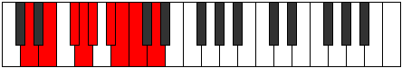
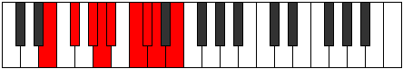

# Mode Epicryllic

## Links

- [Documentation](index.md)
- [Scales Index](Scales.md)
- [Modes Index](Modes.md)
- [Chords Index](Chords.md)

## Parent Scale

[Racryllic](ScaleRacryllic.md)

## Number

[1909](https://ianring.com/musictheory/scales/1909)

## Perfection

- 4 Perfect notes
- 4 Perfect notes

## Perfection Profile

[false true false true false false true true]

## Permutations

| Tonic | Notes | Signature | Illustration | Audio |
|-------|-------|-----------|--------------|-------|
| [C](ModeCNaturalEpicryllic.md) | **C**, D, **E**, F, **F#**, **G#**, A, A#, **C** | C |  | [midi](https://github.com/edipermadi/music/blob/main/docs/ModeCNaturalEpicryllic.mid?raw=true) |
| [C#](ModeCSharpEpicryllic.md) | **C#**, D#, **F**, F#, **G**, **A**, A#, B, **C#** | C |  | [midi](https://github.com/edipermadi/music/blob/main/docs/ModeCSharpEpicryllic.mid?raw=true) |
| [Db](ModeDFlatEpicryllic.md) | **Db**, Eb, **F**, Gb, **G**, **A**, Bb, B, **Db** | C |  | [midi](https://github.com/edipermadi/music/blob/main/docs/ModeDFlatEpicryllic.mid?raw=true) |
| [D](ModeDNaturalEpicryllic.md) | **D**, E, **F#**, G, **G#**, **A#**, B, C, **D** | C |  | [midi](https://github.com/edipermadi/music/blob/main/docs/ModeDNaturalEpicryllic.mid?raw=true) |
| [D#](ModeDSharpEpicryllic.md) | **D#**, F, **G**, G#, **A**, **B**, C, C#, **D#** | C |  | [midi](https://github.com/edipermadi/music/blob/main/docs/ModeDSharpEpicryllic.mid?raw=true) |
| [Eb](ModeEFlatEpicryllic.md) | **Eb**, F, **G**, Ab, **A**, **B**, C, Db, **Eb** | C |  | [midi](https://github.com/edipermadi/music/blob/main/docs/ModeEFlatEpicryllic.mid?raw=true) |
| [E](ModeENaturalEpicryllic.md) | **E**, F#, **G#**, A, **A#**, **C**, C#, D, **E** | C |  | [midi](https://github.com/edipermadi/music/blob/main/docs/ModeENaturalEpicryllic.mid?raw=true) |
| [F](ModeFNaturalEpicryllic.md) | **F**, G, **A**, A#, **B**, **C#**, D, D#, **F** | C |  | [midi](https://github.com/edipermadi/music/blob/main/docs/ModeFNaturalEpicryllic.mid?raw=true) |
| [F#](ModeFSharpEpicryllic.md) | **F#**, G#, **A#**, B, **C**, **D**, D#, E, **F#** | C |  | [midi](https://github.com/edipermadi/music/blob/main/docs/ModeFSharpEpicryllic.mid?raw=true) |
| [Gb](ModeGFlatEpicryllic.md) | **Gb**, Ab, **Bb**, B, **C**, **D**, Eb, E, **Gb** | C |  | [midi](https://github.com/edipermadi/music/blob/main/docs/ModeGFlatEpicryllic.mid?raw=true) |
| [G](ModeGNaturalEpicryllic.md) | **G**, A, **B**, C, **C#**, **D#**, E, F, **G** | C |  | [midi](https://github.com/edipermadi/music/blob/main/docs/ModeGNaturalEpicryllic.mid?raw=true) |
| [G#](ModeGSharpEpicryllic.md) | **G#**, A#, **C**, C#, **D**, **E**, F, F#, **G#** | C |  | [midi](https://github.com/edipermadi/music/blob/main/docs/ModeGSharpEpicryllic.mid?raw=true) |
| [Ab](ModeAFlatEpicryllic.md) | **Ab**, Bb, **C**, Db, **D**, **E**, F, Gb, **Ab** | C |  | [midi](https://github.com/edipermadi/music/blob/main/docs/ModeAFlatEpicryllic.mid?raw=true) |
| [A](ModeANaturalEpicryllic.md) | **A**, B, **C#**, D, **D#**, **F**, F#, G, **A** | C |  | [midi](https://github.com/edipermadi/music/blob/main/docs/ModeANaturalEpicryllic.mid?raw=true) |
| [A#](ModeASharpEpicryllic.md) | **A#**, C, **D**, D#, **E**, **F#**, G, G#, **A#** | C |  | [midi](https://github.com/edipermadi/music/blob/main/docs/ModeASharpEpicryllic.mid?raw=true) |
| [Bb](ModeBFlatEpicryllic.md) | **Bb**, C, **D**, Eb, **E**, **Gb**, G, Ab, **Bb** | C |  | [midi](https://github.com/edipermadi/music/blob/main/docs/ModeBFlatEpicryllic.mid?raw=true) |
| [B](ModeBNaturalEpicryllic.md) | **B**, C#, **D#**, E, **F**, **G**, G#, A, **B** | C |  | [midi](https://github.com/edipermadi/music/blob/main/docs/ModeBNaturalEpicryllic.mid?raw=true) |
