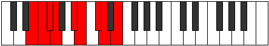

# Mode Epigyllic

## Links

- [Documentation](README.md)
- [Scales Index](Scales.md)
- [Modes Index](Modes.md)
- [Chords Index](Chords.md)

## Parent Scale

[Maptyllic](ScaleMaptyllic.md)

## Number

[1743](https://ianring.com/musictheory/scales/1743)

## Interval Pattern

1, 1, 1, 3, 1, 2, 1, 2

## Chord Pattern

i⁰b3, ii⁰b3, III, IV, v⁰, vi⁰

## Perfection

- 5 Perfect notes
- 3 Perfect notes

## Perfection Profile

[true false true true true true false false]

## Permutations

| Tonic | Notes | Signature | Illustration | Audio |
|-------|-------|-----------|--------------|-------|
| [C](ModeCNaturalEpigyllic.md) | C, **C#**, D, D#, F#, G, **A**, **A#**, C | C |  | [midi](https://github.com/edipermadi/music/blob/main/docs/ModeCNaturalEpigyllic.mid?raw=true) |
| [C#](ModeCSharpEpigyllic.md) | C#, **D**, D#, E, G, G#, **A#**, **B**, C# | C |  | [midi](https://github.com/edipermadi/music/blob/main/docs/ModeCSharpEpigyllic.mid?raw=true) |
| [Db](ModeDFlatEpigyllic.md) | Db, **D**, Eb, E, G, Ab, **Bb**, **B**, Db | C |  | [midi](https://github.com/edipermadi/music/blob/main/docs/ModeDFlatEpigyllic.mid?raw=true) |
| [D](ModeDNaturalEpigyllic.md) | D, **D#**, E, F, G#, A, **B**, **C**, D | C |  | [midi](https://github.com/edipermadi/music/blob/main/docs/ModeDNaturalEpigyllic.mid?raw=true) |
| [D#](ModeDSharpEpigyllic.md) | D#, **E**, F, F#, A, A#, **C**, **C#**, D# | C |  | [midi](https://github.com/edipermadi/music/blob/main/docs/ModeDSharpEpigyllic.mid?raw=true) |
| [Eb](ModeEFlatEpigyllic.md) | Eb, **E**, F, Gb, A, Bb, **C**, **Db**, Eb | C |  | [midi](https://github.com/edipermadi/music/blob/main/docs/ModeEFlatEpigyllic.mid?raw=true) |
| [E](ModeENaturalEpigyllic.md) | E, **F**, F#, G, A#, B, **C#**, **D**, E | C |  | [midi](https://github.com/edipermadi/music/blob/main/docs/ModeENaturalEpigyllic.mid?raw=true) |
| [F](ModeFNaturalEpigyllic.md) | F, **F#**, G, G#, B, C, **D**, **D#**, F | C |  | [midi](https://github.com/edipermadi/music/blob/main/docs/ModeFNaturalEpigyllic.mid?raw=true) |
| [F#](ModeFSharpEpigyllic.md) | F#, **G**, G#, A, C, C#, **D#**, **E**, F# | C |  | [midi](https://github.com/edipermadi/music/blob/main/docs/ModeFSharpEpigyllic.mid?raw=true) |
| [Gb](ModeGFlatEpigyllic.md) | Gb, **G**, Ab, A, C, Db, **Eb**, **E**, Gb | C |  | [midi](https://github.com/edipermadi/music/blob/main/docs/ModeGFlatEpigyllic.mid?raw=true) |
| [G](ModeGNaturalEpigyllic.md) | G, **G#**, A, A#, C#, D, **E**, **F**, G | C |  | [midi](https://github.com/edipermadi/music/blob/main/docs/ModeGNaturalEpigyllic.mid?raw=true) |
| [G#](ModeGSharpEpigyllic.md) | G#, **A**, A#, B, D, D#, **F**, **F#**, G# | C |  | [midi](https://github.com/edipermadi/music/blob/main/docs/ModeGSharpEpigyllic.mid?raw=true) |
| [Ab](ModeAFlatEpigyllic.md) | Ab, **A**, Bb, B, D, Eb, **F**, **Gb**, Ab | C |  | [midi](https://github.com/edipermadi/music/blob/main/docs/ModeAFlatEpigyllic.mid?raw=true) |
| [A](ModeANaturalEpigyllic.md) | A, **A#**, B, C, D#, E, **F#**, **G**, A | C |  | [midi](https://github.com/edipermadi/music/blob/main/docs/ModeANaturalEpigyllic.mid?raw=true) |
| [A#](ModeASharpEpigyllic.md) | A#, **B**, C, C#, E, F, **G**, **G#**, A# | C |  | [midi](https://github.com/edipermadi/music/blob/main/docs/ModeASharpEpigyllic.mid?raw=true) |
| [Bb](ModeBFlatEpigyllic.md) | Bb, **B**, C, Db, E, F, **G**, **Ab**, Bb | C |  | [midi](https://github.com/edipermadi/music/blob/main/docs/ModeBFlatEpigyllic.mid?raw=true) |
| [B](ModeBNaturalEpigyllic.md) | B, **C**, C#, D, F, F#, **G#**, **A**, B | C |  | [midi](https://github.com/edipermadi/music/blob/main/docs/ModeBNaturalEpigyllic.mid?raw=true) |
