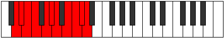

# Mode Epinyllian

## Links

- [Documentation](index.md)
- [Scales Index](Scales.md)
- [Modes Index](Modes.md)
- [Chords Index](Chords.md)

## Parent Scale

[Staptyllian](ScaleStaptyllian.md)

## Number

[3823](https://ianring.com/musictheory/scales/3823)

## Perfection

- 8 Perfect notes
- 2 Perfect notes

## Perfection Profile

[true false true true true true true false true true]

## Permutations

| Tonic | Notes | Signature | Illustration | Audio |
|-------|-------|-----------|--------------|-------|
| [C](ModeCNaturalEpinyllian.md) | C, **C#**, D, D#, F, F#, G, **A**, A#, B, C | C |  | [midi](ModeCNaturalEpinyllian.mid) [ogg](ModeCNaturalEpinyllian.ogg) |
| [C#](ModeCSharpEpinyllian.md) | C#, **D**, D#, E, F#, G, G#, **A#**, B, C, C# | C |  | [midi](ModeCSharpEpinyllian.mid) [ogg](ModeCSharpEpinyllian.ogg) |
| [Db](ModeDFlatEpinyllian.md) | Db, **D**, Eb, E, Gb, G, Ab, **Bb**, B, C, Db | C |  | [midi](ModeDFlatEpinyllian.mid) [ogg](ModeDFlatEpinyllian.ogg) |
| [D](ModeDNaturalEpinyllian.md) | D, **D#**, E, F, G, G#, A, **B**, C, C#, D | C |  | [midi](ModeDNaturalEpinyllian.mid) [ogg](ModeDNaturalEpinyllian.ogg) |
| [D#](ModeDSharpEpinyllian.md) | D#, **E**, F, F#, G#, A, A#, **C**, C#, D, D# | C |  | [midi](ModeDSharpEpinyllian.mid) [ogg](ModeDSharpEpinyllian.ogg) |
| [Eb](ModeEFlatEpinyllian.md) | Eb, **E**, F, Gb, Ab, A, Bb, **C**, Db, D, Eb | C |  | [midi](ModeEFlatEpinyllian.mid) [ogg](ModeEFlatEpinyllian.ogg) |
| [E](ModeENaturalEpinyllian.md) | E, **F**, F#, G, A, A#, B, **C#**, D, D#, E | C |  | [midi](ModeENaturalEpinyllian.mid) [ogg](ModeENaturalEpinyllian.ogg) |
| [F](ModeFNaturalEpinyllian.md) | F, **F#**, G, G#, A#, B, C, **D**, D#, E, F | C |  | [midi](ModeFNaturalEpinyllian.mid) [ogg](ModeFNaturalEpinyllian.ogg) |
| [F#](ModeFSharpEpinyllian.md) | F#, **G**, G#, A, B, C, C#, **D#**, E, F, F# | C |  | [midi](ModeFSharpEpinyllian.mid) [ogg](ModeFSharpEpinyllian.ogg) |
| [Gb](ModeGFlatEpinyllian.md) | Gb, **G**, Ab, A, B, C, Db, **Eb**, E, F, Gb | C |  | [midi](ModeGFlatEpinyllian.mid) [ogg](ModeGFlatEpinyllian.ogg) |
| [G](ModeGNaturalEpinyllian.md) | G, **G#**, A, A#, C, C#, D, **E**, F, F#, G | C |  | [midi](ModeGNaturalEpinyllian.mid) [ogg](ModeGNaturalEpinyllian.ogg) |
| [G#](ModeGSharpEpinyllian.md) | G#, **A**, A#, B, C#, D, D#, **F**, F#, G, G# | C |  | [midi](ModeGSharpEpinyllian.mid) [ogg](ModeGSharpEpinyllian.ogg) |
| [Ab](ModeAFlatEpinyllian.md) | Ab, **A**, Bb, B, Db, D, Eb, **F**, Gb, G, Ab | C |  | [midi](ModeAFlatEpinyllian.mid) [ogg](ModeAFlatEpinyllian.ogg) |
| [A](ModeANaturalEpinyllian.md) | A, **A#**, B, C, D, D#, E, **F#**, G, G#, A | C |  | [midi](ModeANaturalEpinyllian.mid) [ogg](ModeANaturalEpinyllian.ogg) |
| [A#](ModeASharpEpinyllian.md) | A#, **B**, C, C#, D#, E, F, **G**, G#, A, A# | C |  | [midi](ModeASharpEpinyllian.mid) [ogg](ModeASharpEpinyllian.ogg) |
| [Bb](ModeBFlatEpinyllian.md) | Bb, **B**, C, Db, Eb, E, F, **G**, Ab, A, Bb | C |  | [midi](ModeBFlatEpinyllian.mid) [ogg](ModeBFlatEpinyllian.ogg) |
| [B](ModeBNaturalEpinyllian.md) | B, **C**, C#, D, E, F, F#, **G#**, A, A#, B | C |  | [midi](ModeBNaturalEpinyllian.mid) [ogg](ModeBNaturalEpinyllian.ogg) |
