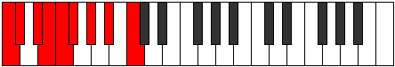

# Mode Epinyllic

## Links

- [Documentation](README.md)
- [Scales Index](Scales.md)
- [Modes Index](Modes.md)
- [Chords Index](Chords.md)

## Parent Scale

[Rocryllic](ScaleRocryllic.md)

## Number

[1403](https://ianring.com/musictheory/scales/1403)

## Transposition

1, 2, 1, 1, 1, 2, 2, 2

## Chord Pattern

iv⁰b3, v, VI, VII, viii⁰

## Perfection

- 6 Perfect notes
- 2 Perfect notes

## Perfection Profile

false, true, true, false, true, true, true, true

## Permutations

| Tonic | Notes | Signature | Illustration | Audio |
|-------|-------|-----------|--------------|-------|
| [C](ModeCNaturalEpinyllic.md) | **C**, C#, D#, **E**, F, F#, G#, A#, **C** | C |  | [midi](https://github.com/edipermadi/music/blob/main/docs/ModeCNaturalEpinyllic.mid?raw=true) |
| [C#](ModeCSharpEpinyllic.md) | **C#**, D, E, **F**, F#, G, A, B, **C#** | C |  | [midi](https://github.com/edipermadi/music/blob/main/docs/ModeCSharpEpinyllic.mid?raw=true) |
| [Db](ModeDFlatEpinyllic.md) | **Db**, D, E, **F**, Gb, G, A, B, **Db** | C |  | [midi](https://github.com/edipermadi/music/blob/main/docs/ModeDFlatEpinyllic.mid?raw=true) |
| [D](ModeDNaturalEpinyllic.md) | **D**, D#, F, **F#**, G, G#, A#, C, **D** | C |  | [midi](https://github.com/edipermadi/music/blob/main/docs/ModeDNaturalEpinyllic.mid?raw=true) |
| [D#](ModeDSharpEpinyllic.md) | **D#**, E, F#, **G**, G#, A, B, C#, **D#** | C |  | [midi](https://github.com/edipermadi/music/blob/main/docs/ModeDSharpEpinyllic.mid?raw=true) |
| [Eb](ModeEFlatEpinyllic.md) | **Eb**, E, Gb, **G**, Ab, A, B, Db, **Eb** | C |  | [midi](https://github.com/edipermadi/music/blob/main/docs/ModeEFlatEpinyllic.mid?raw=true) |
| [E](ModeENaturalEpinyllic.md) | **E**, F, G, **G#**, A, A#, C, D, **E** | C |  | [midi](https://github.com/edipermadi/music/blob/main/docs/ModeENaturalEpinyllic.mid?raw=true) |
| [F](ModeFNaturalEpinyllic.md) | **F**, F#, G#, **A**, A#, B, C#, D#, **F** | C |  | [midi](https://github.com/edipermadi/music/blob/main/docs/ModeFNaturalEpinyllic.mid?raw=true) |
| [F#](ModeFSharpEpinyllic.md) | **F#**, G, A, **A#**, B, C, D, E, **F#** | C |  | [midi](https://github.com/edipermadi/music/blob/main/docs/ModeFSharpEpinyllic.mid?raw=true) |
| [Gb](ModeGFlatEpinyllic.md) | **Gb**, G, A, **Bb**, B, C, D, E, **Gb** | C |  | [midi](https://github.com/edipermadi/music/blob/main/docs/ModeGFlatEpinyllic.mid?raw=true) |
| [G](ModeGNaturalEpinyllic.md) | **G**, G#, A#, **B**, C, C#, D#, F, **G** | C |  | [midi](https://github.com/edipermadi/music/blob/main/docs/ModeGNaturalEpinyllic.mid?raw=true) |
| [G#](ModeGSharpEpinyllic.md) | **G#**, A, B, **C**, C#, D, E, F#, **G#** | C |  | [midi](https://github.com/edipermadi/music/blob/main/docs/ModeGSharpEpinyllic.mid?raw=true) |
| [Ab](ModeAFlatEpinyllic.md) | **Ab**, A, B, **C**, Db, D, E, Gb, **Ab** | C |  | [midi](https://github.com/edipermadi/music/blob/main/docs/ModeAFlatEpinyllic.mid?raw=true) |
| [A](ModeANaturalEpinyllic.md) | **A**, A#, C, **C#**, D, D#, F, G, **A** | C |  | [midi](https://github.com/edipermadi/music/blob/main/docs/ModeANaturalEpinyllic.mid?raw=true) |
| [A#](ModeASharpEpinyllic.md) | **A#**, B, C#, **D**, D#, E, F#, G#, **A#** | C |  | [midi](https://github.com/edipermadi/music/blob/main/docs/ModeASharpEpinyllic.mid?raw=true) |
| [Bb](ModeBFlatEpinyllic.md) | **Bb**, B, Db, **D**, Eb, E, Gb, Ab, **Bb** | C |  | [midi](https://github.com/edipermadi/music/blob/main/docs/ModeBFlatEpinyllic.mid?raw=true) |
| [B](ModeBNaturalEpinyllic.md) | **B**, C, D, **D#**, E, F, G, A, **B** | C |  | [midi](https://github.com/edipermadi/music/blob/main/docs/ModeBNaturalEpinyllic.mid?raw=true) |
