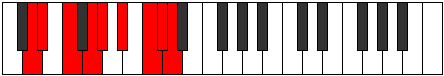

# Mode Epiphyllic

## Links

- [Documentation](index.md)
- [Scales Index](Scales.md)
- [Modes Index](Modes.md)
- [Chords Index](Chords.md)

## Parent Scale

[Aerycryllic](ScaleAerycryllic.md)

## Number

[3435](https://ianring.com/musictheory/scales/3435)

## Perfection

- 7 Perfect notes
- 1 Perfect notes

## Perfection Profile

[false true true true true true true true]

## Permutations

| Tonic | Notes | Signature | Illustration | Audio |
|-------|-------|-----------|--------------|-------|
| [C](ModeCNaturalEpiphyllic.md) | **C**, C#, D#, F, F#, G#, A#, B, **C** | C |  | [midi](ModeCNaturalEpiphyllic.mid) [ogg](ModeCNaturalEpiphyllic.ogg) |
| [C#](ModeCSharpEpiphyllic.md) | **C#**, D, E, F#, G, A, B, C, **C#** | C |  | [midi](ModeCSharpEpiphyllic.mid) [ogg](ModeCSharpEpiphyllic.ogg) |
| [Db](ModeDFlatEpiphyllic.md) | **Db**, D, E, Gb, G, A, B, C, **Db** | C |  | [midi](ModeDFlatEpiphyllic.mid) [ogg](ModeDFlatEpiphyllic.ogg) |
| [D](ModeDNaturalEpiphyllic.md) | **D**, D#, F, G, G#, A#, C, C#, **D** | C |  | [midi](ModeDNaturalEpiphyllic.mid) [ogg](ModeDNaturalEpiphyllic.ogg) |
| [D#](ModeDSharpEpiphyllic.md) | **D#**, E, F#, G#, A, B, C#, D, **D#** | C |  | [midi](ModeDSharpEpiphyllic.mid) [ogg](ModeDSharpEpiphyllic.ogg) |
| [Eb](ModeEFlatEpiphyllic.md) | **Eb**, E, Gb, Ab, A, B, Db, D, **Eb** | C |  | [midi](ModeEFlatEpiphyllic.mid) [ogg](ModeEFlatEpiphyllic.ogg) |
| [E](ModeENaturalEpiphyllic.md) | **E**, F, G, A, A#, C, D, D#, **E** | C |  | [midi](ModeENaturalEpiphyllic.mid) [ogg](ModeENaturalEpiphyllic.ogg) |
| [F](ModeFNaturalEpiphyllic.md) | **F**, F#, G#, A#, B, C#, D#, E, **F** | C |  | [midi](ModeFNaturalEpiphyllic.mid) [ogg](ModeFNaturalEpiphyllic.ogg) |
| [F#](ModeFSharpEpiphyllic.md) | **F#**, G, A, B, C, D, E, F, **F#** | C |  | [midi](ModeFSharpEpiphyllic.mid) [ogg](ModeFSharpEpiphyllic.ogg) |
| [Gb](ModeGFlatEpiphyllic.md) | **Gb**, G, A, B, C, D, E, F, **Gb** | C |  | [midi](ModeGFlatEpiphyllic.mid) [ogg](ModeGFlatEpiphyllic.ogg) |
| [G](ModeGNaturalEpiphyllic.md) | **G**, G#, A#, C, C#, D#, F, F#, **G** | C |  | [midi](ModeGNaturalEpiphyllic.mid) [ogg](ModeGNaturalEpiphyllic.ogg) |
| [G#](ModeGSharpEpiphyllic.md) | **G#**, A, B, C#, D, E, F#, G, **G#** | C |  | [midi](ModeGSharpEpiphyllic.mid) [ogg](ModeGSharpEpiphyllic.ogg) |
| [Ab](ModeAFlatEpiphyllic.md) | **Ab**, A, B, Db, D, E, Gb, G, **Ab** | C |  | [midi](ModeAFlatEpiphyllic.mid) [ogg](ModeAFlatEpiphyllic.ogg) |
| [A](ModeANaturalEpiphyllic.md) | **A**, A#, C, D, D#, F, G, G#, **A** | C |  | [midi](ModeANaturalEpiphyllic.mid) [ogg](ModeANaturalEpiphyllic.ogg) |
| [A#](ModeASharpEpiphyllic.md) | **A#**, B, C#, D#, E, F#, G#, A, **A#** | C |  | [midi](ModeASharpEpiphyllic.mid) [ogg](ModeASharpEpiphyllic.ogg) |
| [Bb](ModeBFlatEpiphyllic.md) | **Bb**, B, Db, Eb, E, Gb, Ab, A, **Bb** | C |  | [midi](ModeBFlatEpiphyllic.mid) [ogg](ModeBFlatEpiphyllic.ogg) |
| [B](ModeBNaturalEpiphyllic.md) | **B**, C, D, E, F, G, A, A#, **B** | C |  | [midi](ModeBNaturalEpiphyllic.mid) [ogg](ModeBNaturalEpiphyllic.ogg) |
