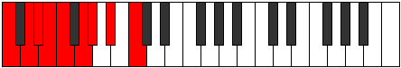
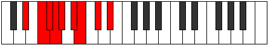

# Mode Epiryllic

## Links

- [Documentation](index.md)
- [Scales Index](Scales.md)
- [Modes Index](Modes.md)
- [Chords Index](Chords.md)

## Parent Scale

[Ionocryllic](ScaleIonocryllic.md)

## Number

[1469](https://ianring.com/musictheory/scales/1469)

## Perfection

- 6 Perfect notes
- 2 Perfect notes

## Perfection Profile

[true false true false true true true true]

## Permutations

| Tonic | Notes | Signature | Illustration | Audio |
|-------|-------|-----------|--------------|-------|
| [C](ModeCNaturalEpiryllic.md) | C, **D**, D#, **E**, F, G, G#, A#, C | C |  | [midi](ModeCNaturalEpiryllic.mid) [ogg](ModeCNaturalEpiryllic.ogg) |
| [C#](ModeCSharpEpiryllic.md) | C#, **D#**, E, **F**, F#, G#, A, B, C# | C |  | [midi](ModeCSharpEpiryllic.mid) [ogg](ModeCSharpEpiryllic.ogg) |
| [Db](ModeDFlatEpiryllic.md) | Db, **Eb**, E, **F**, Gb, Ab, A, B, Db | C |  | [midi](ModeDFlatEpiryllic.mid) [ogg](ModeDFlatEpiryllic.ogg) |
| [D](ModeDNaturalEpiryllic.md) | D, **E**, F, **F#**, G, A, A#, C, D | C |  | [midi](ModeDNaturalEpiryllic.mid) [ogg](ModeDNaturalEpiryllic.ogg) |
| [D#](ModeDSharpEpiryllic.md) | D#, **F**, F#, **G**, G#, A#, B, C#, D# | C |  | [midi](ModeDSharpEpiryllic.mid) [ogg](ModeDSharpEpiryllic.ogg) |
| [Eb](ModeEFlatEpiryllic.md) | Eb, **F**, Gb, **G**, Ab, Bb, B, Db, Eb | C |  | [midi](ModeEFlatEpiryllic.mid) [ogg](ModeEFlatEpiryllic.ogg) |
| [E](ModeENaturalEpiryllic.md) | E, **F#**, G, **G#**, A, B, C, D, E | C |  | [midi](ModeENaturalEpiryllic.mid) [ogg](ModeENaturalEpiryllic.ogg) |
| [F](ModeFNaturalEpiryllic.md) | F, **G**, G#, **A**, A#, C, C#, D#, F | C |  | [midi](ModeFNaturalEpiryllic.mid) [ogg](ModeFNaturalEpiryllic.ogg) |
| [F#](ModeFSharpEpiryllic.md) | F#, **G#**, A, **A#**, B, C#, D, E, F# | C |  | [midi](ModeFSharpEpiryllic.mid) [ogg](ModeFSharpEpiryllic.ogg) |
| [Gb](ModeGFlatEpiryllic.md) | Gb, **Ab**, A, **Bb**, B, Db, D, E, Gb | C |  | [midi](ModeGFlatEpiryllic.mid) [ogg](ModeGFlatEpiryllic.ogg) |
| [G](ModeGNaturalEpiryllic.md) | G, **A**, A#, **B**, C, D, D#, F, G | C |  | [midi](ModeGNaturalEpiryllic.mid) [ogg](ModeGNaturalEpiryllic.ogg) |
| [G#](ModeGSharpEpiryllic.md) | G#, **A#**, B, **C**, C#, D#, E, F#, G# | C |  | [midi](ModeGSharpEpiryllic.mid) [ogg](ModeGSharpEpiryllic.ogg) |
| [Ab](ModeAFlatEpiryllic.md) | Ab, **Bb**, B, **C**, Db, Eb, E, Gb, Ab | C |  | [midi](ModeAFlatEpiryllic.mid) [ogg](ModeAFlatEpiryllic.ogg) |
| [A](ModeANaturalEpiryllic.md) | A, **B**, C, **C#**, D, E, F, G, A | C |  | [midi](ModeANaturalEpiryllic.mid) [ogg](ModeANaturalEpiryllic.ogg) |
| [A#](ModeASharpEpiryllic.md) | A#, **C**, C#, **D**, D#, F, F#, G#, A# | C |  | [midi](ModeASharpEpiryllic.mid) [ogg](ModeASharpEpiryllic.ogg) |
| [Bb](ModeBFlatEpiryllic.md) | Bb, **C**, Db, **D**, Eb, F, Gb, Ab, Bb | C |  | [midi](ModeBFlatEpiryllic.mid) [ogg](ModeBFlatEpiryllic.ogg) |
| [B](ModeBNaturalEpiryllic.md) | B, **C#**, D, **D#**, E, F#, G, A, B | C |  | [midi](ModeBNaturalEpiryllic.mid) [ogg](ModeBNaturalEpiryllic.ogg) |
