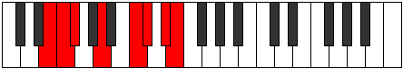

# Mode Epocrian

## Links

- [Documentation](index.md)
- [Scales Index](Scales.md)
- [Modes Index](Modes.md)
- [Chords Index](Chords.md)

## Parent Scale

[Epagian](ScaleEpagian.md)

## Number

[2855](https://ianring.com/musictheory/scales/2855)

## Perfection

- 3 Perfect notes
- 4 Perfect notes

## Perfection Profile

[false true true true false false false]

## Permutations

| Tonic | Notes | Signature | Illustration | Audio |
|-------|-------|-----------|--------------|-------|
| [C](ModeCNaturalEpocrian.md) | **C**, Db, Ebb, F, **G#**, **A**, **B**, **C** | C |  | [midi](ModeCNaturalEpocrian.mid) [ogg](ModeCNaturalEpocrian.ogg) |
| [C#](ModeCSharpEpocrian.md) | **C#**, D, Eb, F#, **G##**, **A#**, **B#**, **C#** | C |  | [midi](ModeCSharpEpocrian.mid) [ogg](ModeCSharpEpocrian.ogg) |
| [Db](ModeDFlatEpocrian.md) | **Db**, Ebb, Fbb, Gb, **A**, **Bb**, **C**, **Db** | C |  | [midi](ModeDFlatEpocrian.mid) [ogg](ModeDFlatEpocrian.ogg) |
| [D](ModeDNaturalEpocrian.md) | **D**, Eb, Fb, G, **A#**, **B**, **C#**, **D** | C |  | [midi](ModeDNaturalEpocrian.mid) [ogg](ModeDNaturalEpocrian.ogg) |
| [D#](ModeDSharpEpocrian.md) | **D#**, E, F, G#, **A##**, **B#**, **C##**, **D#** | C |  | [midi](ModeDSharpEpocrian.mid) [ogg](ModeDSharpEpocrian.ogg) |
| [Eb](ModeEFlatEpocrian.md) | **Eb**, Fb, Gbb, Ab, **B**, **C**, **D**, **Eb** | C |  | [midi](ModeEFlatEpocrian.mid) [ogg](ModeEFlatEpocrian.ogg) |
| [E](ModeENaturalEpocrian.md) | **E**, F, Gb, A, **B#**, **C#**, **D#**, **E** | C |  | [midi](ModeENaturalEpocrian.mid) [ogg](ModeENaturalEpocrian.ogg) |
| [F](ModeFNaturalEpocrian.md) | **F**, Gb, Abb, Bb, **C#**, **D**, **E**, **F** | C |  | [midi](ModeFNaturalEpocrian.mid) [ogg](ModeFNaturalEpocrian.ogg) |
| [F#](ModeFSharpEpocrian.md) | **F#**, G, Ab, B, **C##**, **D#**, **E#**, **F#** | C |  | [midi](ModeFSharpEpocrian.mid) [ogg](ModeFSharpEpocrian.ogg) |
| [Gb](ModeGFlatEpocrian.md) | **Gb**, Abb, Bbbb, Cb, **D**, **Eb**, **F**, **Gb** | C |  | [midi](ModeGFlatEpocrian.mid) [ogg](ModeGFlatEpocrian.ogg) |
| [G](ModeGNaturalEpocrian.md) | **G**, Ab, Bbb, C, **D#**, **E**, **F#**, **G** | C |  | [midi](ModeGNaturalEpocrian.mid) [ogg](ModeGNaturalEpocrian.ogg) |
| [G#](ModeGSharpEpocrian.md) | **G#**, A, Bb, C#, **D##**, **E#**, **F##**, **G#** | C |  | [midi](ModeGSharpEpocrian.mid) [ogg](ModeGSharpEpocrian.ogg) |
| [Ab](ModeAFlatEpocrian.md) | **Ab**, Bbb, Cbb, Db, **E**, **F**, **G**, **Ab** | C |  | [midi](ModeAFlatEpocrian.mid) [ogg](ModeAFlatEpocrian.ogg) |
| [A](ModeANaturalEpocrian.md) | **A**, Bb, Cb, D, **E#**, **F#**, **G#**, **A** | C |  | [midi](ModeANaturalEpocrian.mid) [ogg](ModeANaturalEpocrian.ogg) |
| [A#](ModeASharpEpocrian.md) | **A#**, B, C, D#, **E##**, **F##**, **G##**, **A#** | C |  | [midi](ModeASharpEpocrian.mid) [ogg](ModeASharpEpocrian.ogg) |
| [Bb](ModeBFlatEpocrian.md) | **Bb**, Cb, Dbb, Eb, **F#**, **G**, **A**, **Bb** | C |  | [midi](ModeBFlatEpocrian.mid) [ogg](ModeBFlatEpocrian.ogg) |
| [B](ModeBNaturalEpocrian.md) | **B**, C, Db, E, **F##**, **G#**, **A#**, **B** | C |  | [midi](ModeBNaturalEpocrian.mid) [ogg](ModeBNaturalEpocrian.ogg) |
