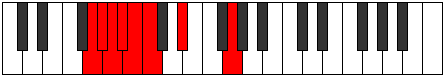

# Mode Epodian

## Links

- [Documentation](index.md)
- [Scales Index](Scales.md)
- [Modes Index](Modes.md)
- [Chords Index](Chords.md)

## Parent Scale

[Katyptian](ScaleKatyptian.md)

## Number

[319](https://ianring.com/musictheory/scales/319)

## Perfection

- 3 Perfect notes
- 4 Perfect notes

## Perfection Profile

[false true false false false true true]

## Permutations

| Tonic | Notes | Signature | Illustration | Audio |
|-------|-------|-----------|--------------|-------|
| [C](ModeCNaturalEpodian.md) | **C**, Db, **Ebb**, **Fbb**, **Gbbb**, D###, F###, **C** | C |  | [midi](ModeCNaturalEpodian.mid) [ogg](ModeCNaturalEpodian.ogg) |
| [C#](ModeCSharpEpodian.md) | **C#**, D, **Eb**, **Fb**, **Gbb**, Abbb, Bbb, **C#** | C |  | [midi](ModeCSharpEpodian.mid) [ogg](ModeCSharpEpodian.ogg) |
| [Db](ModeDFlatEpodian.md) | **Db**, Ebb, **Fbb**, **Gbbb**, **D###**, E##, Cbbb, **Db** | C |  | [midi](ModeDFlatEpodian.mid) [ogg](ModeDFlatEpodian.ogg) |
| [D](ModeDNaturalEpodian.md) | **D**, Eb, **Fb**, **Gbb**, **Abbb**, E###, Cbb, **D** | C |  | [midi](ModeDNaturalEpodian.mid) [ogg](ModeDNaturalEpodian.ogg) |
| [D#](ModeDSharpEpodian.md) | **D#**, E, **F**, **Gb**, **Abb**, Bbbb, Cb, **D#** | C |  | [midi](ModeDSharpEpodian.mid) [ogg](ModeDSharpEpodian.ogg) |
| [Eb](ModeEFlatEpodian.md) | **Eb**, Fb, **Gbb**, **Abbb**, **E###**, F###, Cb, **Eb** | C |  | [midi](ModeEFlatEpodian.mid) [ogg](ModeEFlatEpodian.ogg) |
| [E](ModeENaturalEpodian.md) | **E**, F, **Gb**, **Abb**, **Bbbb**, Cbbb, Dbb, **E** | C |  | [midi](ModeENaturalEpodian.mid) [ogg](ModeENaturalEpodian.ogg) |
| [F](ModeFNaturalEpodian.md) | **F**, Gb, **Abb**, **Bbbb**, **Cbbb**, Cbb, Db, **F** | C |  | [midi](ModeFNaturalEpodian.mid) [ogg](ModeFNaturalEpodian.ogg) |
| [F#](ModeFSharpEpodian.md) | **F#**, G, **Ab**, **Bbb**, **Cbb**, Dbbb, Ebb, **F#** | C |  | [midi](ModeFSharpEpodian.mid) [ogg](ModeFSharpEpodian.ogg) |
| [Gb](ModeGFlatEpodian.md) | **Gb**, Abb, **Bbbb**, **Cbbb**, **Cbb**, Dbbb, Ebb, **Gb** | C |  | [midi](ModeGFlatEpodian.mid) [ogg](ModeGFlatEpodian.ogg) |
| [G](ModeGNaturalEpodian.md) | **G**, Ab, **Bbb**, **Cbb**, **Dbbb**, Dbb, Eb, **G** | C |  | [midi](ModeGNaturalEpodian.mid) [ogg](ModeGNaturalEpodian.ogg) |
| [G#](ModeGSharpEpodian.md) | **G#**, A, **Bb**, **Cb**, **Dbb**, Ebbb, Fb, **G#** | C |  | [midi](ModeGSharpEpodian.mid) [ogg](ModeGSharpEpodian.ogg) |
| [Ab](ModeAFlatEpodian.md) | **Ab**, Bbb, **Cbb**, **Dbbb**, **Dbb**, Ebbb, Fb, **Ab** | C |  | [midi](ModeAFlatEpodian.mid) [ogg](ModeAFlatEpodian.ogg) |
| [A](ModeANaturalEpodian.md) | **A**, Bb, **Cb**, **Dbb**, **Ebbb**, Fbbb, Gbb, **A** | C |  | [midi](ModeANaturalEpodian.mid) [ogg](ModeANaturalEpodian.ogg) |
| [A#](ModeASharpEpodian.md) | **A#**, B, **C**, **Db**, **Ebb**, Fbb, Gb, **A#** | C |  | [midi](ModeASharpEpodian.mid) [ogg](ModeASharpEpodian.ogg) |
| [Bb](ModeBFlatEpodian.md) | **Bb**, Cb, **Dbb**, **Ebbb**, **Fbbb**, C###, E##, **Bb** | C |  | [midi](ModeBFlatEpodian.mid) [ogg](ModeBFlatEpodian.ogg) |
| [B](ModeBNaturalEpodian.md) | **B**, C, **Db**, **Ebb**, **Fbb**, Gbbb, Abb, **B** | C |  | [midi](ModeBNaturalEpodian.mid) [ogg](ModeBNaturalEpodian.ogg) |
