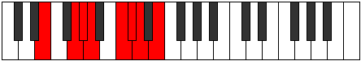
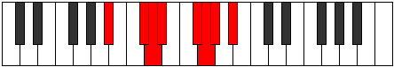
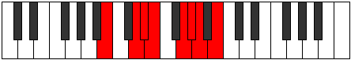

# Mode Epogian

## Links

- [Documentation](index.md)
- [Scales Index](Scales.md)
- [Modes Index](Modes.md)
- [Chords Index](Chords.md)

## Parent Scale

[Epogian](ScaleEpogian.md)

## Number

[1849](https://ianring.com/musictheory/scales/1849)

## Perfection

- 5 Perfect notes
- 2 Perfect notes

## Perfection Profile

[false true false true true true true]

## Permutations

| Tonic | Notes | Signature | Illustration | Audio |
|-------|-------|-----------|--------------|-------|
| [C](ModeCNaturalEpogian.md) | **C**, D#, **E**, F, G#, A, Bb, **C** | C |  | [midi](ModeCNaturalEpogian.mid) [ogg](ModeCNaturalEpogian.ogg) |
| [C#](ModeCSharpEpogian.md) | **C#**, D##, **E#**, F#, G##, A#, B, **C#** | C |  | [midi](ModeCSharpEpogian.mid) [ogg](ModeCSharpEpogian.ogg) |
| [Db](ModeDFlatEpogian.md) | **Db**, E, **F**, Gb, A, Bb, Cb, **Db** | C |  | [midi](ModeDFlatEpogian.mid) [ogg](ModeDFlatEpogian.ogg) |
| [D](ModeDNaturalEpogian.md) | **D**, E#, **F#**, G, A#, B, C, **D** | C |  | [midi](ModeDNaturalEpogian.mid) [ogg](ModeDNaturalEpogian.ogg) |
| [D#](ModeDSharpEpogian.md) | **D#**, E##, **F##**, G#, A##, B#, C#, **D#** | C |  | [midi](ModeDSharpEpogian.mid) [ogg](ModeDSharpEpogian.ogg) |
| [Eb](ModeEFlatEpogian.md) | **Eb**, F#, **G**, Ab, B, C, Db, **Eb** | C |  | [midi](ModeEFlatEpogian.mid) [ogg](ModeEFlatEpogian.ogg) |
| [E](ModeENaturalEpogian.md) | **E**, F##, **G#**, A, B#, C#, D, **E** | C |  | [midi](ModeENaturalEpogian.mid) [ogg](ModeENaturalEpogian.ogg) |
| [F](ModeFNaturalEpogian.md) | **F**, G#, **A**, Bb, C#, D, Eb, **F** | C |  | [midi](ModeFNaturalEpogian.mid) [ogg](ModeFNaturalEpogian.ogg) |
| [F#](ModeFSharpEpogian.md) | **F#**, G##, **A#**, B, C##, D#, E, **F#** | C |  | [midi](ModeFSharpEpogian.mid) [ogg](ModeFSharpEpogian.ogg) |
| [Gb](ModeGFlatEpogian.md) | **Gb**, A, **Bb**, Cb, D, Eb, Fb, **Gb** | C |  | [midi](ModeGFlatEpogian.mid) [ogg](ModeGFlatEpogian.ogg) |
| [G](ModeGNaturalEpogian.md) | **G**, A#, **B**, C, D#, E, F, **G** | C |  | [midi](ModeGNaturalEpogian.mid) [ogg](ModeGNaturalEpogian.ogg) |
| [G#](ModeGSharpEpogian.md) | **G#**, A##, **B#**, C#, D##, E#, F#, **G#** | C |  | [midi](ModeGSharpEpogian.mid) [ogg](ModeGSharpEpogian.ogg) |
| [Ab](ModeAFlatEpogian.md) | **Ab**, B, **C**, Db, E, F, Gb, **Ab** | C |  | [midi](ModeAFlatEpogian.mid) [ogg](ModeAFlatEpogian.ogg) |
| [A](ModeANaturalEpogian.md) | **A**, B#, **C#**, D, E#, F#, G, **A** | C |  | [midi](ModeANaturalEpogian.mid) [ogg](ModeANaturalEpogian.ogg) |
| [A#](ModeASharpEpogian.md) | **A#**, B##, **C##**, D#, E##, F##, G#, **A#** | C |  | [midi](ModeASharpEpogian.mid) [ogg](ModeASharpEpogian.ogg) |
| [Bb](ModeBFlatEpogian.md) | **Bb**, C#, **D**, Eb, F#, G, Ab, **Bb** | C |  | [midi](ModeBFlatEpogian.mid) [ogg](ModeBFlatEpogian.ogg) |
| [B](ModeBNaturalEpogian.md) | **B**, C##, **D#**, E, F##, G#, A, **B** | C |  | [midi](ModeBNaturalEpogian.mid) [ogg](ModeBNaturalEpogian.ogg) |
