# Mode Epogic

## Links

- [Documentation](index.md)
- [Scales Index](Scales.md)
- [Modes Index](Modes.md)
- [Chords Index](Chords.md)

## Parent Scale

[Zyphic](ScaleZyphic.md)

## Number

[401](https://ianring.com/musictheory/scales/401)

## Interval Pattern

4, 3, 1, 4

## Chord Pattern

I, I⁺, II⁺, IV⁺

## Perfection

- 1 Perfect notes
- 3 Perfect notes

## Perfection Profile

[true false false false]

## Permutations

| Tonic | Notes | Signature | Illustration | Audio |
|-------|-------|-----------|--------------|-------|
| [C](ModeCNaturalEpogic.md) | C, **E**, **G**, **G#**, C | C |  | [midi](https://github.com/edipermadi/music/blob/main/docs/ModeCNaturalEpogic.mid?raw=true) |
| [C#](ModeCSharpEpogic.md) | C#, **F**, **G#**, **A**, C# | C | 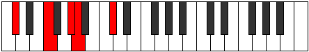 | [midi](https://github.com/edipermadi/music/blob/main/docs/ModeCSharpEpogic.mid?raw=true) |
| [Db](ModeDFlatEpogic.md) | Db, **F**, **Ab**, **A**, Db | C |  | [midi](https://github.com/edipermadi/music/blob/main/docs/ModeDFlatEpogic.mid?raw=true) |
| [D](ModeDNaturalEpogic.md) | D, **F#**, **A**, **A#**, D | C | 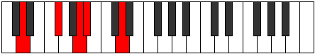 | [midi](https://github.com/edipermadi/music/blob/main/docs/ModeDNaturalEpogic.mid?raw=true) |
| [D#](ModeDSharpEpogic.md) | D#, **G**, **A#**, **B**, D# | C | 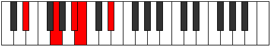 | [midi](https://github.com/edipermadi/music/blob/main/docs/ModeDSharpEpogic.mid?raw=true) |
| [Eb](ModeEFlatEpogic.md) | Eb, **G**, **Bb**, **B**, Eb | C |  | [midi](https://github.com/edipermadi/music/blob/main/docs/ModeEFlatEpogic.mid?raw=true) |
| [E](ModeENaturalEpogic.md) | E, **G#**, **B**, **C**, E | C | 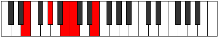 | [midi](https://github.com/edipermadi/music/blob/main/docs/ModeENaturalEpogic.mid?raw=true) |
| [F](ModeFNaturalEpogic.md) | F, **A**, **C**, **C#**, F | C | 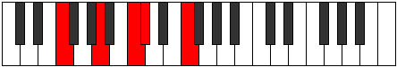 | [midi](https://github.com/edipermadi/music/blob/main/docs/ModeFNaturalEpogic.mid?raw=true) |
| [F#](ModeFSharpEpogic.md) | F#, **A#**, **C#**, **D**, F# | C | 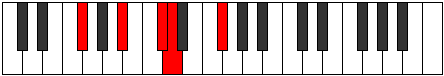 | [midi](https://github.com/edipermadi/music/blob/main/docs/ModeFSharpEpogic.mid?raw=true) |
| [Gb](ModeGFlatEpogic.md) | Gb, **Bb**, **Db**, **D**, Gb | C |  | [midi](https://github.com/edipermadi/music/blob/main/docs/ModeGFlatEpogic.mid?raw=true) |
| [G](ModeGNaturalEpogic.md) | G, **B**, **D**, **D#**, G | C | 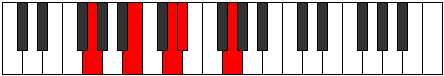 | [midi](https://github.com/edipermadi/music/blob/main/docs/ModeGNaturalEpogic.mid?raw=true) |
| [G#](ModeGSharpEpogic.md) | G#, **C**, **D#**, **E**, G# | C | 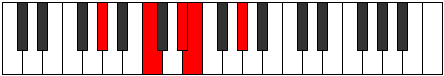 | [midi](https://github.com/edipermadi/music/blob/main/docs/ModeGSharpEpogic.mid?raw=true) |
| [Ab](ModeAFlatEpogic.md) | Ab, **C**, **Eb**, **E**, Ab | C |  | [midi](https://github.com/edipermadi/music/blob/main/docs/ModeAFlatEpogic.mid?raw=true) |
| [A](ModeANaturalEpogic.md) | A, **C#**, **E**, **F**, A | C | 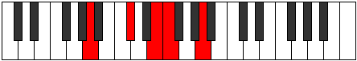 | [midi](https://github.com/edipermadi/music/blob/main/docs/ModeANaturalEpogic.mid?raw=true) |
| [A#](ModeASharpEpogic.md) | A#, **D**, **F**, **F#**, A# | C | 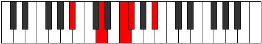 | [midi](https://github.com/edipermadi/music/blob/main/docs/ModeASharpEpogic.mid?raw=true) |
| [Bb](ModeBFlatEpogic.md) | Bb, **D**, **F**, **Gb**, Bb | C |  | [midi](https://github.com/edipermadi/music/blob/main/docs/ModeBFlatEpogic.mid?raw=true) |
| [B](ModeBNaturalEpogic.md) | B, **D#**, **F#**, **G**, B | C | 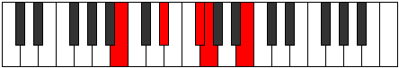 | [midi](https://github.com/edipermadi/music/blob/main/docs/ModeBNaturalEpogic.mid?raw=true) |
